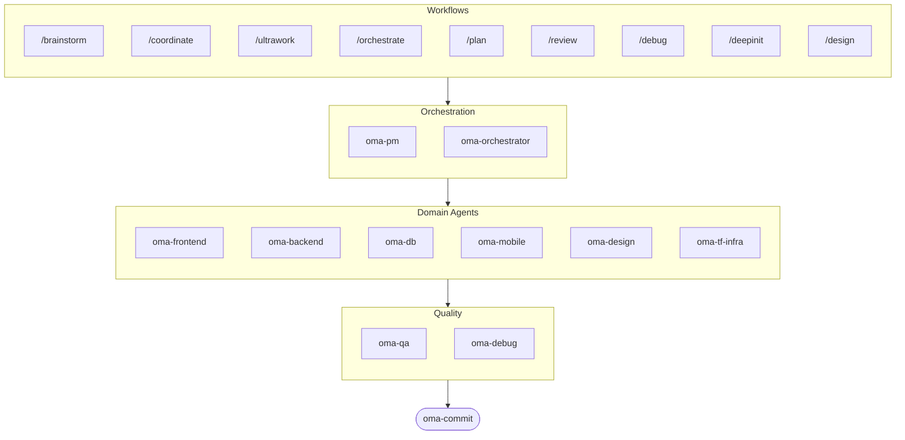

# oh-my-agent: Portable Multi-Agent Harness

[](https://www.npmjs.com/package/oh-my-agent) [](https://www.npmjs.com/package/oh-my-agent) [](https://github.com/first-fluke/oh-my-agent) [](https://github.com/first-fluke/oh-my-agent/blob/main/LICENSE) [](https://github.com/first-fluke/oh-my-agent/commits/main)

[한국어](./docs/README.ko.md) | [中文](./docs/README.zh.md) | [Português](./docs/README.pt.md) | [日本語](./docs/README.ja.md) | [Français](./docs/README.fr.md) | [Español](./docs/README.es.md) | [Nederlands](./docs/README.nl.md) | [Polski](./docs/README.pl.md) | [Русский](./docs/README.ru.md) | [Deutsch](./docs/README.de.md)

The portable, role-based agent harness for serious AI-assisted engineering.

Orchestrate 10 specialized domain agents (PM, Frontend, Backend, DB, Mobile, QA, Debug, Brainstorm, DevWorkflow, Terraform). `oh-my-agent` works with all major AI IDEs including Antigravity, Claude Code, Cursor, Gemini, OpenCode, and more. It combines role-based agents, explicit workflows, real-time observability, and standards-aware guidance for teams that want less AI slop and more disciplined execution.

## Table of Contents

- [What Is This?](#what-is-this)
- [Why Different](#why-different)
- [Quick Start](#quick-start)
- [Architecture](#architecture)
- [Sponsors](#sponsors)
- [License](#license)

## What Is This?

A collection of **Agent Skills** enabling collaborative multi-agent development. Work is distributed across expert agents with explicit roles, workflows, and verification boundaries:

| Agent | Specialization | Triggers |
|-------|---------------|----------|
| **Brainstorm** | Design-first ideation before planning | "brainstorm", "ideate", "explore idea" |
| **PM Agent** | Requirements analysis, task decomposition, architecture | "plan", "break down", "what should we build" |
| **Frontend Agent** | React/Next.js, TypeScript, Tailwind CSS | "UI", "component", "styling" |
| **Backend Agent** | Backend (Python, Node.js, Rust, ...) | "API", "database", "authentication" |
| **DB Agent** | SQL/NoSQL modeling, normalization, integrity, backup, capacity | "ERD", "schema", "database design", "index tuning" |
| **Mobile Agent** | Flutter cross-platform development | "mobile app", "iOS/Android" |
| **QA Agent** | OWASP Top 10 security, performance, accessibility | "review security", "audit", "check performance" |
| **Debug Agent** | Bug diagnosis, root cause analysis, regression tests | "bug", "error", "crash" |
| **Developer Workflow** | Monorepo task automation, mise tasks, CI/CD, migrations, release | "dev workflow", "mise tasks", "CI/CD pipeline" |
| **TF Infra Agent** | Multi-cloud IaC provisioning (AWS, GCP, Azure, OCI) | "infrastructure", "terraform", "cloud setup" |
| **Orchestrator** | CLI-based parallel agent execution | "spawn agent", "parallel execution" |
| **Commit** | Conventional Commits with project-specific rules | "commit", "save changes" |


## Why Different

- **`.agents/` is the source of truth**: skills, workflows, shared resources, and config live in one portable project structure instead of being trapped inside one IDE plugin.
- **Role-shaped agent teams**: PM, QA, DB, Infra, Frontend, Backend, Mobile, Debug, and Workflow agents are modeled like an engineering org, not just a pile of prompts.
- **Workflow-first orchestration**: planning, review, debug, and coordinated execution are first-class workflows, not afterthoughts.
- **Standards-aware by design**: agents now carry focused guidance for ISO-driven planning, QA, database continuity/security, and infrastructure governance.
- **Built for verification**: dashboards, manifest generation, shared execution protocols, and structured outputs favor traceability over vibe-only generation.


## Quick Start

### Prerequisites

- **AI IDE** (Antigravity, Claude Code, Codex, Gemini, etc.)

### Option 1: One-Line Install (Recommended)

```bash
curl -fsSL https://raw.githubusercontent.com/first-fluke/oh-my-agent/main/cli/install.sh | bash
```

Automatically detects and installs missing dependencies (bun, uv), then launches the interactive setup.

### Option 2: Manual Install

```bash
# Install bun if you don't have it:
# curl -fsSL https://bun.sh/install | bash

# Install uv if you don't have it:
# curl -LsSf https://astral.sh/uv/install.sh | sh

bunx oh-my-agent
```

Select your project type and skills will be installed to `.agents/skills/`, with compatibility symlinks created under `.agents/skills/` and `.claude/skills/`.

| Preset | Skills |
|--------|--------|
| ✨ All | Everything |
| 🌐 Fullstack | oma-brainstorm, oma-frontend, oma-backend, oma-db, oma-pm, oma-qa, oma-debug, oma-commit |
| 🎨 Frontend | oma-brainstorm, oma-frontend, oma-pm, oma-qa, oma-debug, oma-commit |
| ⚙️ Backend | oma-brainstorm, oma-backend, oma-db, oma-pm, oma-qa, oma-debug, oma-commit |
| 📱 Mobile | oma-brainstorm, oma-mobile, oma-pm, oma-qa, oma-debug, oma-commit |
| 🚀 DevOps | oma-brainstorm, oma-tf-infra, oma-dev-workflow, oma-pm, oma-qa, oma-debug, oma-commit |

### Option 3: Global Installation (For Orchestrator)

To use the core tools globally or run the SubAgent Orchestrator:

```bash
# Homebrew (macOS/Linux)
brew install oh-my-agent

# npm/bun
bun install --global oh-my-agent
```

You'll also need at least one CLI tool:

| CLI | Install | Auth |
|-----|---------|------|
| Gemini | `bun install --global @google/gemini-cli` | Auto on first `gemini` run |
| Claude | `curl -fsSL https://claude.ai/install.sh \| bash` | Auto on first `claude` run |
| Codex | `bun install --global @openai/codex` | `codex login` |
| Qwen | `bun install --global @qwen-code/qwen-code` | `/auth` inside CLI |

### 2. Chat

**Complex project** (/coordinate workflow):

```
"Build a TODO app with user authentication"
→ /coordinate → PM Agent plans → agents spawned in Agent Manager
```

**Maximum deployment** (/ultrawork workflow):

```
"Refactor auth module, add API tests, and update docs"
→ /ultrawork → Independent tasks execute in parallel across agents
```

**Simple task** (invoke a domain skill directly):

```
"Create a login form with Tailwind CSS and form validation"
→ oma-frontend skill
```

**Commit changes** (conventional commits):

```
/commit
→ Analyze changes, suggest commit type/scope, create commit with Co-Author
```

**Design system** (DESIGN.md + anti-patterns + optional Stitch MCP):

```
/design
→ 7-phase workflow: Setup → Extract → Enhance → Propose → Generate → Audit → Handoff
```

### 3. Monitor with Dashboards

For dashboard setup and usage details, see [`web/content/en/guide/usage.md`](./web/content/en/guide/usage.md#real-time-dashboards).


## Architecture




## Sponsors

This project is maintained thanks to our generous sponsors.

> **Like this project?** Give it a star!
>
> ```bash
> gh api --method PUT /user/starred/first-fluke/oh-my-agent
> ```
>
> Try our optimized starter template: [fullstack-starter](https://github.com/first-fluke/fullstack-starter)

<a href="https://github.com/sponsors/first-fluke">
  
</a>
<a href="https://buymeacoffee.com/firstfluke">
  
</a>

### 🚀 Champion

<!-- Champion tier ($100/mo) logos here -->

### 🛸 Booster

<!-- Booster tier ($30/mo) logos here -->

### ☕ Contributor

<!-- Contributor tier ($10/mo) names here -->

[Become a sponsor →](https://github.com/sponsors/first-fluke)

See [SPONSORS.md](./SPONSORS.md) for a full list of supporters.


## License

MIT

