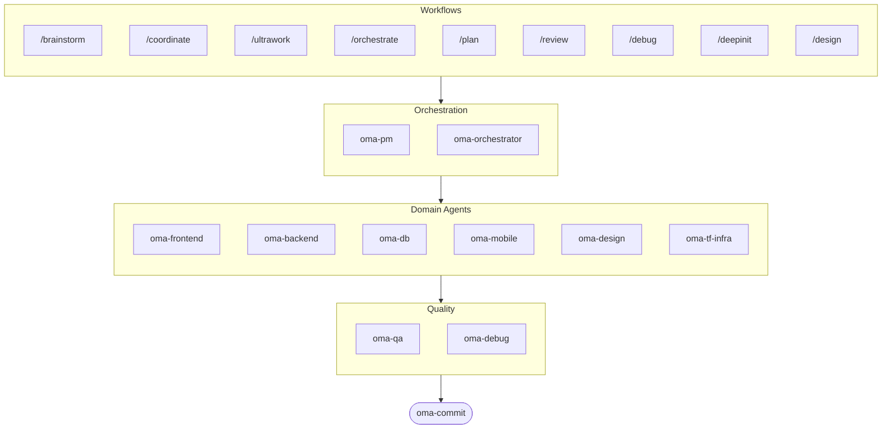

# oh-my-agent: Portable Multi-Agent Harness

[](https://www.npmjs.com/package/oh-my-agent) [](https://www.npmjs.com/package/oh-my-agent) [](https://github.com/first-fluke/oh-my-agent) [](https://github.com/first-fluke/oh-my-agent/blob/main/LICENSE) [](https://github.com/first-fluke/oh-my-agent/commits/main)

[한국어](./README.ko.md) | [中文](./README.zh.md) | [Português](./README.pt.md) | [日本語](./README.ja.md) | [Français](./README.fr.md) | [Español](./README.es.md) | [Nederlands](./README.nl.md) | [Polski](./README.pl.md) | [Русский](./README.ru.md) | [Deutsch](./README.de.md)

Hast du dir schon mal gewünscht, dein KI-Assistent hätte Kollegen? Genau das macht oh-my-agent.

Statt dass eine einzige KI alles erledigt (und sich auf halbem Weg verheddert), verteilt oh-my-agent die Arbeit auf **spezialisierte Agenten** — Frontend, Backend, QA, PM, DB, Mobile, Infra, Debug, Design und mehr. Jeder kennt sein Fachgebiet in- und auswendig, hat eigene Tools und Checklisten und bleibt in seiner Spur.

Funktioniert mit allen großen KI-IDEs: Antigravity, Claude Code, Cursor, Gemini CLI, Codex CLI, OpenCode und weiteren.

## Schnellstart

```bash
# Einzeiler (installiert bun & uv automatisch, falls nicht vorhanden)
curl -fsSL https://raw.githubusercontent.com/first-fluke/oh-my-agent/main/cli/install.sh | bash

# Oder manuell
bunx oh-my-agent
```

Wähl ein Preset und los geht's:

| Preset | Was Du Bekommst |
|--------|-------------|
| ✨ All | Alle Agenten und Skills |
| 🌐 Fullstack | frontend + backend + db + pm + qa + debug + brainstorm + commit |
| 🎨 Frontend | frontend + pm + qa + debug + brainstorm + commit |
| ⚙️ Backend | backend + db + pm + qa + debug + brainstorm + commit |
| 📱 Mobile | mobile + pm + qa + debug + brainstorm + commit |
| 🚀 DevOps | tf-infra + dev-workflow + pm + qa + debug + brainstorm + commit |

## Dein Agenten-Team

| Agent | Was Er Macht |
|-------|-------------|
| **oma-brainstorm** | Erkundet Ideen, bevor du loslegst |
| **oma-pm** | Plant Aufgaben, zerlegt Anforderungen, definiert API-Verträge |
| **oma-frontend** | React/Next.js, TypeScript, Tailwind CSS v4, shadcn/ui |
| **oma-backend** | APIs in Python, Node.js oder Rust |
| **oma-db** | Schema-Design, Migrationen, Indexierung, Vector DB |
| **oma-mobile** | Plattformübergreifende Apps mit Flutter |
| **oma-design** | Design-Systeme, Tokens, Barrierefreiheit, Responsive |
| **oma-qa** | OWASP-Sicherheit, Performance, Barrierefreiheits-Review |
| **oma-debug** | Ursachenanalyse, Fixes, Regressionstests |
| **oma-tf-infra** | Multi-Cloud IaC mit Terraform |
| **oma-dev-workflow** | CI/CD, Releases, Monorepo-Automatisierung |
| **oma-translator** | Natürliche mehrsprachige Übersetzung |
| **oma-orchestrator** | Parallele Agentenausführung über CLI |
| **oma-commit** | Saubere konventionelle Commits |

## So Funktioniert's

Einfach chatten. Beschreib, was du willst, und oh-my-agent sucht die passenden Agenten aus.

```
Du: "Bau eine TODO-App mit User-Authentifizierung"
→ PM plant die Arbeit
→ Backend baut die Auth-API
→ Frontend baut die React-UI
→ DB entwirft das Schema
→ QA prüft alles durch
→ Fertig: koordinierter, geprüfter Code
```

Oder nutz Slash Commands für strukturierte Workflows:

| Befehl | Was Er Macht |
|---------|-------------|
| `/plan` | PM zerlegt dein Feature in Aufgaben |
| `/coordinate` | Schritt-für-Schritt Multi-Agent-Ausführung |
| `/orchestrate` | Automatisiertes paralleles Agenten-Spawning |
| `/ultrawork` | 5-Phasen-Qualitätsworkflow mit 11 Review-Gates |
| `/review` | Sicherheits- + Performance- + Barrierefreiheits-Audit |
| `/debug` | Strukturiertes Ursachen-Debugging |
| `/design` | 7-Phasen Design-System-Workflow |
| `/brainstorm` | Freie Ideenfindung |
| `/commit` | Konventioneller Commit mit Type/Scope-Analyse |

**Auto-Erkennung**: Du brauchst nicht mal Slash Commands — Schlüsselwörter wie "plan", "review", "debug" in deiner Nachricht (in 11 Sprachen!) aktivieren automatisch den richtigen Workflow.

## CLI

```bash
# Global installieren
bun install --global oh-my-agent   # oder: brew install oh-my-agent

# Überall nutzen
oma doctor                  # Gesundheitscheck
oma dashboard               # Echtzeit-Agenten-Monitoring
oma agent:spawn backend "Build auth API" session-01
oma agent:parallel -i backend:"Auth API" frontend:"Login form"
```

## Warum oh-my-agent?

- **Portabel** — `.agents/` reist mit deinem Projekt, nicht in einer IDE eingesperrt
- **Rollenbasiert** — Agenten wie ein echtes Engineering-Team modelliert, kein Haufen Prompts
- **Token-effizient** — Zwei-Schichten-Skill-Design spart ~75% der Tokens
- **Qualität zuerst** — Charter Preflight, Quality Gates und Review-Workflows eingebaut
- **Multi-Vendor** — Mische Gemini, Claude, Codex und Qwen je nach Agententyp
- **Beobachtbar** — Terminal- und Web-Dashboards für Echtzeit-Monitoring

## Architektur



## Mehr Erfahren

- **[Detaillierte Dokumentation](./AGENTS_SPEC.md)** — Vollständige technische Spec und Architektur
- **[Unterstützte Agenten](./SUPPORTED_AGENTS.md)** — Agenten-Support-Matrix nach IDE
- **[Web-Docs](https://oh-my-agent.dev)** — Guides, Tutorials und CLI-Referenz

## Sponsors

Dieses Projekt wird dank unserer großzügigen Sponsors gepflegt.

> **Gefällt dir das Projekt?** Gib ihm einen Stern!
>
> ```bash
> gh api --method PUT /user/starred/first-fluke/oh-my-agent
> ```
>
> Probier unser optimiertes Starter-Template: [fullstack-starter](https://github.com/first-fluke/fullstack-starter)

<a href="https://github.com/sponsors/first-fluke">
  
</a>
<a href="https://buymeacoffee.com/firstfluke">
  
</a>

### 🚀 Champion

<!-- Champion tier ($100/mo) logos here -->

### 🛸 Booster

<!-- Booster tier ($30/mo) logos here -->

### ☕ Contributor

<!-- Contributor tier ($10/mo) names here -->

[Sponsor werden →](https://github.com/sponsors/first-fluke)

Siehe [SPONSORS.md](../SPONSORS.md) für die vollständige Liste der Unterstützer.


## Lizenz

MIT
