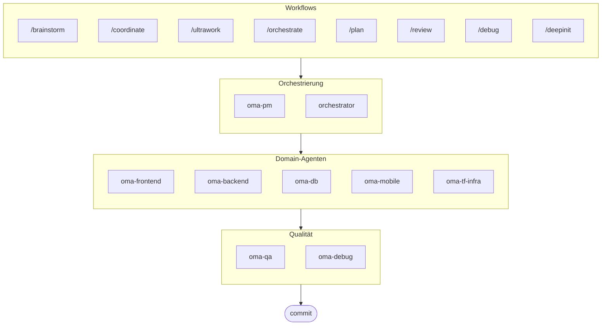

# oh-my-agent: Tragbares Multi-Agenten-Harness

[](https://www.npmjs.com/package/oh-my-agent) [](https://www.npmjs.com/package/oh-my-agent) [](https://github.com/first-fluke/oh-my-agent) [](https://github.com/first-fluke/oh-my-agent/blob/main/LICENSE) [](https://github.com/first-fluke/oh-my-agent/commits/main)

[English](../README.md) | [한국어](./README.ko.md) | [中文](./README.zh.md) | [Português](./README.pt.md) | [日本語](./README.ja.md) | [Français](./README.fr.md) | [Español](./README.es.md) | [Nederlands](./README.nl.md) | [Polski](./README.pl.md) | [Русский](./README.ru.md)

Das tragbare, rollenbasierte Agenten-Harness für ernsthaftes KI-gestütztes Engineering.

Orchestrieren Sie 10 spezialisierte Domain-Agenten (PM, Frontend, Backend, DB, Mobile, QA, Debug, Brainstorm, DevWorkflow, Terraform) über **Serena Memory**. `oh-my-agent` verwendet `.agents/` als Single Source of Truth für tragbare Fähigkeiten und Workflows und verbindet sich von dort aus mit anderen KI-IDEs und CLIs. Es kombiniert rollenbasierte Agenten, explizite Workflows, Echtzeit-Observability und standardbewusste Anleitung für Teams, die weniger KI-Chaos und eine diszipliniertere Ausführung wünschen.

> **Gefällt Ihnen dieses Projekt?** Geben Sie ihm einen Stern!
>
> ```bash
> gh api --method PUT /user/starred/first-fluke/oh-my-agent
> ```
>
> Probieren Sie unsere optimierte Starter-Vorlage: [fullstack-starter](https://github.com/first-fluke/fullstack-starter)

## Inhaltsverzeichnis

- [Architektur](#architektur)
- [Warum anders](#warum-anders)
- [Kompatibilität](#kompatibilität)
- [`.agents` Spezifikation](#agents-spezifikation)
- [Was ist das?](#was-ist-das)
- [Schnellstart](#schnellstart)
- [Sponsoren](#sponsoren)
- [Lizenz](#lizenz)

## Warum anders

- **`.agents/` ist die Single Source of Truth**: Skills, Workflows, gemeinsame Ressourcen und Konfiguration leben in einer portablen Projektstruktur statt in einem IDE-Plugin gefangen zu sein.
- **Rollenbasierte Agententeams**: PM, QA, DB, Infra, Frontend, Backend, Mobile, Debug und Workflow Agenten sind wie eine Engineering-Organisation modelliert, nicht nur ein Haufen Prompts.
- **Workflow-first Orchestrierung**: Planung, Review, Debugging und koordinierte Ausführung sind First-Class-Workflows, keine Nachgedanken.
- **Standard-bewusstes Design**: Agenten tragen jetzt fokussierte Anleitung für ISO-getriebene Planung, QA, Datenbank-Kontinuität/Sicherheit und Infrastruktur-Governance.
- **Für Verifikation gebaut**: Dashboards, Manifest-Generierung, gemeinsame Ausführungsprotokolle und strukturierte Ausgaben bevorzugen Rückverfolgbarkeit gegenüber reiner Vibe-Generierung.

## Kompatibilität

`oh-my-agent` ist um `.agents/` herum entworfen und überbrückt dann bei Bedarf zu anderen toolspezifischen Skill-Ordnern.

| Tool / IDE | Skill-Quelle | Interop-Modus | Hinweise |
|------------|---------------|--------------|-------|
| Antigravity | `.agents/skills/` | Native | Primäre Source-of-Truth-Layout |
| Claude Code | `.claude/skills/` + `.claude/agents/` | Nativ + Adapter | Domain-Skills per Symlink, Workflow-Skills / Subagenten / CLAUDE.md nativ |
| OpenCode | `.agents/skills/` | Native-kompatibel | Verwendet dieselbe Projekt-Level-Skill-Quelle |
| Amp | `.agents/skills/` | Native-kompatibel | Teilt dieselbe Projekt-Level-Quelle |
| Codex CLI | `.agents/skills/` | Native-kompatibel | Arbeitet von derselben Projekt-Skill-Quelle |
| Cursor | `.agents/skills/` | Native-kompatibel | Kann dieselbe Projekt-Level-Skill-Quelle konsumieren |
| GitHub Copilot | `.github/skills/` | Optionale Symlink | Installiert bei Auswahl während des Setups |

Siehe [SUPPORTED_AGENTS.md](./SUPPORTED_AGENTS.md) für die aktuelle Support-Matrix und Interoperabilitäts-Hinweise.

## Native Claude Code Integration

Claude Code unterstützt `oh-my-agent` vollständig nativ — ohne Plugins.

- **`CLAUDE.md`** — wird beim Start automatisch geladen; enthält Projektbeschreibung, Architektur und Agentenregeln.
- **`.claude/skills/`** — 12 Workflow-Skills aus `.agents/workflows/` (z. B. `/orchestrate`, `/coordinate`, `/ultrawork`), direkt als Slash-Befehle verfügbar.
- **`.claude/agents/`** — 7 Subagenten, die per Task-Tool gestartet werden: `backend-engineer`, `frontend-engineer`, `mobile-engineer`, `db-engineer`, `qa-reviewer`, `debug-investigator`, `pm-planner`.
- **Loop-Muster** — Review Loop, Issue Remediation Loop und Phase Gate Loop laufen ohne CLI-Polling; das Task-Tool liefert Ergebnisse synchron zurück.

## `.agents` Spezifikation

`oh-my-agent` behandelt `.agents/` als portable Projektkonvention für Agenten-Skills, Workflows und gemeinsamen Kontext.

- Skills leben in `.agents/skills/<skill-name>/SKILL.md`
- Gemeinsame Ressourcen leben in `.agents/skills/_shared/`
- Workflows leben in `.agents/workflows/*.md`
- Projektkonfiguration lebt in `.agents/config/`
- CLI-Metadaten und Packaging bleiben durch generierte Manifeste ausgerichtet

Siehe [AGENTS_SPEC.md](./AGENTS_SPEC.md) für das Projekt-Layout, erforderliche Dateien, Interoperabilitätsregeln und Source-of-Truth-Modell.

## Architektur



## Was ist das?

Eine Sammlung von **Agent Skills**, die kollaborative Multi-Agent-Entwicklung ermöglichen. Die Arbeit wird auf Experten-Agenten verteilt:

| Agent | Spezialisierung | Auslöser |
|-------|----------------|----------|
| **Brainstorm** | Design-first Ideenfindung vor der Planung | "brainstorm", "ideate", "explore idea" |
| **PM Agent** | Anforderungsanalyse, Task-Zerlegung, Architektur | "planen", "aufschlüsseln", "was sollen wir bauen" |
| **Frontend Agent** | React/Next.js, TypeScript, Tailwind CSS | "UI", "Komponente", "Styling" |
| **Backend Agent** | Backend (Python, Node.js, Rust, ...) | "API", "Datenbank", "Authentifizierung" |
| **DB Agent** | SQL/NoSQL-Modellierung, Normalisierung, Integrität, Backups, Kapazitätsplanung | "ERD", "Schema", "Datenbankdesign", "Index-Tuning" |
| **Mobile Agent** | Flutter Cross-Platform-Entwicklung | "mobile App", "iOS/Android" |
| **QA Agent** | OWASP Top 10 Sicherheit, Performance, Accessibility | "Sicherheit prüfen", "Audit", "Performance checken" |
| **Debug Agent** | Bug-Diagnose, Root-Cause-Analyse, Regressionstests | "Bug", "Fehler", "Absturz" |
| **Developer Workflow** | Monorepo-Aufgabenautomatisierung, mise-Tasks, CI/CD, Migrationen, Release | "Dev-Workflow", "mise-Tasks", "CI/CD-Pipeline" |
| **TF Infra Agent** | Multi-Cloud-IaC-Bereitstellung (AWS, GCP, Azure, OCI) | "Infrastruktur", "Terraform", "Cloud-Setup" |
| **Orchestrator** | CLI-basierte parallele Agent-Ausführung mit Serena Memory | "Agent spawnen", "parallele Ausführung" |
| **Commit** | Conventional Commits mit projektspezifischen Regeln | "commit", "Änderungen speichern" |

## Schnellstart

### Voraussetzungen

- **AI IDE** (Antigravity, Claude Code, Codex, Gemini, etc.)

### Option 1: Ein-Zeilen-Installation (Empfohlen)

```bash
curl -fsSL https://raw.githubusercontent.com/first-fluke/oh-my-agent/main/cli/install.sh | bash
```

Erkennt und installiert automatisch fehlende Abhängigkeiten (bun, uv) und startet dann die interaktive Einrichtung.

### Option 2: Manuelle Installation

```bash
# Installieren Sie bun, falls noch nicht vorhanden:
# curl -fsSL https://bun.sh/install | bash

# Installieren Sie uv, falls noch nicht vorhanden:
# curl -LsSf https://astral.sh/uv/install.sh | sh

bunx oh-my-agent
```

Wählen Sie Ihren Projekttyp und Skills werden in `.agents/skills/` installiert.

| Preset | Skills |
|--------|--------|
| ✨ All | Alle |
| 🌐 Fullstack | oma-brainstorm, oma-frontend, oma-backend, oma-db, oma-pm, oma-qa, oma-debug, oma-commit |
| 🎨 Frontend | oma-brainstorm, oma-frontend, oma-pm, oma-qa, oma-debug, oma-commit |
| ⚙️ Backend | oma-brainstorm, oma-backend, oma-db, oma-pm, oma-qa, oma-debug, oma-commit |
| 📱 Mobile | oma-brainstorm, oma-mobile, oma-pm, oma-qa, oma-debug, oma-commit |
| 🚀 DevOps | oma-brainstorm, oma-tf-infra, oma-dev-workflow, oma-pm, oma-qa, oma-debug, oma-commit |

### Option 3: Globale Installation (Für Orchestrator)

Um die Core-Tools global zu verwenden oder den SubAgent Orchestrator auszuführen:

```bash
bun install --global oh-my-agent
```

Sie benötigen außerdem mindestens ein CLI-Tool:

| CLI | Installation | Auth |
|-----|--------------|------|
| Gemini | `bun install --global @google/gemini-cli` | Auto on first `gemini` run |
| Claude | `curl -fsSL https://claude.ai/install.sh \| bash` | Auto on first `claude` run |
| Codex | `bun install --global @openai/codex` | `codex login` |
| Qwen | `bun install --global @qwen-code/qwen-code` | `/auth` inside CLI |

### Option 4: In bestehendes Projekt integrieren

**Empfohlen (CLI):**

Führen Sie den folgenden Befehl im Root-Verzeichnis Ihres Projekts aus, um Skills und Workflows automatisch zu installieren/aktualisieren:

```bash
bunx oh-my-agent
```

> **Tipp:** Führen Sie nach der Installation `bunx oh-my-agent doctor` aus, um zu überprüfen, ob alles korrekt eingerichtet ist (einschließlich globaler Workflows).

### 2. Chatten

**Einfache Aufgabe** (einzelner Agent aktiviert automatisch):

```
"Erstelle ein Login-Formular mit Tailwind CSS und Formularvalidierung"
→ oma-frontend wird aktiviert
```

**Komplexes Projekt** (/coordinate Workflow):

```
"Baue eine TODO-App mit Benutzerauthentifizierung"
→ /coordinate → PM Agent plant → Agenten im Agent Manager gespawnt
```

**Maximaler Einsatz** (/ultrawork Workflow):

```
"Auth-Modul refactoren, API-Tests hinzufügen und Docs aktualisieren"
→ /ultrawork → Unabhängige Aufgaben werden parallel über Agenten ausgeführt
```

**Änderungen committen** (Conventional Commits):

```
/commit
→ Änderungen analysieren, Commit-Typ/Scope vorschlagen, Commit mit Co-Author erstellen
```

### 3. Mit Dashboards überwachen

Details zu Dashboard-Setup und Nutzung finden Sie in [`web/content/de/guide/usage.md`](./web/content/de/guide/usage.md#echtzeit-dashboards).

## Sponsoren

Dieses Projekt wird dank unserer großzügigen Sponsoren gepflegt.

<a href="https://github.com/sponsors/first-fluke">
  
</a>
<a href="https://buymeacoffee.com/firstfluke">
  
</a>

### 🚀 Champion

<!-- Champion tier ($100/mo) logos here -->

### 🛸 Booster

<!-- Booster tier ($30/mo) logos here -->

### ☕ Contributor

<!-- Contributor tier ($10/mo) names here -->

[Sponsor werden →](https://github.com/sponsors/first-fluke)

Eine vollständige Liste der Unterstützer finden Sie in [SPONSORS.md](./SPONSORS.md).

## Star History

[](https://www.star-history.com/#first-fluke/oh-my-agent&type=date&legend=bottom-right)

## Lizenz

MIT
