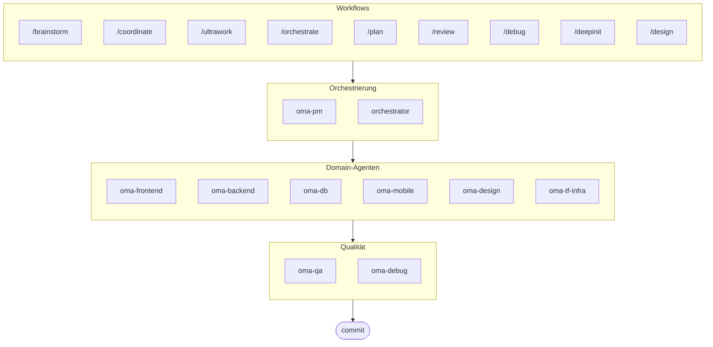

# oh-my-agent: Tragbares Multi-Agenten-Harness

[](https://www.npmjs.com/package/oh-my-agent) [](https://www.npmjs.com/package/oh-my-agent) [](https://github.com/first-fluke/oh-my-agent) [](https://github.com/first-fluke/oh-my-agent/blob/main/LICENSE) [](https://github.com/first-fluke/oh-my-agent/commits/main)

[English](../README.md) | [한국어](./README.ko.md) | [中文](./README.zh.md) | [Português](./README.pt.md) | [日本語](./README.ja.md) | [Français](./README.fr.md) | [Español](./README.es.md) | [Nederlands](./README.nl.md) | [Polski](./README.pl.md) | [Русский](./README.ru.md)

Das tragbare, rollenbasierte Agenten-Harness für ernsthaftes KI-gestütztes Engineering.

`oh-my-agent` funktioniert mit allen wichtigen KI-IDEs, einschließlich Antigravity, Claude Code, Cursor, Gemini, OpenCode und mehr. Es kombiniert rollenbasierte Agenten, explizite Workflows, Echtzeit-Observability und standardbewusste Anleitung für Teams, die weniger KI-Chaos und eine diszipliniertere Ausführung wünschen.

## Was ist das?

Eine Sammlung von **Agent Skills**, die kollaborative Multi-Agent-Entwicklung ermöglichen. Die Arbeit wird auf Experten-Agenten verteilt:

| Agent | Spezialisierung | Auslöser |
|-------|----------------|----------|
| **Brainstorm** | Design-first Ideenfindung vor der Planung | "brainstorm", "ideate", "explore idea" |
| **PM Agent** | Anforderungsanalyse, Task-Zerlegung, Architektur | "planen", "aufschlüsseln", "was sollen wir bauen" |
| **Frontend Agent** | React/Next.js, TypeScript, Tailwind CSS | "UI", "Komponente", "Styling" |
| **Backend Agent** | Backend (Python, Node.js, Rust, ...) | "API", "Datenbank", "Authentifizierung" |
| **DB Agent** | SQL/NoSQL-Modellierung, Normalisierung, Integrität, Backups, Kapazitätsplanung | "ERD", "Schema", "Datenbankdesign", "Index-Tuning" |
| **Mobile Agent** | Flutter Cross-Platform-Entwicklung | "mobile App", "iOS/Android" |
| **QA Agent** | OWASP Top 10 Sicherheit, Performance, Accessibility | "Sicherheit prüfen", "Audit", "Performance checken" |
| **Debug Agent** | Bug-Diagnose, Root-Cause-Analyse, Regressionstests | "Bug", "Fehler", "Absturz" |
| **Developer Workflow** | Monorepo-Aufgabenautomatisierung, mise-Tasks, CI/CD, Migrationen, Release | "Dev-Workflow", "mise-Tasks", "CI/CD-Pipeline" |
| **TF Infra Agent** | Multi-Cloud-IaC-Bereitstellung (AWS, GCP, Azure, OCI) | "Infrastruktur", "Terraform", "Cloud-Setup" |
| **Orchestrator** | CLI-basierte parallele Agent-Ausführung  | "Agent spawnen", "parallele Ausführung" |
| **Commit** | Conventional Commits mit projektspezifischen Regeln | "commit", "Änderungen speichern" |


## Warum anders

- **`.agents/` ist die Single Source of Truth**: Skills, Workflows, gemeinsame Ressourcen und Konfiguration leben in einer portablen Projektstruktur statt in einem IDE-Plugin gefangen zu sein.
- **Rollenbasierte Agententeams**: PM, QA, DB, Infra, Frontend, Backend, Mobile, Debug und Workflow Agenten sind wie eine Engineering-Organisation modelliert, nicht nur ein Haufen Prompts.
- **Workflow-first Orchestrierung**: Planung, Review, Debugging und koordinierte Ausführung sind First-Class-Workflows, keine Nachgedanken.
- **Standard-bewusstes Design**: Agenten tragen jetzt fokussierte Anleitung für ISO-getriebene Planung, QA, Datenbank-Kontinuität/Sicherheit und Infrastruktur-Governance.
- **Für Verifikation gebaut**: Dashboards, Manifest-Generierung, gemeinsame Ausführungsprotokolle und strukturierte Ausgaben bevorzugen Rückverfolgbarkeit gegenüber reiner Vibe-Generierung.


## Schnellstart

### Voraussetzungen

- **AI IDE** (Antigravity, Claude Code, Codex, Gemini, etc.)

### Option 1: Ein-Zeilen-Installation (Empfohlen)

```bash
curl -fsSL https://raw.githubusercontent.com/first-fluke/oh-my-agent/main/cli/install.sh | bash
```

Erkennt und installiert automatisch fehlende Abhängigkeiten (bun, uv) und startet dann die interaktive Einrichtung.

### Option 2: Manuelle Installation

```bash
# Installieren Sie bun, falls noch nicht vorhanden:
# curl -fsSL https://bun.sh/install | bash

# Installieren Sie uv, falls noch nicht vorhanden:
# curl -LsSf https://astral.sh/uv/install.sh | sh

bunx oh-my-agent
```

Wählen Sie Ihren Projekttyp und Skills werden in `.agents/skills/` installiert.

| Preset | Skills |
|--------|--------|
| ✨ All | Alle |
| 🌐 Fullstack | oma-brainstorm, oma-frontend, oma-backend, oma-db, oma-pm, oma-qa, oma-debug, oma-commit |
| 🎨 Frontend | oma-brainstorm, oma-frontend, oma-pm, oma-qa, oma-debug, oma-commit |
| ⚙️ Backend | oma-brainstorm, oma-backend, oma-db, oma-pm, oma-qa, oma-debug, oma-commit |
| 📱 Mobile | oma-brainstorm, oma-mobile, oma-pm, oma-qa, oma-debug, oma-commit |
| 🚀 DevOps | oma-brainstorm, oma-tf-infra, oma-dev-workflow, oma-pm, oma-qa, oma-debug, oma-commit |

### Option 3: Globale Installation (Für Orchestrator)

Um die Core-Tools global zu verwenden oder den SubAgent Orchestrator auszuführen:

```bash
# Homebrew (macOS/Linux)
brew install oh-my-agent

# npm/bun
bun install --global oh-my-agent
```

Sie benötigen außerdem mindestens ein CLI-Tool:

| CLI | Installation | Auth |
|-----|--------------|------|
| Gemini | `bun install --global @google/gemini-cli` | Auto on first `gemini` run |
| Claude | `curl -fsSL https://claude.ai/install.sh \| bash` | Auto on first `claude` run |
| Codex | `bun install --global @openai/codex` | `codex login` |
| Qwen | `bun install --global @qwen-code/qwen-code` | `/auth` inside CLI |

### Option 4: In bestehendes Projekt integrieren

**Empfohlen (CLI):**

Führen Sie den folgenden Befehl im Root-Verzeichnis Ihres Projekts aus, um Skills und Workflows automatisch zu installieren/aktualisieren:

```bash
bunx oh-my-agent
```

> **Tipp:** Führen Sie nach der Installation `bunx oh-my-agent doctor` aus, um zu überprüfen, ob alles korrekt eingerichtet ist (einschließlich globaler Workflows).

### 2. Chatten

**Einfache Aufgabe** (Domain-Skill direkt aufrufen):

```
"Erstelle ein Login-Formular mit Tailwind CSS und Formularvalidierung"
→ oma-frontend Skill
```

**Komplexes Projekt** (/coordinate Workflow):

```
"Baue eine TODO-App mit Benutzerauthentifizierung"
→ /coordinate → PM Agent plant → Agenten im Agent Manager gespawnt
```

**Maximaler Einsatz** (/ultrawork Workflow):

```
"Auth-Modul refactoren, API-Tests hinzufügen und Docs aktualisieren"
→ /ultrawork → Unabhängige Aufgaben werden parallel über Agenten ausgeführt
```

**Änderungen committen** (Conventional Commits):

```
/commit
→ Änderungen analysieren, Commit-Typ/Scope vorschlagen, Commit mit Co-Author erstellen
```

**Designsystem** (DESIGN.md + Anti-Patterns + optionaler Stitch MCP):

```
/design
→ 7-Phasen-Workflow: Einrichtung → Extraktion → Verbesserung → Vorschlag → Generierung → Audit → Übergabe
```

### 3. Mit Dashboards überwachen

Details zu Dashboard-Setup und Nutzung finden Sie in [`web/content/de/guide/usage.md`](./web/content/de/guide/usage.md#echtzeit-dashboards).


## Architektur




## Sponsoren

Dieses Projekt wird dank unserer großzügigen Sponsoren gepflegt.

<a href="https://github.com/sponsors/first-fluke">
  
</a>
<a href="https://buymeacoffee.com/firstfluke">
  
</a>

### 🚀 Champion

<!-- Champion tier ($100/mo) logos here -->

### 🛸 Booster

<!-- Booster tier ($30/mo) logos here -->

### ☕ Contributor

<!-- Contributor tier ($10/mo) names here -->

[Sponsor werden →](https://github.com/sponsors/first-fluke)

Eine vollständige Liste der Unterstützer finden Sie in [SPONSORS.md](./SPONSORS.md).


## Lizenz

MIT

