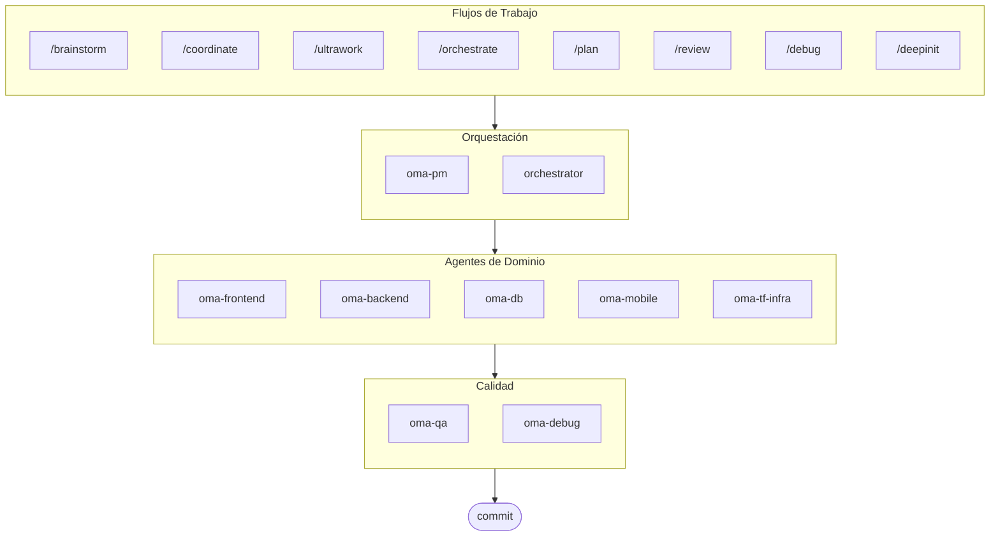

# oh-my-agent: Arnés Multigente Portátil

[](https://www.npmjs.com/package/oh-my-agent) [](https://www.npmjs.com/package/oh-my-agent) [](https://github.com/first-fluke/oh-my-agent) [](https://github.com/first-fluke/oh-my-agent/blob/main/LICENSE) [](https://github.com/first-fluke/oh-my-agent/commits/main)

[English](../README.md) | [한국어](./README.ko.md) | [中文](./README.zh.md) | [Português](./README.pt.md) | [日本語](./README.ja.md) | [Français](./README.fr.md) | [Nederlands](./README.nl.md) | [Polski](./README.pl.md) | [Русский](./README.ru.md) | [Deutsch](./README.de.md)

El arnés de agente portátil, basado en roles, para la ingeniería seria asistida por IA.

Orquesta 10 agentes de dominio especializados (PM, Frontend, Backend, DB, Mobile, QA, Debug, Brainstorm, DevWorkflow, Terraform) a través de **Serena Memory**. `oh-my-agent` utiliza `.agents/` como la fuente de verdad para las habilidades y los flujos de trabajo portátiles, y los adapta para funcionar con otras IDE y CLI de IA. Combina agentes basados en roles, flujos de trabajo explícitos, observabilidad en tiempo real y orientación con conocimiento de estándares para los equipos que desean menos desorden de IA y una ejecución más disciplinada.

> **¿Te gusta este proyecto?** ¡Dale una estrella!
>
> ```bash
> gh api --method PUT /user/starred/first-fluke/oh-my-agent
> ```
>
> Prueba nuestra plantilla inicial optimizada: [fullstack-starter](https://github.com/first-fluke/fullstack-starter)

## Tabla de Contenidos

- [Arquitectura](#arquitectura)
- [Por qué diferente](#por-qué-diferente)
- [Compatibilidad](#compatibilidad)
- [Especificación `.agents`](#especificación-agents)
- [¿Qué es esto?](#qué-es-esto)
- [Inicio Rápido](#inicio-rápido)
- [Patrocinadores](#patrocinadores)
- [Licencia](#licencia)

## Por qué diferente

- **`.agents/` es la fuente de verdad**: skills, workflows, recursos compartidos y configuración viven en una estructura de proyecto portátil en lugar de estar atrapados dentro de un plugin IDE.
- **Equipos de agentes basados en roles**: los agentes PM, QA, DB, Infra, Frontend, Backend, Mobile, Debug y Workflow están modelados como una organización de ingeniería, no solo como una pila de prompts.
- **Orquestación workflow-first**: planificación, revisión, depuración y ejecución coordinada son workflows de primera clase, no pensados después.
- **Diseño consciente de estándares**: los agentes ahora llevan guía enfocada para planificación ISO, QA, continuidad/seguridad de bases de datos y gobernanza de infraestructura.
- **Construido para verificación**: dashboards, generación de manifiestos, protocolos de ejecución compartidos y salidas estructuradas favorecen la trazabilidad sobre generación basada solo en vibes.

## Compatibilidad

`oh-my-agent` está diseñado alrededor de `.agents/` y luego hace puentes a otras carpetas de skills específicas de herramientas cuando es necesario.

| Herramienta / IDE | Fuente de Skills | Modo de Interoperabilidad | Notas |
|------------|---------------|--------------|-------|
| Antigravity | `.agents/skills/` | Nativo | Disposición principal fuente-de-verdad |
| Claude Code | `.claude/skills/` + `.claude/agents/` | Nativo + Adaptador | skills de dominio vía enlace simbólico, workflow skills / subagentes / CLAUDE.md nativo |
| OpenCode | `.agents/skills/` | Nativo-compatible | Usa la misma fuente de skills a nivel de proyecto |
| Amp | `.agents/skills/` | Nativo-compatible | Comparte la misma fuente a nivel de proyecto |
| Codex CLI | `.agents/skills/` | Nativo-compatible | Funciona desde la misma fuente de skills |
| Cursor | `.agents/skills/` | Nativo-compatible | Puede consumir la misma fuente de skills |
| GitHub Copilot | `.github/skills/` | Enlace simbólico opcional | Instalado cuando se selecciona durante la configuración |

Ver [SUPPORTED_AGENTS.md](./SUPPORTED_AGENTS.md) para la matriz de soporte actual y notas de interoperabilidad.

## Integración Nativa con Claude Code

Claude Code tiene soporte nativo de primera clase a través de tres mecanismos:

- **`CLAUDE.md`** — cargado automáticamente al inicio de cada sesión; contiene la información del proyecto, la arquitectura y las reglas de comportamiento del agente.
- **`.claude/skills/`** — 12 workflow skills mapeados desde `.agents/workflows/` (por ejemplo, `/orchestrate`, `/coordinate`, `/ultrawork`). Los skills de dominio se enlazan simbólicamente desde `.agents/skills/`.
- **`.claude/agents/`** — 7 subagentes invocados mediante la herramienta Task: `backend-engineer`, `frontend-engineer`, `mobile-engineer`, `db-engineer`, `qa-reviewer`, `debug-investigator`, `pm-planner`.

Los patrones de bucle (Review Loop, Issue Remediation Loop, Phase Gate Loop) se ejecutan directamente dentro de Claude Code sin necesidad de sondear la CLI externa.

## Especificación `.agents`

`oh-my-agent` trata `.agents/` como una convención de proyecto portable para skills, workflows y contexto compartido de agentes.

- Los skills viven en `.agents/skills/<skill-name>/SKILL.md`
- Los recursos compartidos viven en `.agents/skills/_shared/`
- Los workflows viven en `.agents/workflows/*.md`
- La configuración del proyecto vive en `.agents/config/`
- Los metadatos CLI y empaquetado se mantienen alineados a través de manifiestos generados

Ver [AGENTS_SPEC.md](./AGENTS_SPEC.md) para la disposición del proyecto, archivos requeridos, reglas de interoperabilidad y modelo fuente-de-verdad.

## Arquitectura



## ¿Qué es esto?

Una colección de **Agent Skills** que habilitan desarrollo colaborativo multi-agente. El trabajo se distribuye entre agentes expertos:

| Agente | Especialización | Activadores |
|-------|---------------|----------|
| **Brainstorm** | Ideación design-first antes de la planificación | "brainstorm", "ideate", "explore idea" |
| **PM Agent** | Análisis de requisitos, descomposición de tareas, arquitectura | "planificar", "descomponer", "qué deberíamos construir" |
| **Frontend Agent** | React/Next.js, TypeScript, Tailwind CSS | "UI", "componente", "estilos" |
| **Backend Agent** | Backend (Python, Node.js, Rust, ...) | "API", "base de datos", "autenticación" |
| **DB Agent** | Modelado SQL/NoSQL, normalización, integridad, backup, capacidad | "ERD", "schema", "database design", "index tuning" |
| **Mobile Agent** | Desarrollo multiplataforma con Flutter | "app móvil", "iOS/Android" |
| **QA Agent** | Seguridad OWASP Top 10, rendimiento, accesibilidad | "revisar seguridad", "auditoría", "verificar rendimiento" |
| **Debug Agent** | Diagnóstico de bugs, análisis de causa raíz, pruebas de regresión | "bug", "error", "crash" |
| **Developer Workflow** | Automatización de tareas monorepo, tareas mise, CI/CD, migraciones, release | "workflow dev", "tareas mise", "pipeline CI/CD" |
| **TF Infra Agent** | Provisión IaC multi-nube (AWS, GCP, Azure, OCI) | "infraestructura", "terraform", "config cloud" |
| **Orchestrator** | Ejecución paralela de agentes basada en CLI con Serena Memory | "generar agente", "ejecución paralela" |
| **Commit** | Conventional Commits con reglas específicas del proyecto | "commit", "guardar cambios" |

## Inicio Rápido

### Requisitos Previos

- **AI IDE** (Antigravity, Claude Code, Codex, Gemini, etc.)

### Opción 1: Instalación en Una Línea (Recomendado)

```bash
curl -fsSL https://raw.githubusercontent.com/first-fluke/oh-my-agent/main/cli/install.sh | bash
```

Detecta e instala automáticamente las dependencias faltantes (bun, uv) y luego lanza la configuración interactiva.

### Opción 2: Instalación Manual

```bash
# Instala bun si no lo tienes:
# curl -fsSL https://bun.sh/install | bash

# Instala uv si no lo tienes:
# curl -LsSf https://astral.sh/uv/install.sh | sh

bunx oh-my-agent
```

Selecciona tu tipo de proyecto y los skills se instalarán en `.agents/skills/`.

| Preset | Skills |
|--------|--------|
| ✨ All | Todo |
| 🌐 Fullstack | oma-brainstorm, oma-frontend, oma-backend, oma-db, oma-pm, oma-qa, oma-debug, oma-commit |
| 🎨 Frontend | oma-brainstorm, oma-frontend, oma-pm, oma-qa, oma-debug, oma-commit |
| ⚙️ Backend | oma-brainstorm, oma-backend, oma-db, oma-pm, oma-qa, oma-debug, oma-commit |
| 📱 Mobile | oma-brainstorm, oma-mobile, oma-pm, oma-qa, oma-debug, oma-commit |
| 🚀 DevOps | oma-brainstorm, oma-tf-infra, oma-dev-workflow, oma-pm, oma-qa, oma-debug, oma-commit |

### Opción 3: Instalación Global (Para Orchestrator)

Para usar las herramientas principales globalmente o ejecutar el SubAgent Orchestrator:

```bash
bun install --global oh-my-agent
```

También necesitarás al menos una herramienta CLI:

| CLI | Instalar | Autenticación |
|-----|---------|------|
| Gemini | `bun install --global @google/gemini-cli` | Auto on first `gemini` run |
| Claude | `curl -fsSL https://claude.ai/install.sh \| bash` | Auto on first `claude` run |
| Codex | `bun install --global @openai/codex` | `codex login` |
| Qwen | `bun install --global @qwen-code/qwen-code` | `/auth` inside CLI |

### Opción 4: Integrar en Proyecto Existente

**Recomendado (CLI):**

Ejecuta el siguiente comando en la raíz de tu proyecto para instalar/actualizar automáticamente skills y workflows:

```bash
bunx oh-my-agent
```

> **Consejo:** Ejecuta `bunx oh-my-agent doctor` después de la instalación para verificar que todo esté configurado correctamente (incluyendo workflows globales).

### 2. Chat

**Tarea simple** (un solo agente se auto-activa):

```
"Crear un formulario de login con Tailwind CSS y validación de formularios"
→ oma-frontend se activa
```

**Proyecto complejo** (/coordinate workflow):

```
"Construir una app TODO con autenticación de usuarios"
→ /coordinate → PM Agent planifica → agentes generados en Agent Manager
```

**Despliegue máximo** (/ultrawork workflow):

```
"Refactorizar módulo de auth, agregar tests de API y actualizar docs"
→ /ultrawork → Tareas independientes se ejecutan en paralelo entre agentes
```

**Commitear cambios** (conventional commits):

```
/commit
→ Analizar cambios, sugerir tipo/scope de commit, crear commit con Co-Author
```

### 3. Monitorear con Dashboards

Para detalles de configuración y uso del dashboard, consulta [`web/content/es/guide/usage.md`](./web/content/es/guide/usage.md#dashboards-en-tiempo-real).

## Patrocinadores

Este proyecto se mantiene gracias a nuestros generosos patrocinadores.

<a href="https://github.com/sponsors/first-fluke">
  
</a>
<a href="https://buymeacoffee.com/firstfluke">
  
</a>

### 🚀 Champion

<!-- Champion tier ($100/mo) logos here -->

### 🛸 Booster

<!-- Booster tier ($30/mo) logos here -->

### ☕ Contributor

<!-- Contributor tier ($10/mo) names here -->

[Conviértete en patrocinador →](https://github.com/sponsors/first-fluke)

Consulta [SPONSORS.md](./SPONSORS.md) para una lista completa de colaboradores.

## Star History

[](https://www.star-history.com/#first-fluke/oh-my-agent&type=date&legend=bottom-right)

## Licencia

MIT
