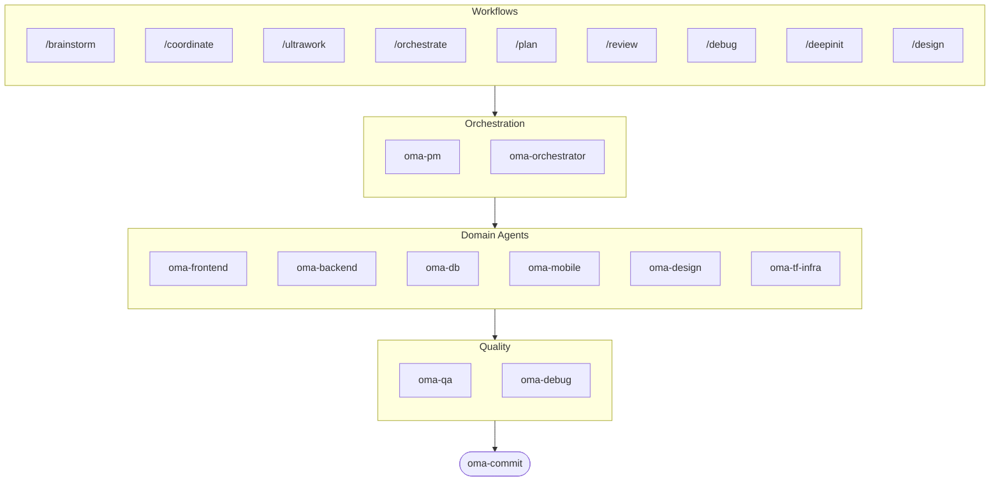

# oh-my-agent: Portable Multi-Agent Harness

[](https://www.npmjs.com/package/oh-my-agent) [](https://www.npmjs.com/package/oh-my-agent) [](https://github.com/first-fluke/oh-my-agent) [](https://github.com/first-fluke/oh-my-agent/blob/main/LICENSE) [](https://github.com/first-fluke/oh-my-agent/commits/main)

[한국어](./README.ko.md) | [中文](./README.zh.md) | [Português](./README.pt.md) | [日本語](./README.ja.md) | [Français](./README.fr.md) | [Español](./README.es.md) | [Nederlands](./README.nl.md) | [Polski](./README.pl.md) | [Русский](./README.ru.md) | [Deutsch](./README.de.md)

Tu as déjà rêvé que ton assistant IA ait des collègues ? C'est exactement ce que fait oh-my-agent.

Au lieu qu'une seule IA fasse tout (et se perde en route), oh-my-agent répartit le boulot entre des **agents spécialisés** — frontend, backend, QA, PM, DB, mobile, infra, debug, design, et plus encore. Chacun connaît son domaine sur le bout des doigts, a ses propres outils et checklists, et reste dans sa voie.

Compatible avec tous les principaux IDEs IA : Antigravity, Claude Code, Cursor, Gemini CLI, Codex CLI, OpenCode, et d'autres.

## Démarrage Rapide

```bash
# Une seule ligne (installe bun & uv automatiquement si absents)
curl -fsSL https://raw.githubusercontent.com/first-fluke/oh-my-agent/main/cli/install.sh | bash

# Ou manuellement
bunx oh-my-agent
```

Choisis un preset et c'est parti :

| Preset | Ce Que Tu Obtiens |
|--------|-------------|
| ✨ All | Tous les agents et skills |
| 🌐 Fullstack | frontend + backend + db + pm + qa + debug + brainstorm + commit |
| 🎨 Frontend | frontend + pm + qa + debug + brainstorm + commit |
| ⚙️ Backend | backend + db + pm + qa + debug + brainstorm + commit |
| 📱 Mobile | mobile + pm + qa + debug + brainstorm + commit |
| 🚀 DevOps | tf-infra + dev-workflow + pm + qa + debug + brainstorm + commit |

## Ton Équipe d'Agents

| Agent | Ce Qu'il Fait |
|-------|-------------|
| **oma-brainstorm** | Explore les idées avant que tu te lances dans le code |
| **oma-pm** | Planifie les tâches, découpe les specs, définit les contrats d'API |
| **oma-frontend** | React/Next.js, TypeScript, Tailwind CSS v4, shadcn/ui |
| **oma-backend** | APIs en Python, Node.js ou Rust |
| **oma-db** | Conception de schémas, migrations, indexation, vector DB |
| **oma-mobile** | Apps multiplateformes avec Flutter |
| **oma-design** | Systèmes de design, tokens, accessibilité, responsive |
| **oma-qa** | Sécurité OWASP, performance, revue d'accessibilité |
| **oma-debug** | Analyse de cause racine, corrections, tests de régression |
| **oma-tf-infra** | IaC multi-cloud avec Terraform |
| **oma-dev-workflow** | CI/CD, releases, automatisation monorepo |
| **oma-translator** | Traduction multilingue naturelle |
| **oma-orchestrator** | Exécution parallèle d'agents via CLI |
| **oma-commit** | Commits conventionnels propres |

## Comment Ça Marche

Discute, tout simplement. Décris ce que tu veux et oh-my-agent choisit les bons agents.

```
Toi : "Construis une app TODO avec authentification"
→ PM planifie le travail
→ Backend construit l'API d'auth
→ Frontend construit l'UI React
→ DB conçoit le schéma
→ QA passe tout en revue
→ Terminé : code coordonné et vérifié
```

Ou utilise les slash commands pour des workflows structurés :

| Commande | Ce Qu'elle Fait |
|---------|-------------|
| `/plan` | PM découpe ta feature en tâches |
| `/coordinate` | Exécution multi-agent étape par étape |
| `/orchestrate` | Lancement automatisé d'agents en parallèle |
| `/ultrawork` | Workflow qualité en 5 phases avec 11 portes de revue |
| `/review` | Audit sécurité + performance + accessibilité |
| `/debug` | Debugging structuré par cause racine |
| `/design` | Workflow de système de design en 7 phases |
| `/brainstorm` | Idéation libre |
| `/commit` | Commit conventionnel avec analyse type/scope |

**Auto-détection** : Tu n'as même pas besoin des slash commands — des mots-clés comme "plan", "review", "debug" dans ton message (en 11 langues !) activent automatiquement le bon workflow.

## CLI

```bash
# Installer globalement
bun install --global oh-my-agent   # ou : brew install oh-my-agent

# Utiliser n'importe où
oma doctor                  # Bilan de santé
oma dashboard               # Monitoring des agents en temps réel
oma agent:spawn backend "Build auth API" session-01
oma agent:parallel -i backend:"Auth API" frontend:"Login form"
```

## Pourquoi oh-my-agent ?

- **Portable** — `.agents/` voyage avec ton projet, pas enfermé dans un IDE
- **Basé sur les rôles** — Des agents modélisés comme une vraie équipe d'ingé, pas un tas de prompts
- **Économe en tokens** — Le design de skills à deux couches économise ~75% de tokens
- **Qualité d'abord** — Charter preflight, quality gates et workflows de revue intégrés
- **Multi-vendor** — Mélange Gemini, Claude, Codex et Qwen par type d'agent
- **Observable** — Dashboards terminal et web pour le monitoring en temps réel

## Architecture



## En Savoir Plus

- **[Documentation Détaillée](./AGENTS_SPEC.md)** — Spec technique complète et architecture
- **[Agents Supportés](./SUPPORTED_AGENTS.md)** — Matrice de support des agents par IDE
- **[Docs Web](https://oh-my-agent.dev)** — Guides, tutoriels et référence CLI

## Sponsors

Ce projet est maintenu grâce à nos généreux sponsors.

> **Tu aimes ce projet ?** Mets-lui une étoile !
>
> ```bash
> gh api --method PUT /user/starred/first-fluke/oh-my-agent
> ```
>
> Essaie notre template starter optimisé : [fullstack-starter](https://github.com/first-fluke/fullstack-starter)

<a href="https://github.com/sponsors/first-fluke">
  
</a>
<a href="https://buymeacoffee.com/firstfluke">
  
</a>

### 🚀 Champion

<!-- Champion tier ($100/mo) logos here -->

### 🛸 Booster

<!-- Booster tier ($30/mo) logos here -->

### ☕ Contributor

<!-- Contributor tier ($10/mo) names here -->

[Devenir sponsor →](https://github.com/sponsors/first-fluke)

Voir [SPONSORS.md](../SPONSORS.md) pour la liste complète des supporters.


## Licence

MIT
