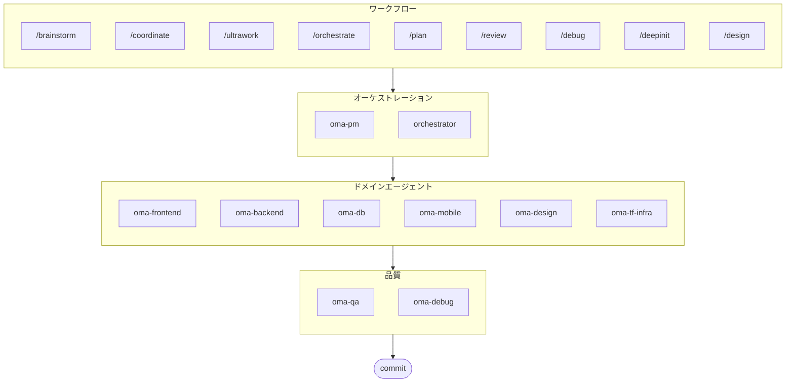

# oh-my-agent: どの IDE でも使えるマルチエージェントハーネス

[](https://www.npmjs.com/package/oh-my-agent) [](https://www.npmjs.com/package/oh-my-agent) [](https://github.com/first-fluke/oh-my-agent) [](https://github.com/first-fluke/oh-my-agent/blob/main/LICENSE) [](https://github.com/first-fluke/oh-my-agent/commits/main)

[English](../README.md) | [한국어](./README.ko.md) | [中文](./README.zh.md) | [Português](./README.pt.md) | [Français](./README.fr.md) | [Español](./README.es.md) | [Nederlands](./README.nl.md) | [Polski](./README.pl.md) | [Русский](./README.ru.md) | [Deutsch](./README.de.md)

AI で本気の開発をしたいチームのためのエージェントハーネス。役割ごとにエージェントが分かれていて、特定の IDE に縛られません。

Antigravity、Claude Code、Cursor、Gemini、OpenCode など、すべての主要な AI IDE で動作します。役割を持ったエージェント、明確なワークフロー、リアルタイム監視、標準に沿ったガイドを組み合わせて、AI が雑に生成したコードを減らし、チームが体系的に動けるようにします。

## 何ができるのか

複数のエージェントが協力して開発する**Agent Skills**のコレクションです。専門エージェントに役割を分けて任せます:

| エージェント | 担当 | こういう時に呼びます |
|-------|---------------|----------|
| **Brainstorm** | 企画前にアイデアを探る | "brainstorm"、"ideate"、"explore idea" |
| **PM Agent** | 要件分析、タスク分解、アーキテクチャ | "plan"、"break down"、"what should we build" |
| **Frontend Agent** | React/Next.js、TypeScript、Tailwind CSS | "UI"、"component"、"styling" |
| **Backend Agent** | Backend (Python, Node.js, Rust, ...) | "API"、"database"、"authentication" |
| **DB Agent** | SQL/NoSQLモデリング、正規化、整合性、バックアップ | "ERD"、"schema"、"DB設計"、"index tuning" |
| **Mobile Agent** | Flutterクロスプラットフォーム開発 | "mobile app"、"iOS/Android" |
| **QA Agent** | OWASP Top 10セキュリティ、パフォーマンス、アクセシビリティ | "review security"、"audit"、"check performance" |
| **Debug Agent** | バグ診断、原因分析、回帰テスト | "bug"、"error"、"crash" |
| **Developer Workflow** | モノレポ自動化、mise、CI/CD、リリース | "dev workflow"、"mise"、"CI/CD" |
| **TF Infra Agent** | マルチクラウドIaC（AWS、GCP、Azure、OCI） | "infrastructure"、"terraform"、"cloud" |
| **Orchestrator** | CLIでエージェントを並列実行  | "spawn agent"、"parallel execution" |
| **Commit** | Conventional Commitsのルールでコミット | "commit"、"save changes" |


## 何が違うのか

- **`.agents/`が原本です**: スキル、ワークフロー、共有リソース、設定がひとつのプロジェクト構造に入っていて、特定のIDEプラグインに閉じ込められません。
- **エンジニアリング組織のように動きます**: PM、QA、DB、Infra、Frontend、Backend、Mobile、Debug、Workflowの各エージェントが、プロンプトの寄せ集めではなくチームとして役割を分担します。
- **ワークフローが最初に来ます**: 企画、レビュー、デバッグ、協調実行がおまけではなく、コアのワークフローとして設計されています。
- **標準を知っています**: ISO基準の企画、QA、DBセキュリティ、インフラガバナンスのガイドがエージェントに組み込まれています。
- **検証できます**: ダッシュボード、マニフェスト生成、実行プロトコル、構造化された出力で結果を追跡できます。ただ生成するだけではありません。


## クイックスタート

### 必要なもの

- **AI IDE**（Antigravity、Claude Code、Codex、Geminiなど）

### オプション1: ワンラインインストール（推奨）

```bash
curl -fsSL https://raw.githubusercontent.com/first-fluke/oh-my-agent/main/cli/install.sh | bash
```

足りない依存関係（bun、uv）を自動で見つけてインストールし、対話型セットアップを始めます。

### オプション2: 手動インストール

```bash
# bunがなければ:
# curl -fsSL https://bun.sh/install | bash

# uvがなければ:
# curl -LsSf https://astral.sh/uv/install.sh | sh

bunx oh-my-agent
```

プロジェクトタイプを選ぶと`.agents/skills/`にスキルがインストールされます。

| プリセット | スキル |
|--------|--------|
| ✨ All | すべて |
| 🌐 Fullstack | oma-brainstorm, oma-frontend, oma-backend, oma-db, oma-pm, oma-qa, oma-debug, oma-commit |
| 🎨 Frontend | oma-brainstorm, oma-frontend, oma-pm, oma-qa, oma-debug, oma-commit |
| ⚙️ Backend | oma-brainstorm, oma-backend, oma-db, oma-pm, oma-qa, oma-debug, oma-commit |
| 📱 Mobile | oma-brainstorm, oma-mobile, oma-pm, oma-qa, oma-debug, oma-commit |
| 🚀 DevOps | oma-brainstorm, oma-tf-infra, oma-dev-workflow, oma-pm, oma-qa, oma-debug, oma-commit |

### オプション3: グローバルインストール（Orchestrator用）

SubAgent Orchestratorを使うか、ツールをグローバルで使うには:

```bash
# Homebrew (macOS/Linux)
brew install oh-my-agent

# npm/bun
bun install --global oh-my-agent
```

CLIツールが最低1つ必要です:

| CLI | インストール | 認証 |
|-----|---------|------|
| Gemini | `bun install --global @google/gemini-cli` | Auto on first `gemini` run |
| Claude | `curl -fsSL https://claude.ai/install.sh \| bash` | Auto on first `claude` run |
| Codex | `bun install --global @openai/codex` | `codex login` |
| Qwen | `bun install --global @qwen-code/qwen-code` | `/auth` inside CLI |

### オプション4: 既存プロジェクトに追加

プロジェクトルートで実行すると、スキルとワークフローが自動インストールされます:

```bash
bunx oh-my-agent
```

> **ヒント:** インストール後に`bunx oh-my-agent doctor`を実行すると、設定が正しいか確認できます。

### 2. チャットで使う

**複雑なプロジェクト**（/coordinate）:

```
"ユーザー認証付きのTODOアプリを作って"
→ /coordinate → PM Agentが企画 → Agent Managerでエージェント起動
```

**全力投入**（/ultrawork）:

```
"認証モジュールのリファクタリング、APIテスト追加、ドキュメント更新"
→ /ultrawork → 独立したタスクがエージェント間で同時実行
```

**簡単なタスク**（ドメインスキルを直接呼び出し）:

```
"Tailwind CSSでログインフォームを作って"
→ oma-frontendスキル
```

**コミット**（Conventional Commits）:

```
/commit
→ 変更を分析、コミットタイプ/スコープを提案、Co-Author付きでコミット
```

**デザインシステム** (DESIGN.md + アンチパターン + オプションStitch MCP):

```
/design
→ 7フェーズワークフロー: セットアップ → 抽出 → 強化 → 提案 → 生成 → 監査 → 引き渡し
```

### 3. ダッシュボードで監視

ダッシュボードの設定と使い方は[`web/content/ja/guide/usage.md`](./web/content/ja/guide/usage.md#リアルタイムダッシュボード)を参照してください。


## アーキテクチャ


## スポンサー

このプロジェクトはスポンサーの皆さんのおかげで維持されています。

> **気に入りましたか？** スターをお願いします！
>
> ```bash
> gh api --method PUT /user/starred/first-fluke/oh-my-agent
> ```
>
> スターターテンプレートもあります: [fullstack-starter](https://github.com/first-fluke/fullstack-starter)

<a href="https://github.com/sponsors/first-fluke">
  
</a>
<a href="https://buymeacoffee.com/firstfluke">
  
</a>

### 🚀 Champion

<!-- Champion ($100/月) ロゴ -->

### 🛸 Booster

<!-- Booster ($30/月) ロゴ -->

### ☕ Contributor

<!-- Contributor ($10/月) 名前 -->

[スポンサーになる →](https://github.com/sponsors/first-fluke)

サポーターの一覧は[SPONSORS.md](./SPONSORS.md)を参照してください。


## ライセンス

MIT## 何ができるのか

複数のエージェントが協力して開発する**Agent Skills**のコレクションです。専門エージェントに役割を分けて任せます:

| エージェント | 担当 | こういう時に呼びます |
|-------|---------------|----------|
| **Brainstorm** | 企画前にアイデアを探る | "brainstorm"、"ideate"、"explore idea" |
| **PM Agent** | 要件分析、タスク分解、アーキテクチャ | "plan"、"break down"、"what should we build" |
| **Frontend Agent** | React/Next.js、TypeScript、Tailwind CSS | "UI"、"component"、"styling" |
| **Backend Agent** | Backend (Python, Node.js, Rust, ...) | "API"、"database"、"authentication" |
| **DB Agent** | SQL/NoSQLモデリング、正規化、整合性、バックアップ | "ERD"、"schema"、"DB設計"、"index tuning" |
| **Mobile Agent** | Flutterクロスプラットフォーム開発 | "mobile app"、"iOS/Android" |
| **QA Agent** | OWASP Top 10セキュリティ、パフォーマンス、アクセシビリティ | "review security"、"audit"、"check performance" |
| **Debug Agent** | バグ診断、原因分析、回帰テスト | "bug"、"error"、"crash" |
| **Developer Workflow** | モノレポ自動化、mise、CI/CD、リリース | "dev workflow"、"mise"、"CI/CD" |
| **TF Infra Agent** | マルチクラウドIaC（AWS、GCP、Azure、OCI） | "infrastructure"、"terraform"、"cloud" |
| **Orchestrator** | CLIでエージェントを並列実行  | "spawn agent"、"parallel execution" |
| **Commit** | Conventional Commitsのルールでコミット | "commit"、"save changes" |





- **`.agents/`が原本です**: スキル、ワークフロー、共有リソース、設定がひとつのプロジェクト構造に入っていて、特定のIDEプラグインに閉じ込められません。
- **エンジニアリング組織のように動きます**: PM、QA、DB、Infra、Frontend、Backend、Mobile、Debug、Workflowの各エージェントが、プロンプトの寄せ集めではなくチームとして役割を分担します。
- **ワークフローが最初に来ます**: 企画、レビュー、デバッグ、協調実行がおまけではなく、コアのワークフローとして設計されています。
- **標準を知っています**: ISO基準の企画、QA、DBセキュリティ、インフラガバナンスのガイドがエージェントに組み込まれています。
- **検証できます**: ダッシュボード、マニフェスト生成、実行プロトコル、構造化された出力で結果を追跡できます。ただ生成するだけではありません。


