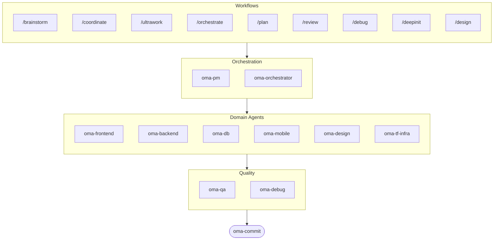

# oh-my-agent: Portable Multi-Agent Harness

[](https://www.npmjs.com/package/oh-my-agent) [](https://www.npmjs.com/package/oh-my-agent) [](https://github.com/first-fluke/oh-my-agent) [](https://github.com/first-fluke/oh-my-agent/blob/main/LICENSE) [](https://github.com/first-fluke/oh-my-agent/commits/main)

[English](../README.md) | [한국어](./README.ko.md) | [中文](./README.zh.md) | [Português](./README.pt.md) | [Français](./README.fr.md) | [Español](./README.es.md) | [Nederlands](./README.nl.md) | [Polski](./README.pl.md) | [Русский](./README.ru.md) | [Deutsch](./README.de.md)

AIアシスタントに同僚がいたらいいのに、って思ったことありませんか？ oh-my-agentはまさにそれです。

1つのAIに全部やらせて途中で混乱する代わりに、oh-my-agentは作業を**専門エージェント**に分担します — frontend、backend、QA、PM、DB、mobile、infra、debug、designなど。各エージェントは自分の領域を深く理解し、専用ツールとチェックリストを持ち、担当範囲に集中します。

主要なAI IDEすべてに対応: Antigravity、Claude Code、Cursor、Gemini CLI、Codex CLI、OpenCodeなど。

## クイックスタート

```bash
# ワンライナー（bun & uvがなければ自動インストール）
curl -fsSL https://raw.githubusercontent.com/first-fluke/oh-my-agent/main/cli/install.sh | bash

# または手動で
bunx oh-my-agent
```

プリセットを選べばすぐ使えます:

| プリセット | 内容 |
|-----------|------|
| ✨ All | すべてのエージェントとスキル |
| 🌐 Fullstack | frontend + backend + db + pm + qa + debug + brainstorm + commit |
| 🎨 Frontend | frontend + pm + qa + debug + brainstorm + commit |
| ⚙️ Backend | backend + db + pm + qa + debug + brainstorm + commit |
| 📱 Mobile | mobile + pm + qa + debug + brainstorm + commit |
| 🚀 DevOps | tf-infra + dev-workflow + pm + qa + debug + brainstorm + commit |

## エージェントチーム

| エージェント | 役割 |
|-------------|------|
| **oma-brainstorm** | 実装前にアイデアを探索 |
| **oma-pm** | タスク計画、要件分解、APIコントラクト定義 |
| **oma-frontend** | React/Next.js、TypeScript、Tailwind CSS v4、shadcn/ui |
| **oma-backend** | Python、Node.js、RustでAPI開発 |
| **oma-db** | スキーマ設計、マイグレーション、インデックス、vector DB |
| **oma-mobile** | Flutterクロスプラットフォームアプリ |
| **oma-design** | デザインシステム、トークン、アクセシビリティ、レスポンシブ |
| **oma-qa** | OWASPセキュリティ、パフォーマンス、アクセシビリティレビュー |
| **oma-debug** | 根本原因分析、修正、リグレッションテスト |
| **oma-tf-infra** | マルチクラウドTerraform IaC |
| **oma-dev-workflow** | CI/CD、リリース、モノレポ自動化 |
| **oma-translator** | 自然な多言語翻訳 |
| **oma-orchestrator** | CLI経由の並列エージェント実行 |
| **oma-commit** | きれいなconventional commit |

## 仕組み

チャットするだけ。やりたいことを説明すれば、oh-my-agentが適切なエージェントを選びます。

```
You: "ユーザー認証付きのTODOアプリを作って"
→ PMが作業を計画
→ Backendが認証APIを構築
→ FrontendがReact UIを構築
→ DBがスキーマを設計
→ QAが全体をレビュー
→ 完了: 統制されたコード、レビュー済み
```

スラッシュコマンドで構造化されたワークフローも実行できます:

| コマンド | 説明 |
|---------|------|
| `/plan` | PMが機能をタスクに分解 |
| `/coordinate` | ステップごとのマルチエージェント実行 |
| `/orchestrate` | 自動並列エージェントスポーン |
| `/ultrawork` | 11のレビューゲート付き5フェーズ品質ワークフロー |
| `/review` | セキュリティ + パフォーマンス + アクセシビリティ監査 |
| `/debug` | 構造化された根本原因デバッグ |
| `/design` | 7フェーズのデザインシステムワークフロー |
| `/brainstorm` | 自由なアイデア発散 |
| `/commit` | type/scope分析付きconventional commit |

**自動検出**: スラッシュコマンドなしでも、メッセージに「計画」「レビュー」「デバッグ」などのキーワードを入れるだけで（11言語対応！）適切なワークフローが自動で起動します。

## CLI

```bash
# グローバルインストール
bun install --global oh-my-agent   # または: brew install oh-my-agent

# どこでも使える
oma doctor                  # ヘルスチェック
oma dashboard               # リアルタイムエージェントモニタリング
oma agent:spawn backend "Build auth API" session-01
oma agent:parallel -i backend:"Auth API" frontend:"Login form"
```

## なぜ oh-my-agent？

- **ポータブル** — `.agents/`がプロジェクトと一緒に移動、特定のIDEに縛られない
- **ロールベース** — プロンプトの寄せ集めではなく、実際のエンジニアリングチームのようにモデル化
- **トークン効率的** — 2レイヤースキル設計でトークンを約75%節約
- **品質重視** — Charter preflight、quality gate、レビューワークフロー内蔵
- **マルチベンダー** — エージェントタイプごとにGemini、Claude、Codex、Qwenを混在可能
- **可観測性** — ターミナルとWebダッシュボードでリアルタイムモニタリング

## アーキテクチャ



## もっと詳しく

- **[詳細ドキュメント](./AGENTS_SPEC.md)** — 完全な技術仕様とアーキテクチャ
- **[対応エージェント](./SUPPORTED_AGENTS.md)** — IDE別エージェント対応状況
- **[Webドキュメント](https://oh-my-agent.dev)** — ガイド、チュートリアル、CLIリファレンス

## スポンサー

このプロジェクトは素敵なスポンサーの皆さんのおかげで維持されています。

> **気に入りましたか？** スターをお願いします！
>
> ```bash
> gh api --method PUT /user/starred/first-fluke/oh-my-agent
> ```
>
> 最適化されたスターターテンプレートもどうぞ: [fullstack-starter](https://github.com/first-fluke/fullstack-starter)

<a href="https://github.com/sponsors/first-fluke">
  
</a>
<a href="https://buymeacoffee.com/firstfluke">
  
</a>

### 🚀 Champion

<!-- Champion tier ($100/mo) logos here -->

### 🛸 Booster

<!-- Booster tier ($30/mo) logos here -->

### ☕ Contributor

<!-- Contributor tier ($10/mo) names here -->

[スポンサーになる →](https://github.com/sponsors/first-fluke)

全サポーターの一覧は [SPONSORS.md](../SPONSORS.md) をご覧ください。


## ライセンス

MIT
