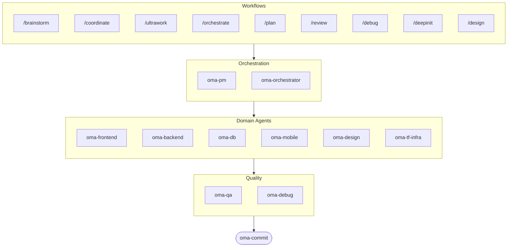

# oh-my-agent: Portable Multi-Agent Harness

[](https://www.npmjs.com/package/oh-my-agent) [](https://www.npmjs.com/package/oh-my-agent) [](https://github.com/first-fluke/oh-my-agent) [](https://github.com/first-fluke/oh-my-agent/blob/main/LICENSE) [](https://github.com/first-fluke/oh-my-agent/commits/main)

[English](../README.md) | [中文](./README.zh.md) | [Português](./README.pt.md) | [日本語](./README.ja.md) | [Français](./README.fr.md) | [Español](./README.es.md) | [Nederlands](./README.nl.md) | [Polski](./README.pl.md) | [Русский](./README.ru.md) | [Deutsch](./README.de.md)

AI 어시스턴트한테 동료가 있으면 좋겠다고 생각한 적 없나요? oh-my-agent가 바로 그겁니다.

AI 하나가 전부 다 하다가 중간에 길을 잃는 대신, oh-my-agent는 작업을 **전문 에이전트**들에게 나눠줍니다 — frontend, backend, QA, PM, DB, mobile, infra, debug, design 등등. 각 에이전트는 자기 영역을 깊이 알고, 전용 도구와 체크리스트를 갖고 있으며, 맡은 일에만 집중합니다.

주요 AI IDE 모두 지원: Antigravity, Claude Code, Cursor, Gemini CLI, Codex CLI, OpenCode 등.

## 빠른 시작

```bash
# 한 줄로 설치 (bun & uv 없으면 자동 설치)
curl -fsSL https://raw.githubusercontent.com/first-fluke/oh-my-agent/main/cli/install.sh | bash

# 또는 직접 실행
bunx oh-my-agent
```

프리셋 하나 고르면 바로 시작:

| 프리셋 | 구성 |
|--------|------|
| ✨ All | 모든 에이전트와 스킬 |
| 🌐 Fullstack | frontend + backend + db + pm + qa + debug + brainstorm + commit |
| 🎨 Frontend | frontend + pm + qa + debug + brainstorm + commit |
| ⚙️ Backend | backend + db + pm + qa + debug + brainstorm + commit |
| 📱 Mobile | mobile + pm + qa + debug + brainstorm + commit |
| 🚀 DevOps | tf-infra + dev-workflow + pm + qa + debug + brainstorm + commit |

## 에이전트 팀

| 에이전트 | 역할 |
|----------|------|
| **oma-brainstorm** | 구현 전에 아이디어를 탐색 |
| **oma-pm** | 작업 계획, 요구사항 분석, API 계약 정의 |
| **oma-frontend** | React/Next.js, TypeScript, Tailwind CSS v4, shadcn/ui |
| **oma-backend** | Python, Node.js, Rust로 API 개발 |
| **oma-db** | 스키마 설계, 마이그레이션, 인덱싱, vector DB |
| **oma-mobile** | Flutter 크로스플랫폼 앱 |
| **oma-design** | 디자인 시스템, 토큰, 접근성, 반응형 |
| **oma-qa** | OWASP 보안, 성능, 접근성 리뷰 |
| **oma-debug** | 근본 원인 분석, 수정, 회귀 테스트 |
| **oma-tf-infra** | 멀티 클라우드 Terraform IaC |
| **oma-dev-workflow** | CI/CD, 릴리스, 모노레포 자동화 |
| **oma-translator** | 자연스러운 다국어 번역 |
| **oma-orchestrator** | CLI를 통한 병렬 에이전트 실행 |
| **oma-commit** | 깔끔한 conventional commit |

## 작동 방식

그냥 채팅하세요. 원하는 걸 설명하면 oh-my-agent가 알아서 적절한 에이전트를 고릅니다.

```
You: "유저 인증이 있는 TODO 앱 만들어줘"
→ PM이 작업을 계획
→ Backend가 인증 API 구축
→ Frontend가 React UI 구축
→ DB가 스키마 설계
→ QA가 전체 리뷰
→ 완료: 조율된 코드, 리뷰 완료
```

또는 슬래시 커맨드로 구조화된 워크플로우를 실행:

| 커맨드 | 설명 |
|--------|------|
| `/plan` | PM이 기능을 태스크로 분해 |
| `/coordinate` | 단계별 멀티 에이전트 실행 |
| `/orchestrate` | 자동 병렬 에이전트 스포닝 |
| `/ultrawork` | 11개 리뷰 게이트가 포함된 5단계 품질 워크플로우 |
| `/review` | 보안 + 성능 + 접근성 감사 |
| `/debug` | 구조화된 근본 원인 디버깅 |
| `/design` | 7단계 디자인 시스템 워크플로우 |
| `/brainstorm` | 자유로운 아이디어 발산 |
| `/commit` | type/scope 분석 포함 conventional commit |

**자동 감지**: 슬래시 커맨드 없이도 메시지에 "계획", "리뷰", "디버그" 같은 키워드를 쓰면 (11개 언어 지원!) 알맞은 워크플로우가 자동으로 활성화됩니다.

## CLI

```bash
# 전역 설치
bun install --global oh-my-agent   # 또는: brew install oh-my-agent

# 어디서든 사용
oma doctor                  # 상태 점검
oma dashboard               # 실시간 에이전트 모니터링
oma agent:spawn backend "Build auth API" session-01
oma agent:parallel -i backend:"Auth API" frontend:"Login form"
```

## 왜 oh-my-agent인가?

- **이식성** — `.agents/`가 프로젝트와 함께 이동, 특정 IDE에 종속되지 않음
- **역할 기반** — 프롬프트 뭉치가 아니라 실제 엔지니어링 팀처럼 모델링
- **토큰 효율적** — 2레이어 스킬 설계로 토큰 ~75% 절약
- **품질 우선** — Charter preflight, quality gate, 리뷰 워크플로우 내장
- **멀티 벤더** — 에이전트 유형별로 Gemini, Claude, Codex, Qwen 혼용 가능
- **관찰 가능** — 터미널과 웹 대시보드로 실시간 모니터링

## 아키텍처



## 더 알아보기

- **[상세 문서](./AGENTS_SPEC.md)** — 전체 기술 스펙과 아키텍처
- **[지원 에이전트](./SUPPORTED_AGENTS.md)** — IDE별 에이전트 지원 현황
- **[웹 문서](https://oh-my-agent.dev)** — 가이드, 튜토리얼, CLI 레퍼런스

## 스폰서

이 프로젝트는 든든한 스폰서분들 덕분에 유지됩니다.

> **마음에 드셨나요?** 스타를 눌러주세요!
>
> ```bash
> gh api --method PUT /user/starred/first-fluke/oh-my-agent
> ```
>
> 최적화된 스타터 템플릿도 확인해보세요: [fullstack-starter](https://github.com/first-fluke/fullstack-starter)

<a href="https://github.com/sponsors/first-fluke">
  
</a>
<a href="https://buymeacoffee.com/firstfluke">
  
</a>

### 🚀 Champion

<!-- Champion tier ($100/mo) logos here -->

### 🛸 Booster

<!-- Booster tier ($30/mo) logos here -->

### ☕ Contributor

<!-- Contributor tier ($10/mo) names here -->

[스폰서 되기 →](https://github.com/sponsors/first-fluke)

전체 후원자 목록은 [SPONSORS.md](../SPONSORS.md)를 참고하세요.


## 라이선스

MIT
