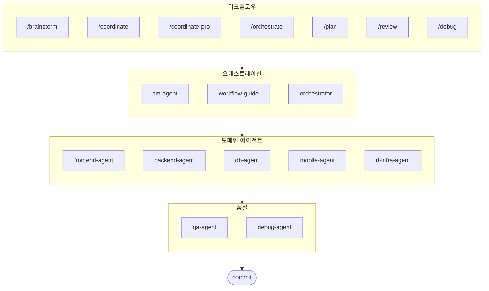

# oh-my-agent: 휴대용 멀티 에이전트 하네스

[](https://www.npmjs.com/package/oh-my-agent) [](https://www.npmjs.com/package/oh-my-agent) [](https://github.com/first-fluke/oh-my-agent) [](https://github.com/first-fluke/oh-my-agent/blob/main/LICENSE) [](https://github.com/first-fluke/oh-my-agent/commits/main)

[English](../README.md) | [中文](./README.zh.md) | [Português](./README.pt.md) | [日本語](./README.ja.md) | [Français](./README.fr.md) | [Español](./README.es.md) | [Nederlands](./README.nl.md) | [Polski](./README.pl.md) | [Русский](./README.ru.md) | [Deutsch](./README.de.md)

진지한 AI 지원 엔지니어링을 위한 휴대용, 역할 기반 에이전트 하네스입니다.

**Serena Memory**를 통해 10개의 전문 도메인 에이전트(PM, Frontend, Backend, DB, Mobile, QA, Debug, Brainstorm, DevWorkflow, Terraform)를 조율하세요. `oh-my-agent`는 휴대용 스킬 및 워크플로우의 단일 진실 공급원(source of truth)으로 `.agents/`를 사용한 다음 다른 AI IDE 및 CLI에 호환성을 투영합니다. 역할 기반 에이전트, 명시적 워크플로우, 실시간 관측 가능성 및 표준 인식 지침을 결합하여, AI 슬롭(slop)을 줄이고 더 훈련된 실행을 원하는 팀을 위한 것입니다.

## 목차

- [아키텍처](#아키텍처)
- [다른 점](#다른-점)
- [호환성](#호환성)
- [`.agents` 명세](#agents-명세)
- [이게 뭔가요?](#이게-뭔가요)
- [빠른 시작](#빠른-시작)
- [후원하기](#후원하기)
- [라이선스](#라이선스)

## 다른 점

- **`.agents/` 가 single source of truth**: 스킬, 워크플로우, 공유 리소스, 설정이 하나의 이식 가능한 프로젝트 구조에 저장되며, 특정 IDE 플러그인 안에 갇히지 않습니다.
- **역할 기반 에이전트 팀**: PM, QA, DB, Infra, Frontend, Backend, Mobile, Debug, Workflow 에이전트는 단순 프롬프트 모음이 아니라 엔지니어링 조직처럼 모델링됩니다.
- **워크플로우 우선 오케스트레이션**: 기획, 검토, 디버그, 조정 실행이 사후 처리가 아닌 일급 워크플로우로 취급됩니다.
- **표준 인지 설계**: 에이전트는 ISO 기반 기획, QA, 데이터베이스 연속성/보안, 인프라 거버넌스에 대한 집중 가이드를 제공합니다.
- **검증 중심 설계**: 대시보드, 매니페스트 생성, 공유 실행 프로토콜, 구조화된 출력은 단순 생성보다 추적 가능성을 우선시합니다.

## 호환성

`oh-my-agent` 는 `.agents/` 를 중심으로 설계되었으며, 필요시 다른 도구별 스킬 폴더와 브리징합니다.

| 도구 / IDE | 스킬 소스 | 상호운용 모드 | 참고 |
|------------|---------------|--------------|-------|
| Antigravity | `.agents/skills/` | 네이티브 | 주 single source-of-truth 레이아웃 |
| Claude Code | `.claude/skills/` + `.claude/agents/` | 네이티브 + 어댑터 | 도메인 스킬 심링크 + 네이티브 워크플로우 스킬, 서브에이전트, CLAUDE.md |
| OpenCode | `.agents/skills/` | 네이티브 호환 | 동일 프로젝트 레벨 스킬 소스 사용 |
| Amp | `.agents/skills/` | 네이티브 호환 | 동일 프로젝트 레벨 소스 공유 |
| Codex CLI | `.agents/skills/` | 네이티브 호환 | 동일 프로젝트 스킬 소스에서 작동 |
| Cursor | `.agents/skills/` | 네이티브 호환 | 동일 프로젝트 레벨 스킬 소스 소비 가능 |
| GitHub Copilot | `.github/skills/` | 선택적 심볼릭 링크 | 설정 중 선택 시 설치 |

자세한 지원 매트릭스와 상호운용성 노트는 [SUPPORTED_AGENTS.md](./SUPPORTED_AGENTS.md) 를 참고하세요.

### Claude Code 네이티브 통합

Claude Code는 심링크 이상의 일급 네이티브 통합을 지원합니다:

- **`CLAUDE.md`** — 프로젝트 정체성, 아키텍처, 규칙 (Claude Code가 자동 로딩)
- **`.claude/skills/`** — `.agents/workflows/`에서 매핑된 12개 워크플로우 스킬 (예: `/orchestrate`, `/coordinate`, `/ultrawork`)
- **`.claude/agents/`** — Task tool로 스폰되는 7개 서브에이전트 정의 (backend-impl, frontend-impl, mobile-impl, db-impl, qa-reviewer, debug-investigator, pm-planner)
- **네이티브 루프 패턴** — CLI 폴링 대신 Task tool 동기 결과를 활용한 Review Loop, Issue Remediation Loop, Phase Gate Loop

도메인 스킬(backend-agent, frontend-agent 등)은 `.agents/skills/`의 심링크로 유지됩니다. 워크플로우 스킬은 원본 `.agents/workflows/*.md`를 SSOT로 참조하는 네이티브 SKILL.md 파일입니다.

## `.agents` 명세

`oh-my-agent` 는 `.agents/` 를 에이전트 스킬, 워크플로우, 공유 컨텍스트를 위한 이식 가능한 프로젝트 규약으로 취급합니다.

- 스킬: `.agents/skills/<skill-name>/SKILL.md`
- 공유 리소스: `.agents/skills/_shared/`
- 워크플로우: `.agents/workflows/*.md`
- 프로젝트 설정: `.agents/config/`
- CLI 메타데이터 및 패키징: 생성된 매니페스트를 통해 정렬 유지

프로젝트 레이아웃, 필수 파일, 상호운용성 규칙, single source-of-truth 모델에 대한 자세한 내용은 [AGENTS_SPEC.md](./AGENTS_SPEC.md) 를 참고하세요.

## 이게 뭔가요?

멀티 에이전트 협업 개발을 위한 **Agent Skills** 모음입니다. 작업을 전문 에이전트에게 분배합니다:

| 에이전트 | 전문 분야 | 발동 키워드 |
|---------|----------|-----------|
| **Brainstorm** | 기획 전 설계 우선 아이디에이션 | "브레인스톰", "아이디어", "설계 탐색" |
| **Workflow Guide** | 복잡한 멀티 에이전트 프로젝트 조율 | "멀티 도메인", "복잡한 프로젝트" |
| **PM Agent** | 요구사항 분석, 태스크 분해, 아키텍처 설계 | "기획", "분석", "뭘 만들어야 할까" |
| **Frontend Agent** | React/Next.js, TypeScript, Tailwind CSS | "UI", "컴포넌트", "스타일링" |
| **Backend Agent** | FastAPI, PostgreSQL, JWT 인증 | "API", "데이터베이스", "인증" |
| **DB Agent** | SQL/NoSQL 모델링, 정규화, 무결성, 백업, 용량 산정 | "ERD", "스키마", "데이터베이스 설계", "인덱스 튜닝" |
| **Mobile Agent** | Flutter 크로스 플랫폼 개발 | "모바일 앱", "iOS/Android" |
| **QA Agent** | OWASP Top 10 보안, 성능, 접근성 감사 | "보안 검토", "감사", "성능 확인" |
| **Debug Agent** | 버그 진단, 근본 원인 분석, 회귀 테스트 | "버그", "에러", "크래시" |
| **Developer Workflow** | 모노레포 태스크 자동화, mise 태스크, CI/CD, 마이그레이션, 릴리스 | "개발 워크플로우", "mise 태스크", "CI/CD 파이프라인" |
| **TF Infra Agent** | 멀티 클라우드 IaC 프로비저닝 (AWS, GCP, Azure, OCI) | "인프라", "terraform", "클라우드 설정" |
| **Orchestrator** | CLI 기반 병렬 에이전트 실행 + Serena Memory | "에이전트 실행", "병렬 실행" |
| **Commit** | Conventional Commits 규칙 기반 커밋 관리 | "커밋", "변경사항 저장" |

## 아키텍처



## 빠른 시작

### 사전 요구 사항

- **AI IDE** (Antigravity, Claude Code, Codex, Gemini, etc.)
- **Bun** (CLI 및 대시보드용)
- **uv** (Serena 설정용)

### 옵션 1: 대화형 CLI (권장)

```bash
# bun이 없으면 먼저 설치:
# curl -fsSL https://bun.sh/install | bash

# uv가 없으면 먼저 설치:
# curl -LsSf https://astral.sh/uv/install.sh | sh

bunx oh-my-agent
```

프로젝트 타입을 선택하면 `.agents/skills/`에 스킬이 설치됩니다.

| 프리셋 | 스킬 |
|--------|--------|
| ✨ All | 전체 |
| 🌐 Fullstack | brainstorm, frontend, backend, db, pm, qa, debug, commit |
| 🎨 Frontend | brainstorm, frontend, pm, qa, debug, commit |
| ⚙️ Backend | brainstorm, backend, db, pm, qa, debug, commit |
| 📱 Mobile | brainstorm, mobile, pm, qa, debug, commit |
| 🚀 DevOps | brainstorm, tf-infra, dev-workflow, pm, qa, debug, commit |

### 옵션 2: 전역 설치 (Orchestrator용)

SubAgent Orchestrator를 사용하거나 도구를 전역에서 사용하려면:

```bash
bun install --global oh-my-agent
```

최소 1개의 CLI 도구가 필요합니다:

| CLI | 설치 | 인증 |
|-----|------|------|
| Gemini | `bun install --global @google/gemini-cli` | `gemini auth` |
| Claude | `curl -fsSL https://claude.ai/install.sh \| bash` | `claude auth` |
| Codex | `bun install --global @openai/codex` | `codex auth` |
| Qwen | `bun install --global @qwen-code/qwen` | `qwen auth` |

### 옵션 3: 기존 프로젝트에 통합하기

**권장 방법 (CLI):**

기존 프로젝트의 루트 디렉토리에서 다음 명령어를 실행하면 스킬과 워크플로우가 자동으로 설치됩니다:

```bash
bunx oh-my-agent
```

> **팁:** 설치 후 `bunx oh-my-agent doctor`를 실행하여 모든 설정(전역 워크플로우 포함)이 올바른지 확인하세요.


### 2. 채팅으로 사용

**명시적 조율** (유저가 워크플로우 호출):

```
/coordinate
→ 단계별: PM 기획 → 에이전트 생성 → QA 검토
```

**복잡한 프로젝트** (workflow-guide가 조율):

```
"사용자 인증이 있는 TODO 앱 만들어줘"
→ workflow-guide → PM Agent 기획 → Agent Manager에서 에이전트 생성
```

**간단한 작업** (단일 에이전트 자동 활성화):

```
"Tailwind CSS로 로그인 폼 만들어줘"
→ frontend-agent 자동 활성화
```

**변경사항 커밋** (Conventional Commits):

```
/commit
→ 변경 분석, 커밋 타입/스코프 제안, Co-Author 포함 커밋 생성
```

### 3. 대시보드로 모니터링

대시보드 설정과 상세 사용법은 [`web/content/ko/guide/usage.md`](./web/content/ko/guide/usage.md#실시간-대시보드)를 참고하세요.

## 후원하기

이 프로젝트는 후원자분들의 지원으로 유지됩니다.

> **마음에 드셨나요?** 스타 눌러주세요!
>
> ```bash
> gh api --method PUT /user/starred/first-fluke/oh-my-agent
> ```
>
> 최적화된 스타터 템플릿을 사용해 보세요: [fullstack-starter](https://github.com/first-fluke/fullstack-starter)

<a href="https://github.com/sponsors/first-fluke">
  
</a>
<a href="https://buymeacoffee.com/firstfluke">
  
</a>

### 🚀 Champion

<!-- Champion 티어 ($100/월) 로고 -->

### 🛸 Booster

<!-- Booster 티어 ($30/월) 로고 -->

### ☕ Contributor

<!-- Contributor 티어 ($10/월) 이름 -->

[후원자 되기 →](https://github.com/sponsors/first-fluke)

전체 후원자 목록은 [SPONSORS.md](./SPONSORS.md)를 참고하세요.

## 스타 히스토리

[](https://www.star-history.com/#first-fluke/oh-my-agent&type=date&legend=bottom-right)

## 라이선스

MIT
