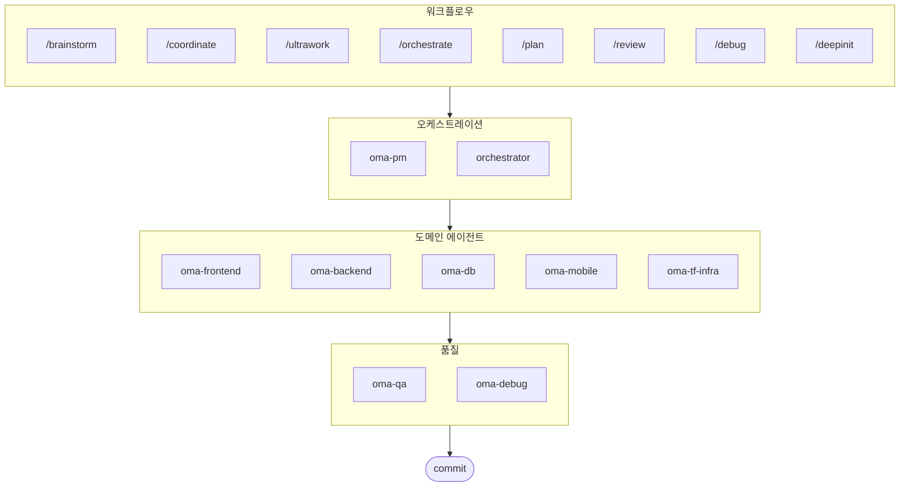

# oh-my-agent: 어디서든 쓸 수 있는 멀티 에이전트 하네스

[](https://www.npmjs.com/package/oh-my-agent) [](https://www.npmjs.com/package/oh-my-agent) [](https://github.com/first-fluke/oh-my-agent) [](https://github.com/first-fluke/oh-my-agent/blob/main/LICENSE) [](https://github.com/first-fluke/oh-my-agent/commits/main)

[English](../README.md) | [中文](./README.zh.md) | [Português](./README.pt.md) | [日本語](./README.ja.md) | [Français](./README.fr.md) | [Español](./README.es.md) | [Nederlands](./README.nl.md) | [Polski](./README.pl.md) | [Русский](./README.ru.md) | [Deutsch](./README.de.md)

AI로 제대로 개발하고 싶은 팀을 위한 에이전트 하네스. 역할별로 나뉘어 있고, 특정 IDE에 종속되지 않습니다.

**Serena Memory**로 10개 전문 에이전트(PM, Frontend, Backend, DB, Mobile, QA, Debug, Brainstorm, DevWorkflow, Terraform)를 조율합니다. `oh-my-agent`는 `.agents/`를 스킬과 워크플로우의 원본으로 쓰고, 여기서 다른 AI IDE나 CLI로 연결해줍니다. 역할이 정해진 에이전트, 명확한 워크플로우, 실시간 모니터링, 표준 기반 가이드를 합쳐서 AI가 대충 만든 코드를 줄이고 체계적으로 일할 수 있게 해줍니다.

## 목차

- [아키텍처](#아키텍처)
- [뭐가 다른가요?](#뭐가-다른가요)
- [호환성](#호환성)
- [`.agents` 명세](#agents-명세)
- [이게 뭔가요?](#이게-뭔가요)
- [빠른 시작](#빠른-시작)
- [후원하기](#후원하기)
- [라이선스](#라이선스)

## 아키텍처



## 뭐가 다른가요?

- **`.agents/`가 원본입니다**: 스킬, 워크플로우, 공유 리소스, 설정이 하나의 프로젝트 구조에 들어있어서 특정 IDE 플러그인에 갇히지 않습니다.
- **엔지니어링 조직처럼 굴러갑니다**: PM, QA, DB, Infra, Frontend, Backend, Mobile, Debug, Workflow 에이전트가 프롬프트 모음이 아니라 팀처럼 역할을 나눠 일합니다.
- **워크플로우가 먼저입니다**: 기획, 리뷰, 디버그, 조율 실행이 부가 기능이 아니라 핵심 워크플로우로 설계되어 있습니다.
- **표준을 알고 있습니다**: ISO 기반 기획, QA, DB 보안, 인프라 거버넌스 가이드가 에이전트에 내장되어 있습니다.
- **검증할 수 있습니다**: 대시보드, 매니페스트 생성, 실행 프로토콜, 구조화된 출력으로 결과를 추적할 수 있습니다. 그냥 만들어내기만 하는 게 아닙니다.

## 호환성

`oh-my-agent`는 `.agents/`를 중심으로 설계되어 있고, 필요하면 다른 도구의 스킬 폴더와 연결합니다.

| 도구 / IDE | 스킬 소스 | 연동 방식 | 참고 |
|------------|---------------|--------------|-------|
| Antigravity | `.agents/skills/` | 네이티브 | 원본 레이아웃; 커스텀 서브에이전트 스폰 미지원 |
| Claude Code | `.claude/skills/` + `.claude/agents/` | 네이티브 + 어댑터 | 도메인 스킬은 심링크, 워크플로우 스킬은 씬 라우터, 서브에이전트는 `.agents/agents/`에서 생성 |
| Codex CLI | `.codex/agents/` + `.agents/skills/` | 네이티브 + 어댑터 | `.agents/agents/`에서 TOML로 에이전트 정의 생성 (planned) |
| Gemini CLI | `.gemini/agents/` + `.agents/skills/` | 네이티브 + 어댑터 | `.agents/agents/`에서 MD로 에이전트 정의 생성 (planned) |
| OpenCode | `.agents/skills/` | 호환 | 같은 스킬 소스 사용 |
| Amp | `.agents/skills/` | 호환 | 같은 소스 공유 |
| Cursor | `.agents/skills/` | 호환 | 같은 스킬 소스 사용 가능 |
| GitHub Copilot | `.github/skills/` | 심링크 (선택) | 설정 시 선택하면 설치 |

지원 현황과 연동 방법은 [SUPPORTED_AGENTS.md](./SUPPORTED_AGENTS.md)를 참고하세요.

### Claude Code 네이티브 연동

Claude Code는 심링크를 넘어서 직접 연동됩니다:

- **`CLAUDE.md`** — 프로젝트 정보, 아키텍처, 규칙 (Claude Code가 자동으로 읽음)
- **`.claude/skills/`** — `.agents/workflows/`로 위임하는 12개 씬 라우터 SKILL.md (`/orchestrate`, `/coordinate`, `/ultrawork` 등). 슬래시 커맨드로 명시적 호출만 허용되며, 키워드 자동 활성화되지 않습니다.
- **`.claude/agents/`** — `.agents/agents/*.yaml`에서 생성된 7개 서브에이전트, Task tool로 스폰 (backend-engineer, frontend-engineer, mobile-engineer, db-engineer, qa-reviewer, debug-investigator, pm-planner)
- **루프 패턴** — CLI 폴링 없이 Task tool의 동기 결과를 활용하는 Review Loop, Issue Remediation Loop, Phase Gate Loop

도메인 스킬(oma-backend, oma-frontend 등)은 `.agents/skills/`에서 심링크로 가져옵니다. 워크플로우 스킬은 `.agents/workflows/*.md` 원본으로 위임하는 씬 라우터 SKILL.md 파일입니다.

## `.agents` 명세

`oh-my-agent`는 `.agents/`를 에이전트 스킬, 워크플로우, 공유 컨텍스트를 담는 프로젝트 규약으로 씁니다.

- 스킬: `.agents/skills/<skill-name>/SKILL.md`
- 추상 에이전트 정의: `.agents/agents/` (벤더 중립 SSOT; CLI가 `.claude/agents/`, `.codex/agents/` (planned), `.gemini/agents/` (planned)를 여기서 생성)
- 공유 리소스: `.agents/skills/_shared/`
- 워크플로우: `.agents/workflows/*.md`
- 프로젝트 설정: `.agents/config/`
- CLI 메타데이터와 패키징은 생성된 매니페스트로 관리

레이아웃, 필수 파일, 연동 규칙에 대한 자세한 내용은 [AGENTS_SPEC.md](./AGENTS_SPEC.md)를 참고하세요.

## 이게 뭔가요?

여러 에이전트가 협업해서 개발하는 **Agent Skills** 모음입니다. 전문 에이전트에게 역할을 나눠 맡깁니다:

| 에이전트 | 하는 일 | 이럴 때 불러요 |
|---------|----------|-----------|
| **Brainstorm** | 기획 전에 아이디어를 먼저 탐색 | "브레인스톰", "아이디어", "설계 탐색" |
| **PM Agent** | 요구사항 분석, 태스크 분해, 아키텍처 | "기획", "분석", "뭘 만들어야 할까" |
| **Frontend Agent** | React/Next.js, TypeScript, Tailwind CSS | "UI", "컴포넌트", "스타일링" |
| **Backend Agent** | Backend (Python, Node.js, Rust, ...) | "API", "데이터베이스", "인증" |
| **DB Agent** | SQL/NoSQL 모델링, 정규화, 무결성, 백업 | "ERD", "스키마", "DB 설계", "인덱스 튜닝" |
| **Mobile Agent** | Flutter 크로스 플랫폼 개발 | "모바일 앱", "iOS/Android" |
| **QA Agent** | OWASP Top 10 보안, 성능, 접근성 | "보안 검토", "감사", "성능 확인" |
| **Debug Agent** | 버그 진단, 원인 분석, 회귀 테스트 | "버그", "에러", "크래시" |
| **Developer Workflow** | 모노레포 자동화, mise, CI/CD, 릴리스 | "개발 워크플로우", "mise", "CI/CD" |
| **TF Infra Agent** | 멀티 클라우드 IaC (AWS, GCP, Azure, OCI) | "인프라", "terraform", "클라우드" |
| **Orchestrator** | CLI로 에이전트를 병렬 실행 + Serena Memory | "에이전트 실행", "병렬 실행" |
| **Commit** | Conventional Commits 규칙으로 커밋 | "커밋", "변경사항 저장" |

## 빠른 시작

### 필요한 것

- **AI IDE** (Antigravity, Claude Code, Codex, Gemini 등)

### 옵션 1: 한 줄 설치 (권장)

```bash
curl -fsSL https://raw.githubusercontent.com/first-fluke/oh-my-agent/main/cli/install.sh | bash
```

빠진 의존성(bun, uv)을 자동으로 찾아서 설치하고 대화형 설정을 시작합니다.

### 옵션 2: 직접 설치

```bash
# bun이 없으면:
# curl -fsSL https://bun.sh/install | bash

# uv가 없으면:
# curl -LsSf https://astral.sh/uv/install.sh | sh

bunx oh-my-agent
```

프로젝트 타입을 고르면 `.agents/skills/`에 스킬이 설치됩니다.

| 프리셋 | 스킬 |
|--------|--------|
| ✨ All | 전체 |
| 🌐 Fullstack | oma-brainstorm, oma-frontend, oma-backend, oma-db, oma-pm, oma-qa, oma-debug, oma-commit |
| 🎨 Frontend | oma-brainstorm, oma-frontend, oma-pm, oma-qa, oma-debug, oma-commit |
| ⚙️ Backend | oma-brainstorm, oma-backend, oma-db, oma-pm, oma-qa, oma-debug, oma-commit |
| 📱 Mobile | oma-brainstorm, oma-mobile, oma-pm, oma-qa, oma-debug, oma-commit |
| 🚀 DevOps | oma-brainstorm, oma-tf-infra, oma-dev-workflow, oma-pm, oma-qa, oma-debug, oma-commit |

### 옵션 3: 전역 설치 (Orchestrator용)

SubAgent Orchestrator를 쓰거나 도구를 전역에서 쓰려면:

```bash
bun install --global oh-my-agent
```

CLI 도구가 최소 1개 필요합니다:

| CLI | 설치 | 인증 |
|-----|------|------|
| Gemini | `bun install --global @google/gemini-cli` | Auto on first `gemini` run |
| Claude | `curl -fsSL https://claude.ai/install.sh \| bash` | Auto on first `claude` run |
| Codex | `bun install --global @openai/codex` | `codex login` |
| Qwen | `bun install --global @qwen-code/qwen-code` | `/auth` inside CLI |

### 옵션 4: 기존 프로젝트에 추가

프로젝트 루트에서 실행하면 스킬과 워크플로우가 자동 설치됩니다:

```bash
bunx oh-my-agent
```

> **팁:** 설치 후 `bunx oh-my-agent doctor`를 실행하면 설정이 제대로 됐는지 확인할 수 있습니다.

### 2. 채팅으로 쓰기

**복잡한 프로젝트** (/coordinate):

```
"사용자 인증이 있는 TODO 앱 만들어줘"
→ /coordinate → PM Agent가 기획 → Agent Manager에서 에이전트 실행
```

**전력 투구** (/ultrawork):

```
"인증 모듈 리팩토링, API 테스트 추가, 문서 업데이트"
→ /ultrawork → 독립된 작업이 에이전트 사이에서 동시 실행
```

**간단한 작업** (도메인 스킬 직접 호출):

```
"Tailwind CSS로 로그인 폼 만들어줘"
→ oma-frontend 스킬
```

**커밋** (Conventional Commits):

```
/commit
→ 변경 분석, 커밋 타입/스코프 제안, Co-Author 포함 커밋
```

### 3. 대시보드로 모니터링

대시보드 설정과 사용법은 [`web/content/ko/guide/usage.md`](./web/content/ko/guide/usage.md#실시간-대시보드)를 참고하세요.

## 후원하기

이 프로젝트는 후원자분들 덕분에 유지됩니다.

> **마음에 드셨나요?** 스타 눌러주세요!
>
> ```bash
> gh api --method PUT /user/starred/first-fluke/oh-my-agent
> ```
>
> 스타터 템플릿도 있습니다: [fullstack-starter](https://github.com/first-fluke/fullstack-starter)

<a href="https://github.com/sponsors/first-fluke">
  
</a>
<a href="https://buymeacoffee.com/firstfluke">
  
</a>

### 🚀 Champion

<!-- Champion ($100/월) 로고 -->

### 🛸 Booster

<!-- Booster ($30/월) 로고 -->

### ☕ Contributor

<!-- Contributor ($10/월) 이름 -->

[후원자 되기 →](https://github.com/sponsors/first-fluke)

전체 후원자 목록은 [SPONSORS.md](./SPONSORS.md)를 참고하세요.

## 스타 히스토리

[](https://www.star-history.com/#first-fluke/oh-my-agent&type=date&legend=bottom-right)

## 라이선스

MIT
