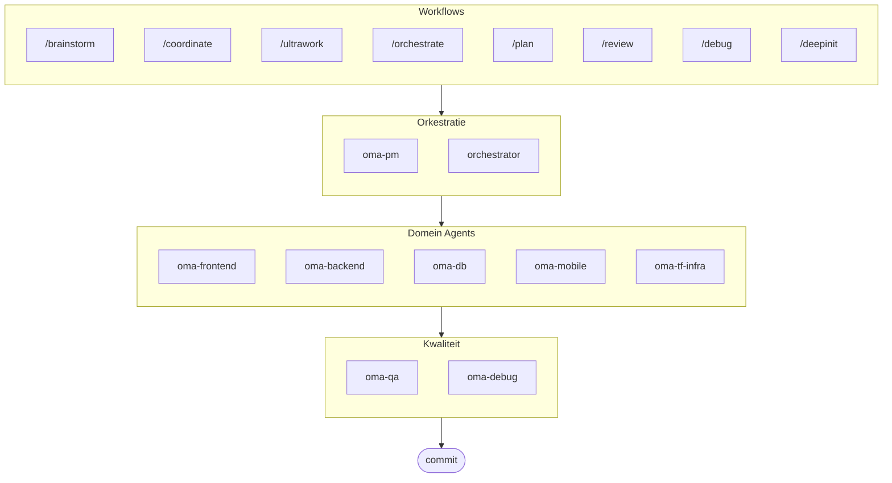

# oh-my-agent: Draagbaar Multi-Agent Harnas

[](https://www.npmjs.com/package/oh-my-agent) [](https://www.npmjs.com/package/oh-my-agent) [](https://github.com/first-fluke/oh-my-agent) [](https://github.com/first-fluke/oh-my-agent/blob/main/LICENSE) [](https://github.com/first-fluke/oh-my-agent/commits/main)

[English](../README.md) | [한국어](./README.ko.md) | [中文](./README.zh.md) | [Português](./README.pt.md) | [日本語](./README.ja.md) | [Français](./README.fr.md) | [Español](./README.es.md) | [Polski](./README.pl.md) | [Русский](./README.ru.md) | [Deutsch](./README.de.md)

Het draagbare, rolgebaseerde agentharnas voor serieuze AI-ondersteunde engineering.

Orkestreer 10 gespecialiseerde domeinagents (PM, Frontend, Backend, DB, Mobile, QA, Debug, Brainstorm, DevWorkflow, Terraform) via **Serena Memory**. `oh-my-agent` gebruikt `.agents/` als de enige bron van waarheid voor draagbare vaardigheden en workflows, en slaat een brug naar andere AI IDE's en CLI's zodat ze dezelfde skills kunnen gebruiken. Het combineert rolgebaseerde agents, expliciete workflows, realtime waarneembaarheid en standaardbewuste begeleiding voor teams die minder AI-rommel en een meer gedisciplineerde uitvoering willen.

> **Vind je dit project leuk?** Geef het een ster!
>
> ```bash
> gh api --method PUT /user/starred/first-fluke/oh-my-agent
> ```
>
> Probeer onze geoptimaliseerde starter template: [fullstack-starter](https://github.com/first-fluke/fullstack-starter)

## Inhoudsopgave

- [Architectuur](#architectuur)
- [Waarom anders](#waarom-anders)
- [Compatibiliteit](#compatibiliteit)
- [`.agents` Specificatie](#agents-specificatie)
- [Wat is dit?](#wat-is-dit)
- [Snel starten](#snel-starten)
- [Sponsors](#sponsors)
- [Licentie](#licentie)

## Waarom anders

- **`.agents/` is de bron van waarheid**: skills, workflows, gedeelde bronnen en configuratie leven in één draagbare projectstructuur in plaats van gevangen te zitten in één IDE-plugin.
- **Rolgebaseerde agentteams**: PM, QA, DB, Infra, Frontend, Backend, Mobile, Debug en Workflow agents zijn gemodelleerd als een engineeringorganisatie, niet zomaar een stapel prompts.
- **Workflow-first orchestratie**: planning, review, debug en gecoördineerde uitvoering zijn first-class workflows, geen nagedachten.
- **Standaard-bewust ontwerp**: agents dragen nu gerichte begeleiding voor ISO-gedreven planning, QA, databasecontinuïteit/veiligheid en infrastructuurgovernance.
- **Gebouwd voor verificatie**: dashboards, manifestgeneratie, gedeelde uitvoeringsprotocollen en gestructureerde uitvoer geven de voorkeur aan traceerbaarheid boven alleen-vibe-generatie.

## Compatibiliteit

`oh-my-agent` is ontworpen rond `.agents/` en overbrugt dan naar andere toolspecifieke skillmappen wanneer nodig.

| Tool / IDE | Skill Bron | Interop Mode | Notities |
|------------|---------------|--------------|-------|
| Antigravity | `.agents/skills/` | Native | Primaire bron-van-waarheid lay-out |
| Claude Code | `.claude/skills/` + `.claude/agents/` | Native + Adapter | domeinskills via symlink, workflow skills / subagents / CLAUDE.md native |
| OpenCode | `.agents/skills/` | Native-compatibel | Gebruikt dezelfde projectniveau skillbron |
| Amp | `.agents/skills/` | Native-compatibel | Deelt dezelfde projectniveau bron |
| Codex CLI | `.agents/skills/` | Native-compatibel | Werkt vanaf dezelfde project skillbron |
| Cursor | `.agents/skills/` | Native-compatibel | Kan dezelfde projectniveau skillbron consumeren |
| GitHub Copilot | `.github/skills/` | Optionele symlink | Geïnstalleerd wanneer geselecteerd tijdens setup |

Zie [SUPPORTED_AGENTS.md](./SUPPORTED_AGENTS.md) voor de huidige supportmatrix en interoperabiliteitsnotities.

## Native integratie met Claude Code

Claude Code heeft native eersteklas ondersteuning via drie mechanismen:

- **`CLAUDE.md`** — wordt automatisch geladen bij elke sessiestart; bevat projectinformatie, architectuur en gedragsregels voor agents.
- **`.claude/skills/`** — 12 workflow skills gekoppeld aan `.agents/workflows/` (bijv. `/orchestrate`, `/coordinate`, `/ultrawork`). Domeinskills zijn gesymlinkt vanuit `.agents/skills/`.
- **`.claude/agents/`** — 7 subagents die via de Task tool worden aangeroepen: `backend-engineer`, `frontend-engineer`, `mobile-engineer`, `db-engineer`, `qa-reviewer`, `debug-investigator`, `pm-planner`.

Luspatronen (Review Loop, Issue Remediation Loop, Phase Gate Loop) draaien rechtstreeks binnen Claude Code zonder externe CLI-polling.

## `.agents` Specificatie

`oh-my-agent` behandelt `.agents/` als een draagbare projectconventie voor agent skills, workflows en gedeelde context.

- Skills leven in `.agents/skills/<skill-name>/SKILL.md`
- Gedeelde bronnen leven in `.agents/skills/_shared/`
- Workflows leven in `.agents/workflows/*.md`
- Projectconfiguratie leeft in `.agents/config/`
- CLI-metagegevens en verpakking blijven uitgelijnd via gegenereerde manifesten

Zie [AGENTS_SPEC.md](./AGENTS_SPEC.md) voor de projectlay-out, vereiste bestanden, interoperabiliteitsregels en bron-van-waarheid model.

## Architectuur



## Wat is dit?

Een verzameling **Agent Skills** die collaboratieve multi-agent ontwikkeling mogelijk maken. Werk wordt verdeeld over expert agents:

| Agent | Specialisatie | Triggers |
|-------|---------------|----------|
| **Brainstorm** | Design-first ideatie vóór planning | "brainstorm", "ideate", "explore idea" |
| **PM Agent** | Requirements analyse, taak decompositie, architectuur | "plan", "onderverdelen", "wat moeten we bouwen" |
| **Frontend Agent** | React/Next.js, TypeScript, Tailwind CSS | "UI", "component", "styling" |
| **Backend Agent** | Backend (Python, Node.js, Rust, ...) | "API", "database", "authenticatie" |
| **DB Agent** | SQL/NoSQL-modellering, normalisatie, integriteit, back-up, capaciteitsplanning | "ERD", "schema", "databaseontwerp", "index-tuning" |
| **Mobile Agent** | Flutter cross-platform ontwikkeling | "mobiele app", "iOS/Android" |
| **QA Agent** | OWASP Top 10 beveiliging, prestaties, toegankelijkheid | "bekijk beveiliging", "audit", "controleer prestaties" |
| **Debug Agent** | Bug diagnose, root cause analyse, regressietests | "bug", "fout", "crash" |
| **Developer Workflow** | Monorepo-taakautomatisering, mise-taken, CI/CD, migraties, release | "dev workflow", "mise-taken", "CI/CD-pipeline" |
| **TF Infra Agent** | Multi-cloud IaC-provisioning (AWS, GCP, Azure, OCI) | "infrastructuur", "terraform", "cloud-setup" |
| **Orchestrator** | CLI-gebaseerde parallelle agent uitvoering met Serena Memory | "spawn agent", "parallelle uitvoering" |
| **Commit** | Conventional Commits met projectspecifieke regels | "commit", "wijzigingen opslaan" |

## Snel starten

### Vereisten

- **AI IDE** (Antigravity, Claude Code, Codex, Gemini, etc.)

### Optie 1: Installatie in één regel (aanbevolen)

```bash
curl -fsSL https://raw.githubusercontent.com/first-fluke/oh-my-agent/main/cli/install.sh | bash
```

Detecteert en installeert automatisch ontbrekende afhankelijkheden (bun, uv) en start vervolgens de interactieve setup.

### Optie 2: Handmatige installatie

```bash
# Installeer bun als je het nog niet hebt:
# curl -fsSL https://bun.sh/install | bash

# Installeer uv als je het nog niet hebt:
# curl -LsSf https://astral.sh/uv/install.sh | sh

bunx oh-my-agent
```

Selecteer je projecttype en skills worden geïnstalleerd in `.agents/skills/`.

| Preset | Skills |
|--------|--------|
| ✨ All | Alles |
| 🌐 Fullstack | oma-brainstorm, oma-frontend, oma-backend, oma-db, oma-pm, oma-qa, oma-debug, oma-commit |
| 🎨 Frontend | oma-brainstorm, oma-frontend, oma-pm, oma-qa, oma-debug, oma-commit |
| ⚙️ Backend | oma-brainstorm, oma-backend, oma-db, oma-pm, oma-qa, oma-debug, oma-commit |
| 📱 Mobile | oma-brainstorm, oma-mobile, oma-pm, oma-qa, oma-debug, oma-commit |
| 🚀 DevOps | oma-brainstorm, oma-tf-infra, oma-dev-workflow, oma-pm, oma-qa, oma-debug, oma-commit |

### Optie 3: Globale installatie (voor Orchestrator)

Om de core tools globaal te gebruiken of de SubAgent Orchestrator uit te voeren:

```bash
bun install --global oh-my-agent
```

Je hebt ook minimaal één CLI tool nodig:

| CLI | Installeren | Authenticatie |
|-----|-------------|---------------|
| Gemini | `bun install --global @google/gemini-cli` | Auto on first `gemini` run |
| Claude | `curl -fsSL https://claude.ai/install.sh \| bash` | Auto on first `claude` run |
| Codex | `bun install --global @openai/codex` | `codex login` |
| Qwen | `bun install --global @qwen-code/qwen-code` | `/auth` inside CLI |

### Optie 4: Integreren in bestaand project

**Aanbevolen (CLI):**

Voer het volgende commando uit in je projectroot om automatisch skills en workflows te installeren/updaten:

```bash
bunx oh-my-agent
```

> **Tip:** Voer `bunx oh-my-agent doctor` uit na installatie om te verifiëren dat alles correct is ingesteld (inclusief globale workflows).

### 2. Chat

**Eenvoudige taak** (enkele agent activeert automatisch):

```
"Maak een loginformulier met Tailwind CSS en formuliervalidatie"
→ oma-frontend activeert
```

**Complex project** (/coordinate workflow):

```
"Bouw een TODO app met gebruikersauthenticatie"
→ /coordinate → PM Agent plant → agents gespawned in Agent Manager
```

**Maximale inzet** (/ultrawork workflow):

```
"Auth module refactoren, API tests toevoegen en docs updaten"
→ /ultrawork → Onafhankelijke taken worden parallel uitgevoerd over agenten
```

**Wijzigingen committen** (conventional commits):

```
/commit
→ Analyseer wijzigingen, stel commit type/scope voor, creëer commit met Co-Author
```

### 3. Monitoren met dashboards

Voor dashboard setup en gebruiksdetails, zie [`web/content/nl/guide/usage.md`](./web/content/nl/guide/usage.md#realtime-dashboards).

## Sponsors

Dit project wordt onderhouden dankzij onze genereuze sponsors.

<a href="https://github.com/sponsors/first-fluke">
  
</a>
<a href="https://buymeacoffee.com/firstfluke">
  
</a>

### 🚀 Champion

<!-- Champion tier ($100/mo) logo's hier -->

### 🛸 Booster

<!-- Booster tier ($30/mo) logo's hier -->

### ☕ Contributor

<!-- Contributor tier ($10/mo) namen hier -->

[Word sponsor →](https://github.com/sponsors/first-fluke)

Zie [SPONSORS.md](./SPONSORS.md) voor een volledige lijst van supporters.

## Star History

[](https://www.star-history.com/#first-fluke/oh-my-agent&type=date&legend=bottom-right)

## Licentie

MIT
