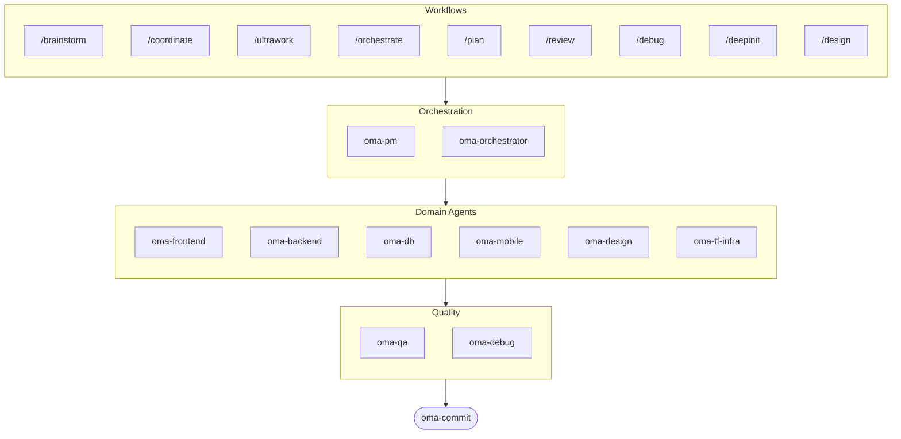

# oh-my-agent: Portable Multi-Agent Harness

[](https://www.npmjs.com/package/oh-my-agent) [](https://www.npmjs.com/package/oh-my-agent) [](https://github.com/first-fluke/oh-my-agent) [](https://github.com/first-fluke/oh-my-agent/blob/main/LICENSE) [](https://github.com/first-fluke/oh-my-agent/commits/main)

[English](../README.md) | [한국어](./README.ko.md) | [中文](./README.zh.md) | [Português](./README.pt.md) | [日本語](./README.ja.md) | [Français](./README.fr.md) | [Español](./README.es.md) | [Polski](./README.pl.md) | [Русский](./README.ru.md) | [Deutsch](./README.de.md)

Ooit gewenst dat je AI-assistent collega's had? Dat is precies wat oh-my-agent doet.

In plaats van een enkele AI die alles doet (en halverwege de draad kwijtraakt), verdeelt oh-my-agent het werk over **gespecialiseerde agents** — frontend, backend, QA, PM, DB, mobile, infra, debug, design en meer. Elk van hen kent zijn domein door en door, heeft eigen tools en checklists, en blijft in zijn eigen baan.

Werkt met alle grote AI IDE's: Antigravity, Claude Code, Cursor, Gemini CLI, Codex CLI, OpenCode en meer.

## Snel starten

```bash
# Eenregelig (installeert bun & uv automatisch als ze ontbreken)
curl -fsSL https://raw.githubusercontent.com/first-fluke/oh-my-agent/main/cli/install.sh | bash

# Of handmatig
bunx oh-my-agent
```

Kies een preset en je bent klaar:

| Preset | Wat je krijgt |
|--------|-------------|
| ✨ All | Alle agents en skills |
| 🌐 Fullstack | frontend + backend + db + pm + qa + debug + brainstorm + commit |
| 🎨 Frontend | frontend + pm + qa + debug + brainstorm + commit |
| ⚙️ Backend | backend + db + pm + qa + debug + brainstorm + commit |
| 📱 Mobile | mobile + pm + qa + debug + brainstorm + commit |
| 🚀 DevOps | tf-infra + dev-workflow + pm + qa + debug + brainstorm + commit |

## Jouw Agent Team

| Agent | Wat ze doen |
|-------|-------------|
| **oma-brainstorm** | Verkent ideeen voordat je begint met bouwen |
| **oma-pm** | Plant taken, splitst requirements op, definieert API-contracten |
| **oma-frontend** | React/Next.js, TypeScript, Tailwind CSS v4, shadcn/ui |
| **oma-backend** | API's in Python, Node.js of Rust |
| **oma-db** | Schema-ontwerp, migraties, indexering, vector DB |
| **oma-mobile** | Cross-platform apps met Flutter |
| **oma-design** | Design systems, tokens, toegankelijkheid, responsive |
| **oma-qa** | OWASP-beveiliging, performance, toegankelijkheidsreview |
| **oma-debug** | Root cause-analyse, fixes, regressietests |
| **oma-tf-infra** | Multi-cloud Terraform IaC |
| **oma-dev-workflow** | CI/CD, releases, monorepo-automatisering |
| **oma-translator** | Natuurlijke meertalige vertaling |
| **oma-orchestrator** | Parallelle agent-uitvoering via CLI |
| **oma-commit** | Nette conventional commits |

## Hoe het werkt

Gewoon chatten. Beschrijf wat je wilt en oh-my-agent zoekt uit welke agents nodig zijn.

```
Jij: "Bouw een TODO-app met gebruikersauthenticatie"
→ PM plant het werk
→ Backend bouwt de auth API
→ Frontend bouwt de React UI
→ DB ontwerpt het schema
→ QA reviewt alles
→ Klaar: gecoordineerde, gereviewde code
```

Of gebruik slash commands voor gestructureerde workflows:

| Commando | Wat het doet |
|---------|-------------|
| `/plan` | PM splitst je feature op in taken |
| `/coordinate` | Stapsgewijze multi-agent uitvoering |
| `/orchestrate` | Automatische parallelle agent-spawning |
| `/ultrawork` | 5-fasen kwaliteitsworkflow met 11 review gates |
| `/review` | Beveiligings- + performance- + toegankelijkheidsaudit |
| `/debug` | Gestructureerde root cause-debugging |
| `/design` | 7-fasen design system workflow |
| `/brainstorm` | Vrije brainstorm |
| `/commit` | Conventional commit met type/scope-analyse |

**Autodetectie**: Je hebt de slash commands niet eens nodig — woorden als "plan", "review", "debug" in je bericht (in 11 talen!) activeren automatisch de juiste workflow.

## CLI

```bash
# Globaal installeren
bun install --global oh-my-agent   # of: brew install oh-my-agent

# Overal gebruiken
oma doctor                  # Health check
oma dashboard               # Realtime agent-monitoring
oma agent:spawn backend "Build auth API" session-01
oma agent:parallel -i backend:"Auth API" frontend:"Login form"
```

## Waarom oh-my-agent?

- **Draagbaar** — `.agents/` reist mee met je project, niet opgesloten in een IDE
- **Rolgebaseerd** — Agents gemodelleerd als een echt engineeringteam, niet een stapel prompts
- **Token-efficient** — Tweelaags skill-ontwerp bespaart ~75% tokens
- **Kwaliteit eerst** — Charter preflight, quality gates en review-workflows ingebouwd
- **Multi-vendor** — Mix Gemini, Claude, Codex en Qwen per agent-type
- **Observeerbaar** — Terminal- en webdashboards voor realtime monitoring

## Architectuur



## Meer informatie

- **[Uitgebreide documentatie](./AGENTS_SPEC.md)** — Volledige technische spec en architectuur
- **[Ondersteunde agents](./SUPPORTED_AGENTS.md)** — Agent-ondersteuningsmatrix per IDE
- **[Webdocs](https://oh-my-agent.dev)** — Handleidingen, tutorials en CLI-referentie

## Sponsors

Dit project wordt onderhouden dankzij onze gulle sponsors.

> **Vind je dit project leuk?** Geef een ster!
>
> ```bash
> gh api --method PUT /user/starred/first-fluke/oh-my-agent
> ```
>
> Probeer onze geoptimaliseerde startertemplate: [fullstack-starter](https://github.com/first-fluke/fullstack-starter)

<a href="https://github.com/sponsors/first-fluke">
  
</a>
<a href="https://buymeacoffee.com/firstfluke">
  
</a>

### 🚀 Champion

<!-- Champion tier ($100/mo) logos here -->

### 🛸 Booster

<!-- Booster tier ($30/mo) logos here -->

### ☕ Contributor

<!-- Contributor tier ($10/mo) names here -->

[Word sponsor →](https://github.com/sponsors/first-fluke)

Zie [SPONSORS.md](../SPONSORS.md) voor de volledige lijst van supporters.


## Licentie

MIT
