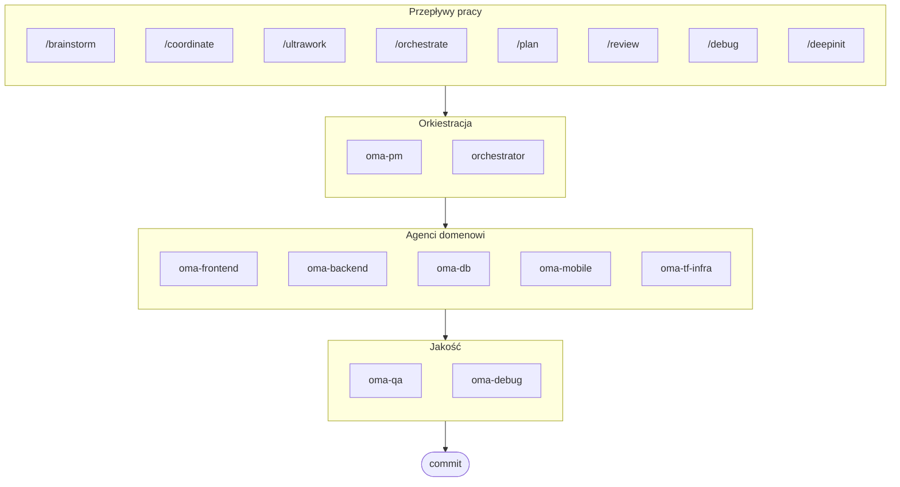

# oh-my-agent: Przenośna Uprząż Wielu Agentów

[](https://www.npmjs.com/package/oh-my-agent) [](https://www.npmjs.com/package/oh-my-agent) [](https://github.com/first-fluke/oh-my-agent) [](https://github.com/first-fluke/oh-my-agent/blob/main/LICENSE) [](https://github.com/first-fluke/oh-my-agent/commits/main)

[English](../README.md) | [한국어](./README.ko.md) | [中文](./README.zh.md) | [Português](./README.pt.md) | [日本語](./README.ja.md) | [Français](./README.fr.md) | [Español](./README.es.md) | [Nederlands](./README.nl.md) | [Русский](./README.ru.md) | [Deutsch](./README.de.md)

Przenośna, oparta na rolach uprząż dla agentów do poważnej inżynierii wspomaganej przez AI.

Orkiestruj 10 wyspecjalizowanymi agentami domenowymi (PM, Frontend, Backend, DB, Mobile, QA, Debug, Brainstorm, DevWorkflow, Terraform) za pośrednictwem **Serena Memory**. `oh-my-agent` używa `.agents/` jako źródła prawdy dla przenośnych umiejętności i przepływów pracy, a następnie zapewnia integrację z innymi środowiskami IDE i interfejsami CLI AI. Łączy opartych na rolach agentów, jawne przepływy pracy, obserwowalność w czasie rzeczywistym i wskazówki uwzględniające standardy dla zespołów, które chcą mniej bałaganu związanego z AI i bardziej zdyscyplinowanego wykonywania zadań.

> **Podoba Ci się ten projekt?** Daj mu gwiazdkę!
>
> ```bash
> gh api --method PUT /user/starred/first-fluke/oh-my-agent
> ```
>
> Wypróbuj nasz zoptymalizowany szablon startowy: [fullstack-starter](https://github.com/first-fluke/fullstack-starter)

## Spis treści

- [Architektura](#architektura)
- [Dlaczego inaczej](#dlaczego-inaczej)
- [Kompatybilność](#kompatybilność)
- [Specyfikacja `.agents`](#specyfikacja-agents)
- [Co to jest?](#co-to-jest)
- [Szybki start](#szybki-start)
- [Sponsorzy](#sponsorzy)
- [Licencja](#licencja)

## Dlaczego inaczej

- **`.agents/` jest źródłem prawdy**: skills, workflows, zasoby współdzielone i konfiguracja żyją w jednej przenośnej strukturze projektu zamiast być uwięzione wewnątrz jednego pluginu IDE.
- **Zespoły agentów oparte na rolach**: agenci PM, QA, DB, Infra, Frontend, Backend, Mobile, Debug i Workflow są modelowani jak organizacja inżynierska, a nie tylko sterta promptów.
- **Orkiestracja workflow-first**: planowanie, przegląd, debugowanie i skoordynowane wykonanie to workflows pierwszej klasy, a nie przemyślenia po fakcie.
- **Projekt świadomy standardów**: agenci teraz przenoszą ukierunkowane wskazówki dla planowania ISO, QA, ciągłości/bezpieczeństwa baz danych i zarządzania infrastrukturą.
- **Zbudowany do weryfikacji**: dashboardy, generowanie manifestów, współdzielone protokoły wykonania i strukturyzowane wyjścia faworyzują możliwości śledzenia nad generowaniem tylko na podstawie odczuć.

## Kompatybilność

`oh-my-agent` jest zaprojektowany wokół `.agents/` i następnie mostkuje do innych folderów skills specyficznych dla narzędzi, gdy jest to potrzebne.

| Narzędzie / IDE | Źródło Skills | Tryb Interoperacyjności | Uwagi |
|------------|---------------|--------------|-------|
| Antigravity | `.agents/skills/` | Natywny | Główny układ źródła-prawdy; brak niestandardowych subagentów |
| Claude Code | `.claude/skills/` + `.claude/agents/` | Natywny + Adapter | Skills domenowe przez dowiązanie symboliczne, skills workflow jako thin routery, subagenty generowane z `.agents/agents/` |
| Codex CLI | `.codex/agents/` + `.agents/skills/` | Natywny + Adapter | Definicje agentów w TOML generowane z `.agents/agents/` (planned) |
| Gemini CLI | `.gemini/agents/` + `.agents/skills/` | Natywny + Adapter | Definicje agentów w MD generowane z `.agents/agents/` (planned) |
| OpenCode | `.agents/skills/` | Natywnie-kompatybilny | Używa tego samego źródła skills na poziomie projektu |
| Amp | `.agents/skills/` | Natywnie-kompatybilny | Dzieli to samo źródło na poziomie projektu |
| Cursor | `.agents/skills/` | Natywnie-kompatybilny | Może konsumować to samo źródło skills na poziomie projektu |
| GitHub Copilot | `.github/skills/` | Opcjonalne dowiązanie | Instalowane po wybraniu podczas konfiguracji |

Zobacz [SUPPORTED_AGENTS.md](./SUPPORTED_AGENTS.md) dla aktualnej macierzy wsparcia i uwag o interoperacyjności.

## Natywna integracja z Claude Code

Claude Code obsługuje `oh-my-agent` w pełni natywnie — bez żadnych wtyczek.

- **`CLAUDE.md`** — plik ładowany automatycznie przy starcie; zawiera informacje o projekcie, architekturę i zasady działania agentów.
- **`.claude/skills/`** — 12 plików SKILL.md thin router delegujących do `.agents/workflows/` (np. `/orchestrate`, `/coordinate`, `/ultrawork`). Skills są wywoływane jawnie przez komendy slash, bez automatycznej aktywacji słowami kluczowymi.
- **`.claude/agents/`** — 7 subagentów wygenerowanych z `.agents/agents/*.yaml`, uruchamianych przez Task tool: `backend-engineer`, `frontend-engineer`, `mobile-engineer`, `db-engineer`, `qa-reviewer`, `debug-investigator`, `pm-planner`.
- **Wzorce pętli** — Review Loop, Issue Remediation Loop i Phase Gate Loop działają bez odpytywania CLI; Task tool zwraca wyniki synchronicznie.

## Specyfikacja `.agents`

`oh-my-agent` traktuje `.agents/` jako przenośną konwencję projektu dla skills, workflows i współdzielonego kontekstu agentów.

- Skills żyją w `.agents/skills/<skill-name>/SKILL.md`
- Abstrakcyjne definicje agentów żyją w `.agents/agents/` (SSOT neutralne wobec dostawców; CLI generuje `.claude/agents/`, `.codex/agents/` (planned), `.gemini/agents/` (planned) z nich)
- Zasoby współdzielone żyją w `.agents/skills/_shared/`
- Workflows żyją w `.agents/workflows/*.md`
- Konfiguracja projektu żyje w `.agents/config/`
- Metadane CLI i pakowanie pozostają wyrównane poprzez generowane manifesty

Zobacz [AGENTS_SPEC.md](./AGENTS_SPEC.md) dla układu projektu, wymaganych plików, reguł interoperacyjności i modelu źródła-prawdy.

## Architektura



## Co to jest?

Kolekcja **Agent Skills** umożliwiających współpracę multi-agentową w rozwoju. Praca jest dystrybuowana pomiędzy wyspecjalizowanych agentów:

| Agent | Specjalizacja | Wyzwalacze |
|-------|---------------|----------|
| **Brainstorm** | Ideacja design-first przed planowaniem | "brainstorm", "ideate", "explore idea" |
| **PM Agent** | Analiza wymagań, dekompozycja zadań, architektura | "zaplanuj", "rozbij", "co powinniśmy zbudować" |
| **Frontend Agent** | React/Next.js, TypeScript, Tailwind CSS | "UI", "komponent", "stylizacja" |
| **Backend Agent** | Backend (Python, Node.js, Rust, ...) | "API", "baza danych", "uwierzytelnianie" |
| **DB Agent** | Modelowanie SQL/NoSQL, normalizacja, integralność, backup, pojemność | "ERD", "schemat", "projekt bazy danych", "strojenie indeksów" |
| **Mobile Agent** | Rozwój wieloplatformowy Flutter | "aplikacja mobilna", "iOS/Android" |
| **QA Agent** | Bezpieczeństwo OWASP Top 10, wydajność, dostępność | "sprawdź bezpieczeństwo", "audyt", "sprawdź wydajność" |
| **Debug Agent** | Diagnoza błędów, analiza przyczyn źródłowych, testy regresji | "błąd", "error", "crash" |
| **Developer Workflow** | Automatyzacja zadań monorepo, zadania mise, CI/CD, migracje, release | "workflow dev", "zadania mise", "pipeline CI/CD" |
| **TF Infra Agent** | Wielochmurowy provisioning IaC (AWS, GCP, Azure, OCI) | "infrastruktura", "terraform", "konfiguracja chmury" |
| **Orchestrator** | Równoległe wykonywanie agentów przez CLI z Serena Memory | "uruchom agenta", "wykonanie równoległe" |
| **Commit** | Conventional Commits z regułami specyficznymi dla projektu | "commit", "zapisz zmiany" |

## Szybki start

### Wymagania wstępne

- **AI IDE** (Antigravity, Claude Code, Codex, Gemini, etc.)

### Opcja 1: Instalacja jedną linią (Zalecane)

```bash
curl -fsSL https://raw.githubusercontent.com/first-fluke/oh-my-agent/main/cli/install.sh | bash
```

Automatycznie wykrywa i instaluje brakujące zależności (bun, uv), a następnie uruchamia interaktywną konfigurację.

### Opcja 2: Instalacja ręczna

```bash
# Zainstaluj bun jeśli go nie masz:
# curl -fsSL https://bun.sh/install | bash

# Zainstaluj uv jeśli go nie masz:
# curl -LsSf https://astral.sh/uv/install.sh | sh

bunx oh-my-agent
```

Wybierz typ projektu, a umiejętności zostaną zainstalowane w `.agents/skills/`.

| Predefiniowany | Umiejętności |
|--------|--------|
| ✨ All | Wszystkie |
| 🌐 Fullstack | oma-brainstorm, oma-frontend, oma-backend, oma-db, oma-pm, oma-qa, oma-debug, oma-commit |
| 🎨 Frontend | oma-brainstorm, oma-frontend, oma-pm, oma-qa, oma-debug, oma-commit |
| ⚙️ Backend | oma-brainstorm, oma-backend, oma-db, oma-pm, oma-qa, oma-debug, oma-commit |
| 📱 Mobile | oma-brainstorm, oma-mobile, oma-pm, oma-qa, oma-debug, oma-commit |
| 🚀 DevOps | oma-brainstorm, oma-tf-infra, oma-dev-workflow, oma-pm, oma-qa, oma-debug, oma-commit |

### Opcja 3: Instalacja globalna (Dla Orchestratora)

Aby używać narzędzi podstawowych globalnie lub uruchamiać SubAgent Orchestrator:

```bash
bun install --global oh-my-agent
```

Potrzebujesz również co najmniej jednego narzędzia CLI:

| CLI | Instalacja | Uwierzytelnianie |
|-----|---------|------|
| Gemini | `bun install --global @google/gemini-cli` | Auto on first `gemini` run |
| Claude | `curl -fsSL https://claude.ai/install.sh \| bash` | Auto on first `claude` run |
| Codex | `bun install --global @openai/codex` | `codex login` |
| Qwen | `bun install --global @qwen-code/qwen-code` | `/auth` inside CLI |

### Opcja 4: Integracja z istniejącym projektem

**Zalecane (CLI):**

Uruchom następujące polecenie w katalogu głównym projektu, aby automatycznie zainstalować/zaktualizować umiejętności i przepływy pracy:

```bash
bunx oh-my-agent
```

> **Wskazówka:** Po instalacji uruchom `bunx oh-my-agent doctor`, aby zweryfikować, czy wszystko jest poprawnie skonfigurowane (włącznie z globalnymi przepływami pracy).

### 3. Chat

**Proste zadanie** (bezpośrednie wywołanie skilla domenowego):

```
"Utwórz formularz logowania z Tailwind CSS i walidacją formularza"
→ skill oma-frontend
```

**Złożony projekt** (/coordinate workflow):

```
"Zbuduj aplikację TODO z uwierzytelnianiem użytkownika"
→ /coordinate → PM Agent planuje → agenci uruchamiani w Agent Manager
```

**Maksymalne wdrożenie** (/ultrawork workflow):

```
"Refaktoryzacja modułu auth, dodanie testów API i aktualizacja dokumentacji"
→ /ultrawork → Niezależne zadania wykonywane równolegle przez agentów
```

**Zatwierdź zmiany** (conventional commits):

```
/commit
→ Analizuj zmiany, sugeruj typ/zakres commita, utwórz commit z Co-Author
```

### 3. Monitoruj za pomocą dashboardów

Szczegóły konfiguracji i użycia dashboardu znajdziesz w [`docs/USAGE.pl.md`](./docs/USAGE.pl.md#dashboardy-w-czasie-rzeczywistym).

## Sponsorzy

Ten projekt jest utrzymywany dzięki naszym hojnym sponsorom.

<a href="https://github.com/sponsors/first-fluke">
  
</a>
<a href="https://buymeacoffee.com/firstfluke">
  
</a>

### 🚀 Champion

<!-- Champion tier ($100/mo) logos here -->

### 🛸 Booster

<!-- Booster tier ($30/mo) logos here -->

### ☕ Contributor

<!-- Contributor tier ($10/mo) names here -->

[Zostań sponsorem →](https://github.com/sponsors/first-fluke)

Zobacz [SPONSORS.md](./SPONSORS.md) dla pełnej listy wspierających.

## Historia gwiazdek

[](https://www.star-history.com/#first-fluke/oh-my-agent&type=date&legend=bottom-right)

## Licencja

MIT
