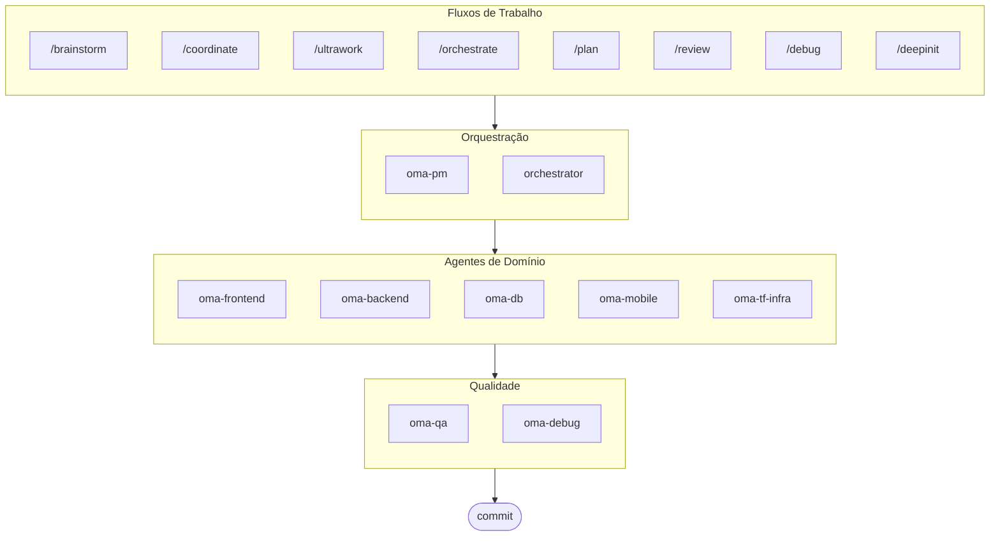

# oh-my-agent: Arnês Multi-Agente Portátil

[](https://www.npmjs.com/package/oh-my-agent) [](https://www.npmjs.com/package/oh-my-agent) [](https://github.com/first-fluke/oh-my-agent) [](https://github.com/first-fluke/oh-my-agent/blob/main/LICENSE) [](https://github.com/first-fluke/oh-my-agent/commits/main)

[English](../README.md) | [한국어](./README.ko.md) | [中文](./README.zh.md) | [日本語](./README.ja.md) | [Français](./README.fr.md) | [Español](./README.es.md) | [Nederlands](./README.nl.md) | [Polski](./README.pl.md) | [Русский](./README.ru.md) | [Deutsch](./README.de.md)

O arnês de agente portátil e baseado em funções para engenharia séria assistida por IA.

Orquestre 10 agentes de domínio especializados (PM, Frontend, Backend, DB, Mobile, QA, Debug, Brainstorm, DevWorkflow, Terraform) via **Serena Memory**. O `oh-my-agent` usa `.agents/` como a fonte de verdade para habilidades e fluxos de trabalho portáteis e é compatível com outras IDEs e CLIs de IA. Ele combina agentes baseados em funções, fluxos de trabalho explícitos, observabilidade em tempo real e orientação com reconhecimento de padrões para equipes que desejam menos confusão de IA e uma execução mais disciplinada.

> **Gostou deste projeto?** Dê uma estrela!
>
> ```bash
> gh api --method PUT /user/starred/first-fluke/oh-my-agent
> ```
>
> Experimente nosso template inicial otimizado: [fullstack-starter](https://github.com/first-fluke/fullstack-starter)

## Índice

- [Arquitetura](#arquitetura)
- [Por que diferente](#por-que-diferente)
- [Compatibilidade](#compatibilidade)
- [Especificação `.agents`](#especificação-agents)
- [O Que É Isso?](#o-que-é-isso)
- [Início Rápido](#início-rápido)
- [Patrocinadores](#patrocinadores)
- [Licença](#licença)

## Por que diferente

- **`.agents/` é a fonte da verdade**: skills, workflows, recursos compartilhados e configuração vivem em uma estrutura de projeto portátil em vez de ficar presos dentro de um plugin IDE.
- **Equipes de agentes baseadas em funções**: agentes PM, QA, DB, Infra, Frontend, Backend, Mobile, Debug e Workflow são modelados como uma organização de engenharia, não apenas uma pilha de prompts.
- **Orquestração workflow-first**: planejamento, revisão, depuração e execução coordenada são workflows de primeira classe, não reflexões tardias.
- **Design consciente de padrões**: agentes agora carregam orientação focada para planejamento ISO, QA, continuidade/segurança de banco de dados e governança de infraestrutura.
- **Construído para verificação**: dashboards, geração de manifestos, protocolos de execução compartilhados e saídas estruturadas favorecem rastreabilidade sobre geração apenas por vibe.

## Compatibilidade

`oh-my-agent` é projetado em torno de `.agents/` e depois faz ponte para outras pastas de skills específicas de ferramentas quando necessário.

| Ferramenta / IDE | Fonte de Skills | Modo de Interoperabilidade | Notas |
|------------|---------------|--------------|-------|
| Antigravity | `.agents/skills/` | Nativo | Layout principal fonte-da-verdade; sem suporte a subagentes customizados |
| Claude Code | `.claude/skills/` + `.claude/agents/` | Nativo + Adaptador | Skills de domínio via symlink, workflow skills como thin routers, subagentes gerados de `.agents/agents/` |
| Codex CLI | `.codex/agents/` + `.agents/skills/` | Nativo + Adaptador | Definições de agentes em TOML geradas de `.agents/agents/` (planned) |
| Gemini CLI | `.gemini/agents/` + `.agents/skills/` | Nativo + Adaptador | Definições de agentes em MD geradas de `.agents/agents/` (planned) |
| OpenCode | `.agents/skills/` | Nativo-compatível | Usa a mesma fonte de skills de nível de projeto |
| Amp | `.agents/skills/` | Nativo-compatível | Compartilha a mesma fonte de nível de projeto |
| Cursor | `.agents/skills/` | Nativo-compatível | Pode consumir a mesma fonte de skills de nível de projeto |
| GitHub Copilot | `.github/skills/` | Symlink opcional | Instalado quando selecionado durante o setup |

Veja [SUPPORTED_AGENTS.md](./SUPPORTED_AGENTS.md) para a matriz de suporte atual e notas de interoperabilidade.

### Integração Nativa com Claude Code

O Claude Code tem integração nativa de primeira classe, além dos symlinks:

- **`CLAUDE.md`** — identidade do projeto, arquitetura e regras (carregado automaticamente pelo Claude Code)
- **`.claude/skills/`** — 12 arquivos SKILL.md thin router que delegam para `.agents/workflows/` (ex.: `/orchestrate`, `/coordinate`, `/ultrawork`). Skills são invocadas explicitamente via comandos slash, sem ativação automática por palavras-chave.
- **`.claude/agents/`** — 7 definições de subagentes geradas de `.agents/agents/*.yaml`, invocados via Task tool (backend-engineer, frontend-engineer, mobile-engineer, db-engineer, qa-reviewer, debug-investigator, pm-planner)
- **Padrões de loop nativos** — Review Loop, Issue Remediation Loop e Phase Gate Loop usando resultados síncronos do Task tool, sem necessidade de polling via CLI

As skills de domínio (oma-backend, oma-frontend, etc.) permanecem como symlinks de `.agents/skills/`. As workflow skills são arquivos SKILL.md thin router que delegam para o `.agents/workflows/*.md` correspondente como fonte de verdade.

## Especificação `.agents`

`oh-my-agent` trata `.agents/` como uma convenção de projeto portátil para skills, workflows e contexto compartilhado de agentes.

- Skills vivem em `.agents/skills/<skill-name>/SKILL.md`
- Definições abstratas de agentes vivem em `.agents/agents/` (SSOT vendor-neutral; o CLI gera `.claude/agents/`, `.codex/agents/` (planned), `.gemini/agents/` (planned) a partir delas)
- Recursos compartilhados vivem em `.agents/skills/_shared/`
- Workflows vivem em `.agents/workflows/*.md`
- Configuração do projeto vive em `.agents/config/`
- Metadados CLI e empacotamento permanecem alinhados através de manifestos gerados

Veja [AGENTS_SPEC.md](./AGENTS_SPEC.md) para o layout do projeto, arquivos necessários, regras de interoperabilidade e modelo fonte-da-verdade.

## Arquitetura



## O Que É Isso?

Uma coleção de **Habilidades Agent** que permite o desenvolvimento colaborativo multi-agente. O trabalho é distribuído entre agentes especialistas:

| Agente | Especialização | Gatilhos |
|-------|---------------|----------|
| **Brainstorm** | Ideação com design-first antes do planejamento | "brainstorm", "ideate", "explore idea" |
| **PM Agent** | Análise de requisitos, decomposição de tarefas, arquitetura | "planejar", "dividir", "o que devemos construir" |
| **Frontend Agent** | React/Next.js, TypeScript, Tailwind CSS | "UI", "componente", "estilo" |
| **Backend Agent** | Backend (Python, Node.js, Rust, ...) | "API", "banco de dados", "autenticação" |
| **DB Agent** | Modelagem SQL/NoSQL, normalização, integridade, backup, capacidade | "ERD", "schema", "database design", "index tuning" |
| **Mobile Agent** | Desenvolvimento Flutter multiplataforma | "app mobile", "iOS/Android" |
| **QA Agent** | Segurança OWASP Top 10, performance, acessibilidade | "revisar segurança", "auditoria", "verificar performance" |
| **Debug Agent** | Diagnóstico de bugs, análise de causa raiz, testes de regressão | "bug", "erro", "crash" |
| **Developer Workflow** | Automação de tarefas monorepo, tarefas mise, CI/CD, migrações, release | "workflow dev", "tarefas mise", "pipeline CI/CD" |
| **TF Infra Agent** | Provisionamento IaC multi-nuvem (AWS, GCP, Azure, OCI) | "infraestrutura", "terraform", "config cloud" |
| **Orchestrator** | Execução paralela de agentes via CLI com Serena Memory | "executar agente", "execução paralela" |
| **Commit** | Commits Convencionais com regras específicas do projeto | "commit", "salvar mudanças" |

## Início Rápido

### Pré-requisitos

- **AI IDE** (Antigravity, Claude Code, Codex, Gemini, etc.)

### Opção 1: Instalação em Uma Linha (Recomendado)

```bash
curl -fsSL https://raw.githubusercontent.com/first-fluke/oh-my-agent/main/cli/install.sh | bash
```

Detecta e instala automaticamente dependências ausentes (bun, uv) e inicia a configuração interativa.

### Opção 2: Instalação Manual

```bash
# Instale o bun se você não tiver:
# curl -fsSL https://bun.sh/install | bash

# Instale o uv se você não tiver:
# curl -LsSf https://astral.sh/uv/install.sh | sh

bunx oh-my-agent
```

Selecione seu tipo de projeto e as habilidades serão instaladas em `.agents/skills/`.

| Preset | Habilidades |
|--------|--------|
| ✨ All | Tudo |
| 🌐 Fullstack | oma-brainstorm, oma-frontend, oma-backend, oma-db, oma-pm, oma-qa, oma-debug, oma-commit |
| 🎨 Frontend | oma-brainstorm, oma-frontend, oma-pm, oma-qa, oma-debug, oma-commit |
| ⚙️ Backend | oma-brainstorm, oma-backend, oma-db, oma-pm, oma-qa, oma-debug, oma-commit |
| 📱 Mobile | oma-brainstorm, oma-mobile, oma-pm, oma-qa, oma-debug, oma-commit |
| 🚀 DevOps | oma-brainstorm, oma-tf-infra, oma-dev-workflow, oma-pm, oma-qa, oma-debug, oma-commit |

### Opção 3: Instalação Global (Para o Orchestrator)

Para usar as ferramentas principais globalmente ou executar o SubAgent Orchestrator:

```bash
bun install --global oh-my-agent
```

Você também precisará de pelo menos uma ferramenta CLI:

| CLI | Instalação | Autenticação |
|-----|---------|------|
| Gemini | `bun install --global @google/gemini-cli` | Auto on first `gemini` run |
| Claude | `curl -fsSL https://claude.ai/install.sh \| bash` | Auto on first `claude` run |
| Codex | `bun install --global @openai/codex` | `codex login` |
| Qwen | `bun install --global @qwen-code/qwen-code` | `/auth` inside CLI |

### Opção 4: Integrar em Projeto Existente

**Recomendado (CLI):**

Execute o seguinte comando na raiz do seu projeto para instalar/atualizar automaticamente habilidades e fluxos de trabalho:

```bash
bunx oh-my-agent
```

> **Dica:** Execute `bunx oh-my-agent doctor` após a instalação para verificar se tudo está configurado corretamente (incluindo fluxos de trabalho globais).

### 2. Chat

**Tarefa simples** (invocar skill de domínio diretamente):

```
"Criar um formulário de login com Tailwind CSS e validação de formulário"
→ skill oma-frontend
```

**Projeto complexo** (/coordinate workflow):

```
"Construir um app TODO com autenticação de usuário"
→ /coordinate → PM Agent planeja → agentes criados no Agent Manager
```

**Implantação máxima** (/ultrawork workflow):

```
"Refatorar módulo de auth, adicionar testes de API e atualizar docs"
→ /ultrawork → Tarefas independentes executam em paralelo entre agentes
```

**Fazer commit de mudanças** (commits convencionais):

```
/commit
→ Analisar mudanças, sugerir tipo/escopo do commit, criar commit com Co-Author
```

### 3. Monitorar com Dashboards

Para detalhes de configuração e uso do dashboard, veja [`docs/USAGE.pt.md`](./docs/USAGE.pt.md#dashboards-em-tempo-real).

## Patrocinadores

Este projeto é mantido graças aos nossos generosos patrocinadores.

<a href="https://github.com/sponsors/first-fluke">
  
</a>
<a href="https://buymeacoffee.com/firstfluke">
  
</a>

### 🚀 Champion

<!-- Logos do tier Champion ($100/mês) aqui -->

### 🛸 Booster

<!-- Logos do tier Booster ($30/mês) aqui -->

### ☕ Contributor

<!-- Nomes do tier Contributor ($10/mês) aqui -->

[Torne-se um patrocinador →](https://github.com/sponsors/first-fluke)

Veja [SPONSORS.md](./SPONSORS.md) para uma lista completa de apoiadores.

## Histórico de Estrelas

[](https://www.star-history.com/#first-fluke/oh-my-agent&type=date&legend=bottom-right)

## Licença

MIT
