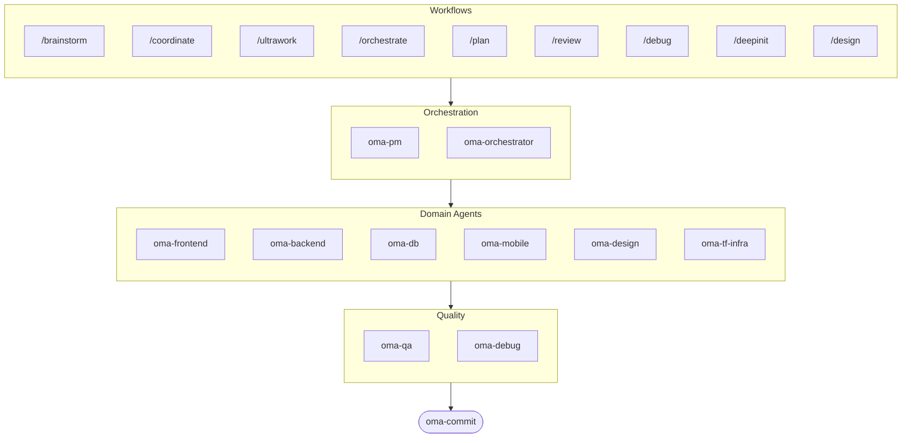

# oh-my-agent: Portable Multi-Agent Harness

[](https://www.npmjs.com/package/oh-my-agent) [](https://www.npmjs.com/package/oh-my-agent) [](https://github.com/first-fluke/oh-my-agent) [](https://github.com/first-fluke/oh-my-agent/blob/main/LICENSE) [](https://github.com/first-fluke/oh-my-agent/commits/main)

[English](../README.md) | [한국어](./README.ko.md) | [中文](./README.zh.md) | [日本語](./README.ja.md) | [Français](./README.fr.md) | [Español](./README.es.md) | [Nederlands](./README.nl.md) | [Polski](./README.pl.md) | [Русский](./README.ru.md) | [Deutsch](./README.de.md)

Ja quis que seu assistente de IA tivesse colegas de trabalho? E isso que o oh-my-agent faz.

Em vez de uma unica IA fazendo tudo (e se perdendo no meio do caminho), o oh-my-agent divide o trabalho entre **agentes especializados** — frontend, backend, QA, PM, DB, mobile, infra, debug, design e mais. Cada um conhece bem o seu dominio, tem suas proprias ferramentas e checklists, e nao sai da sua area.

Funciona com todas as principais IDEs de IA: Antigravity, Claude Code, Cursor, Gemini CLI, Codex CLI, OpenCode e mais.

## Inicio Rapido

```bash
# Uma linha so (instala bun & uv automaticamente se nao tiver)
curl -fsSL https://raw.githubusercontent.com/first-fluke/oh-my-agent/main/cli/install.sh | bash

# Ou manualmente
bunx oh-my-agent
```

Escolha um preset e pronto:

| Preset | O Que Voce Ganha |
|--------|-------------|
| ✨ All | Todos os agentes e skills |
| 🌐 Fullstack | frontend + backend + db + pm + qa + debug + brainstorm + commit |
| 🎨 Frontend | frontend + pm + qa + debug + brainstorm + commit |
| ⚙️ Backend | backend + db + pm + qa + debug + brainstorm + commit |
| 📱 Mobile | mobile + pm + qa + debug + brainstorm + commit |
| 🚀 DevOps | tf-infra + dev-workflow + pm + qa + debug + brainstorm + commit |

## Seu Time de Agentes

| Agente | O Que Faz |
|-------|-------------|
| **oma-brainstorm** | Explora ideias antes de voce comecar a construir |
| **oma-pm** | Planeja tarefas, detalha requisitos, define contratos de API |
| **oma-frontend** | React/Next.js, TypeScript, Tailwind CSS v4, shadcn/ui |
| **oma-backend** | APIs em Python, Node.js ou Rust |
| **oma-db** | Design de schema, migrations, indexacao, vector DB |
| **oma-mobile** | Apps cross-platform com Flutter |
| **oma-design** | Design systems, tokens, acessibilidade, responsividade |
| **oma-qa** | Seguranca OWASP, performance, revisao de acessibilidade |
| **oma-debug** | Analise de causa raiz, correcoes, testes de regressao |
| **oma-tf-infra** | IaC multi-cloud com Terraform |
| **oma-dev-workflow** | CI/CD, releases, automacao de monorepo |
| **oma-translator** | Traducao multilingual natural |
| **oma-orchestrator** | Execucao paralela de agentes via CLI |
| **oma-commit** | Commits convencionais limpos |

## Como Funciona

So conversar. Descreva o que voce quer e o oh-my-agent descobre quais agentes usar.

```
Voce: "Cria um app de TODO com autenticacao de usuario"
→ PM planeja o trabalho
→ Backend constroi a API de auth
→ Frontend constroi a UI em React
→ DB desenha o schema
→ QA revisa tudo
→ Pronto: codigo coordenado e revisado
```

Ou use slash commands para workflows estruturados:

| Comando | O Que Faz |
|---------|-------------|
| `/plan` | PM detalha sua feature em tarefas |
| `/coordinate` | Execucao multi-agente passo a passo |
| `/orchestrate` | Spawn automatico e paralelo de agentes |
| `/ultrawork` | Workflow de qualidade em 5 fases com 11 gates de revisao |
| `/review` | Auditoria de seguranca + performance + acessibilidade |
| `/debug` | Debugging estruturado de causa raiz |
| `/design` | Workflow de design system em 7 fases |
| `/brainstorm` | Ideacao livre |
| `/commit` | Commit convencional com analise de type/scope |

**Auto-deteccao**: Voce nem precisa dos slash commands — palavras como "plan", "review", "debug" na sua mensagem (em 11 idiomas!) ativam automaticamente o workflow certo.

## CLI

```bash
# Instalar globalmente
bun install --global oh-my-agent   # ou: brew install oh-my-agent

# Usar em qualquer lugar
oma doctor                  # Health check
oma dashboard               # Monitoramento em tempo real
oma agent:spawn backend "Build auth API" session-01
oma agent:parallel -i backend:"Auth API" frontend:"Login form"
```

## Por Que oh-my-agent?

- **Portavel** — `.agents/` viaja com seu projeto, sem ficar preso a uma IDE
- **Baseado em papeis** — Agentes modelados como um time de engenharia real, nao um amontoado de prompts
- **Eficiente em tokens** — Design de skills em duas camadas economiza ~75% de tokens
- **Qualidade primeiro** — Charter preflight, quality gates e workflows de revisao integrados
- **Multi-vendor** — Misture Gemini, Claude, Codex e Qwen por tipo de agente
- **Observavel** — Dashboards no terminal e na web para monitoramento em tempo real

## Arquitetura



## Saiba Mais

- **[Documentacao Detalhada](./AGENTS_SPEC.md)** — Spec tecnica completa e arquitetura
- **[Agentes Suportados](./SUPPORTED_AGENTS.md)** — Matriz de suporte de agentes por IDE
- **[Docs Web](https://oh-my-agent.dev)** — Guias, tutoriais e referencia da CLI

## Sponsors

Este projeto e mantido gracas aos nossos generosos sponsors.

> **Curtiu o projeto?** Da uma estrela!
>
> ```bash
> gh api --method PUT /user/starred/first-fluke/oh-my-agent
> ```
>
> Experimente nosso template starter otimizado: [fullstack-starter](https://github.com/first-fluke/fullstack-starter)

<a href="https://github.com/sponsors/first-fluke">
  
</a>
<a href="https://buymeacoffee.com/firstfluke">
  
</a>

### 🚀 Champion

<!-- Champion tier ($100/mo) logos here -->

### 🛸 Booster

<!-- Booster tier ($30/mo) logos here -->

### ☕ Contributor

<!-- Contributor tier ($10/mo) names here -->

[Torne-se um sponsor →](https://github.com/sponsors/first-fluke)

Veja [SPONSORS.md](../SPONSORS.md) para a lista completa de apoiadores.


## Licenca

MIT
