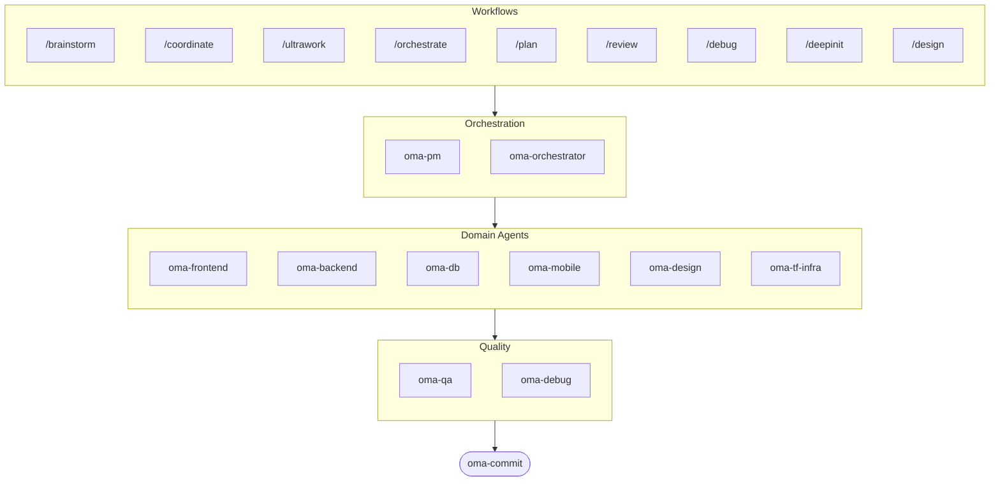

# oh-my-agent: Portable Multi-Agent Harness

[](https://www.npmjs.com/package/oh-my-agent) [](https://www.npmjs.com/package/oh-my-agent) [](https://github.com/first-fluke/oh-my-agent) [](https://github.com/first-fluke/oh-my-agent/blob/main/LICENSE) [](https://github.com/first-fluke/oh-my-agent/commits/main)

[English](../README.md) | [한국어](./README.ko.md) | [中文](./README.zh.md) | [Português](./README.pt.md) | [日本語](./README.ja.md) | [Français](./README.fr.md) | [Español](./README.es.md) | [Nederlands](./README.nl.md) | [Polski](./README.pl.md) | [Deutsch](./README.de.md)

Когда-нибудь хотели, чтобы у вашего ИИ-ассистента были коллеги? Именно это и делает oh-my-agent.

Вместо того чтобы один ИИ делал все (и терялся на полпути), oh-my-agent распределяет работу между **специализированными агентами** — frontend, backend, QA, PM, DB, mobile, infra, debug, design и другими. Каждый глубоко знает свою область, имеет свои инструменты и чеклисты и не лезет в чужую зону.

Работает со всеми основными AI IDE: Antigravity, Claude Code, Cursor, Gemini CLI, Codex CLI, OpenCode и другими.

## Быстрый старт

```bash
# Одна команда (автоматически установит bun & uv, если их нет)
curl -fsSL https://raw.githubusercontent.com/first-fluke/oh-my-agent/main/cli/install.sh | bash

# Или вручную
bunx oh-my-agent
```

Выберите пресет — и готово:

| Пресет | Что получаете |
|--------|-------------|
| ✨ All | Все агенты и навыки |
| 🌐 Fullstack | frontend + backend + db + pm + qa + debug + brainstorm + commit |
| 🎨 Frontend | frontend + pm + qa + debug + brainstorm + commit |
| ⚙️ Backend | backend + db + pm + qa + debug + brainstorm + commit |
| 📱 Mobile | mobile + pm + qa + debug + brainstorm + commit |
| 🚀 DevOps | tf-infra + dev-workflow + pm + qa + debug + brainstorm + commit |

## Ваша команда агентов

| Агент | Что делает |
|-------|-------------|
| **oma-brainstorm** | Исследует идеи, прежде чем вы начнете строить |
| **oma-pm** | Планирует задачи, декомпозирует требования, определяет API-контракты |
| **oma-frontend** | React/Next.js, TypeScript, Tailwind CSS v4, shadcn/ui |
| **oma-backend** | API на Python, Node.js или Rust |
| **oma-db** | Проектирование схем, миграции, индексация, vector DB |
| **oma-mobile** | Кроссплатформенные приложения на Flutter |
| **oma-design** | Дизайн-системы, токены, доступность, адаптивность |
| **oma-qa** | Безопасность OWASP, производительность, ревью доступности |
| **oma-debug** | Анализ корневых причин, исправления, регрессионные тесты |
| **oma-tf-infra** | Мультиоблачный IaC на Terraform |
| **oma-dev-workflow** | CI/CD, релизы, автоматизация монорепо |
| **oma-translator** | Естественный мультиязычный перевод |
| **oma-orchestrator** | Параллельный запуск агентов через CLI |
| **oma-commit** | Чистые conventional commits |

## Как это работает

Просто пишите. Опишите, что вам нужно, и oh-my-agent сам разберется, каких агентов подключить.

```
Вы: "Собери TODO-приложение с аутентификацией пользователей"
→ PM планирует работу
→ Backend строит API аутентификации
→ Frontend строит UI на React
→ DB проектирует схему
→ QA проверяет все
→ Готово: скоординированный, проверенный код
```

Или используйте slash-команды для структурированных воркфлоу:

| Команда | Что делает |
|---------|-------------|
| `/plan` | PM разбивает фичу на задачи |
| `/coordinate` | Пошаговое мульти-агентное выполнение |
| `/orchestrate` | Автоматический параллельный запуск агентов |
| `/ultrawork` | 5-фазный воркфлоу качества с 11 ревью-гейтами |
| `/review` | Аудит безопасности + производительности + доступности |
| `/debug` | Структурированная отладка с поиском корневой причины |
| `/design` | 7-фазный воркфлоу дизайн-системы |
| `/brainstorm` | Свободная генерация идей |
| `/commit` | Conventional commit с анализом type/scope |

**Автодетекция**: Slash-команды даже не нужны — слова вроде "plan", "review", "debug" в вашем сообщении (на 11 языках!) автоматически активируют нужный воркфлоу.

## CLI

```bash
# Установить глобально
bun install --global oh-my-agent   # или: brew install oh-my-agent

# Использовать где угодно
oma doctor                  # Проверка здоровья
oma dashboard               # Мониторинг в реальном времени
oma agent:spawn backend "Build auth API" session-01
oma agent:parallel -i backend:"Auth API" frontend:"Login form"
```

## Почему oh-my-agent?

- **Портативный** — `.agents/` путешествует с вашим проектом, не привязан к одной IDE
- **Ролевой** — Агенты смоделированы как настоящая инженерная команда, а не куча промптов
- **Экономит токены** — Двухуровневый дизайн навыков экономит ~75% токенов
- **Качество прежде всего** — Charter preflight, quality gates и ревью-воркфлоу из коробки
- **Мультивендорный** — Комбинируйте Gemini, Claude, Codex и Qwen для разных типов агентов
- **Наблюдаемый** — Дашборды в терминале и в вебе для мониторинга в реальном времени

## Архитектура



## Узнать больше

- **[Подробная документация](./AGENTS_SPEC.md)** — Полная техническая спецификация и архитектура
- **[Поддерживаемые агенты](./SUPPORTED_AGENTS.md)** — Матрица поддержки агентов по IDE
- **[Веб-документация](https://oh-my-agent.dev)** — Гайды, туториалы и справочник CLI

## Спонсоры

Этот проект поддерживается благодаря нашим щедрым спонсорам.

> **Нравится проект?** Поставьте звезду!
>
> ```bash
> gh api --method PUT /user/starred/first-fluke/oh-my-agent
> ```
>
> Попробуйте наш оптимизированный стартовый шаблон: [fullstack-starter](https://github.com/first-fluke/fullstack-starter)

<a href="https://github.com/sponsors/first-fluke">
  
</a>
<a href="https://buymeacoffee.com/firstfluke">
  
</a>

### 🚀 Champion

<!-- Champion tier ($100/mo) logos here -->

### 🛸 Booster

<!-- Booster tier ($30/mo) logos here -->

### ☕ Contributor

<!-- Contributor tier ($10/mo) names here -->

[Стать спонсором →](https://github.com/sponsors/first-fluke)

Полный список поддерживающих — в [SPONSORS.md](../SPONSORS.md).


## Лицензия

MIT
