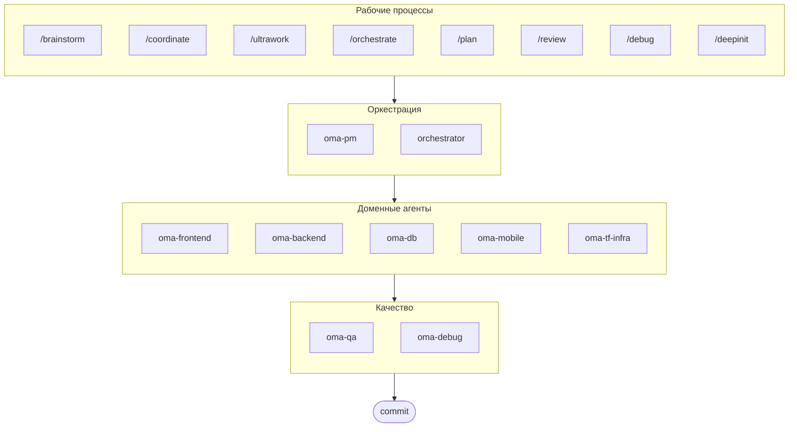

# oh-my-agent: Портативный мультиагентный харнесс

[](https://www.npmjs.com/package/oh-my-agent) [](https://www.npmjs.com/package/oh-my-agent) [](https://github.com/first-fluke/oh-my-agent) [](https://github.com/first-fluke/oh-my-agent/blob/main/LICENSE) [](https://github.com/first-fluke/oh-my-agent/commits/main)

[English](../README.md) | [한국어](./README.ko.md) | [中文](./README.zh.md) | [Português](./README.pt.md) | [日本語](./README.ja.md) | [Français](./README.fr.md) | [Español](./README.es.md) | [Nederlands](./README.nl.md) | [Polski](./README.pl.md) | [Deutsch](./README.de.md)

Портативный ролевой харнесс агентов для серьёзной разработки с применением ИИ.

Управляйте 10 специализированными доменными агентами (PM, Frontend, Backend, DB, Mobile, QA, Debug, Brainstorm, DevWorkflow, Terraform) через **Serena Memory**. `oh-my-agent` использует `.agents/` как единственный источник истины для портативных навыков и рабочих процессов, а затем подключается к другим ИИ-IDE и CLI. Он объединяет ролевых агентов, явные рабочие процессы, наблюдаемость в реальном времени и руководство с учётом стандартов — для команд, которым нужно меньше небрежно сгенерированного ИИ-кода и больше дисциплинированного исполнения.

## Оглавление

- [Архитектура](#архитектура)
- [Почему другой](#почему-другой)
- [Совместимость](#совместимость)
- [Спецификация `.agents`](#спецификация-agents)
- [Что это такое?](#что-это-такое)
- [Быстрый старт](#быстрый-старт)
- [Спонсоры](#спонсоры)
- [Лицензия](#лицензия)

## Архитектура



## Почему другой

- **`.agents/` — единственный источник истины**: навыки, рабочие процессы, общие ресурсы и конфигурация хранятся в одной переносимой структуре проекта, а не закрыты внутри одного плагина IDE.
- **Команды агентов на основе ролей**: агенты PM, QA, DB, Infra, Frontend, Backend, Mobile, Debug и Workflow строятся по модели инженерной организации, а не как набор промптов.
- **Оркестрация с приоритетом рабочих процессов**: планирование, ревью, отладка и координированное выполнение — полноценные рабочие процессы первого класса, а не запоздалые дополнения.
- **Осознанный подход к стандартам**: агенты несут сфокусированное руководство для ISO-ориентированного планирования, QA, непрерывности и безопасности БД, управления инфраструктурой.
- **Создан для верификации**: дашборды, генерация манифестов, общие протоколы выполнения и структурированные выходные данные делают упор на прослеживаемость, а не на генерацию «на ощущение».

## Совместимость

`oh-my-agent` построен вокруг `.agents/` и при необходимости подключается к папкам навыков конкретных инструментов.

| Инструмент / IDE | Источник навыков | Режим совместимости | Примечания |
|------------|---------------|--------------|-------|
| Antigravity | `.agents/skills/` | Нативный | Основной макет источника истины; без пользовательских субагентов |
| Claude Code | `.claude/skills/` + `.claude/agents/` | Нативный + Адаптер | Симлинки для доменных навыков, тонкие маршрутизаторы для рабочих процессов, субагенты генерируются из `.agents/agents/` |
| Codex CLI | `.codex/agents/` + `.agents/skills/` | Нативный + Адаптер | Определения агентов в TOML, сгенерированные из `.agents/agents/` (planned) |
| Gemini CLI | `.gemini/agents/` + `.agents/skills/` | Нативный + Адаптер | Определения агентов в MD, сгенерированные из `.agents/agents/` (planned) |
| OpenCode | `.agents/skills/` | Нативно совместимый | Использует тот же источник навыков на уровне проекта |
| Amp | `.agents/skills/` | Нативно совместимый | Разделяет тот же источник на уровне проекта |
| Cursor | `.agents/skills/` | Нативно совместимый | Может использовать тот же источник навыков на уровне проекта |
| GitHub Copilot | `.github/skills/` | Опциональный симлинк | Устанавливается при выборе во время настройки |

См. [SUPPORTED_AGENTS.md](./SUPPORTED_AGENTS.md) для текущей матрицы поддержки и примечаний о совместимости.

### Нативная интеграция с Claude Code

Claude Code имеет полноценную нативную интеграцию, выходящую за рамки симлинков:

- **`CLAUDE.md`** — идентификация проекта, архитектура и правила (автоматически загружается Claude Code)
- **`.claude/skills/`** — 12 тонких маршрутизаторов SKILL.md, делегирующих в `.agents/workflows/` (например, `/orchestrate`, `/coordinate`, `/ultrawork`). Навыки вызываются явно через slash-команды, без автоматической активации по ключевым словам.
- **`.claude/agents/`** — 7 определений субагентов, сгенерированных из `.agents/agents/*.yaml`, запускаемых через Task tool (backend-engineer, frontend-engineer, mobile-engineer, db-engineer, qa-reviewer, debug-investigator, pm-planner)
- **Нативные циклы** — Review Loop, Issue Remediation Loop и Phase Gate Loop с использованием синхронных результатов Task tool вместо CLI-поллинга

Доменные навыки (oma-backend, oma-frontend и др.) остаются симлинками из `.agents/skills/`. Навыки рабочих процессов — это тонкие маршрутизаторы SKILL.md, делегирующие в соответствующий источник истины `.agents/workflows/*.md`.

## Спецификация `.agents`

`oh-my-agent` рассматривает `.agents/` как переносимое соглашение проекта для навыков агентов, рабочих процессов и общего контекста.

- Навыки хранятся в `.agents/skills/<skill-name>/SKILL.md`
- Абстрактные определения агентов — в `.agents/agents/` (вендор-нейтральный SSOT; CLI генерирует `.claude/agents/`, `.codex/agents/` (planned), `.gemini/agents/` (planned) на их основе)
- Общие ресурсы — в `.agents/skills/_shared/`
- Рабочие процессы — в `.agents/workflows/*.md`
- Конфигурация проекта — в `.agents/config/`
- Метаданные CLI и пакетирование согласованы через генерируемые манифесты

См. [AGENTS_SPEC.md](./AGENTS_SPEC.md) для описания макета проекта, обязательных файлов, правил совместимости и модели источника истины.

## Что это такое?

Коллекция **Agent Skills**, обеспечивающих совместную мультиагентную разработку. Работа распределяется между экспертными агентами с явными ролями, рабочими процессами и границами верификации:

| Агент | Специализация | Триггеры |
|-------|---------------|----------|
| **Brainstorm** | Идеация с приоритетом дизайна перед планированием | "brainstorm", "ideate", "explore idea" |
| **PM Agent** | Анализ требований, декомпозиция задач, архитектура | "plan", "break down", "what should we build" |
| **Frontend Agent** | React/Next.js, TypeScript, Tailwind CSS | "UI", "component", "styling" |
| **Backend Agent** | Backend (Python, Node.js, Rust, ...) | "API", "database", "authentication" |
| **DB Agent** | SQL/NoSQL моделирование, нормализация, целостность, резервное копирование, оценка ёмкости | "ERD", "schema", "database design", "index tuning" |
| **Mobile Agent** | Flutter кросс-платформенная разработка | "mobile app", "iOS/Android" |
| **QA Agent** | Безопасность OWASP Top 10, производительность, доступность | "review security", "audit", "check performance" |
| **Debug Agent** | Диагностика багов, анализ первопричин, регрессионные тесты | "bug", "error", "crash" |
| **Developer Workflow** | Автоматизация задач монорепозитория, задачи mise, CI/CD, миграции, релизы | "dev workflow", "mise tasks", "CI/CD pipeline" |
| **TF Infra Agent** | Мультиоблачное IaC-провизионирование (AWS, GCP, Azure, OCI) | "infrastructure", "terraform", "cloud setup" |
| **Orchestrator** | Параллельный запуск агентов через CLI с Serena Memory | "spawn agent", "parallel execution" |
| **Commit** | Conventional Commits с правилами конкретного проекта | "commit", "save changes" |

## Быстрый старт

### Предварительные требования

- **AI IDE** (Antigravity, Claude Code, Codex, Gemini и др.)

### Вариант 1: Установка одной командой (рекомендуется)

```bash
curl -fsSL https://raw.githubusercontent.com/first-fluke/oh-my-agent/main/cli/install.sh | bash
```

Автоматически определяет и устанавливает недостающие зависимости (bun, uv), затем запускает интерактивную настройку.

### Вариант 2: Ручная установка

```bash
# Установите bun, если его нет:
# curl -fsSL https://bun.sh/install | bash

# Установите uv, если его нет:
# curl -LsSf https://astral.sh/uv/install.sh | sh

bunx oh-my-agent
```

Выберите тип проекта, и навыки будут установлены в `.agents/skills/`, а симлинки совместимости созданы в `.agents/skills/` и `.claude/skills/`.

| Пресет | Навыки |
|--------|--------|
| ✨ All | Всё |
| 🌐 Fullstack | oma-brainstorm, oma-frontend, oma-backend, oma-db, oma-pm, oma-qa, oma-debug, oma-commit |
| 🎨 Frontend | oma-brainstorm, oma-frontend, oma-pm, oma-qa, oma-debug, oma-commit |
| ⚙️ Backend | oma-brainstorm, oma-backend, oma-db, oma-pm, oma-qa, oma-debug, oma-commit |
| 📱 Mobile | oma-brainstorm, oma-mobile, oma-pm, oma-qa, oma-debug, oma-commit |
| 🚀 DevOps | oma-brainstorm, oma-tf-infra, oma-dev-workflow, oma-pm, oma-qa, oma-debug, oma-commit |

### Вариант 3: Глобальная установка (для оркестратора)

Чтобы использовать основные инструменты глобально или запустить SubAgent Orchestrator:

```bash
bun install --global oh-my-agent
```

Потребуется хотя бы один CLI-инструмент:

| CLI | Установка | Авторизация |
|-----|-----------|-------------|
| Gemini | `bun install --global @google/gemini-cli` | Auto on first `gemini` run |
| Claude | `curl -fsSL https://claude.ai/install.sh \| bash` | Auto on first `claude` run |
| Codex | `bun install --global @openai/codex` | `codex login` |
| Qwen | `bun install --global @qwen-code/qwen-code` | `/auth` inside CLI |

### Вариант 4: Интеграция в существующий проект

**Рекомендуется (CLI):**

Выполните следующую команду в корне проекта для автоматической установки и обновления навыков и рабочих процессов:

```bash
bunx oh-my-agent
```

> **Совет:** Запустите `bunx oh-my-agent doctor` после установки, чтобы проверить корректность настройки (включая глобальные рабочие процессы).

### 2. Общение с агентами

**Сложный проект** (рабочий процесс /coordinate):

```
"Создай TODO-приложение с аутентификацией пользователей"
→ /coordinate → PM Agent планирует → агенты запускаются в Agent Manager
```

**Максимальное развёртывание** (рабочий процесс /ultrawork):

```
"Рефакторинг модуля авторизации, добавление тестов API и обновление документации"
→ /ultrawork → Независимые задачи выполняются параллельно через агентов
```

**Простая задача** (прямой вызов доменного навыка):

```
"Создай форму входа с Tailwind CSS и валидацией полей"
→ навык oma-frontend
```

**Фиксация изменений** (conventional commits):

```
/commit
→ Анализ изменений, выбор типа и области коммита, создание коммита с Co-Author
```

### 3. Мониторинг с помощью дашбордов

Для настройки и использования дашбордов см. [`web/content/en/guide/usage.md`](./web/content/en/guide/usage.md#real-time-dashboards).

## Спонсоры

Этот проект поддерживается благодаря нашим щедрым спонсорам.

> **Понравился проект?** Поставьте звезду!
>
> ```bash
> gh api --method PUT /user/starred/first-fluke/oh-my-agent
> ```
>
> Попробуйте наш оптимизированный стартовый шаблон: [fullstack-starter](https://github.com/first-fluke/fullstack-starter)

<a href="https://github.com/sponsors/first-fluke">
  
</a>
<a href="https://buymeacoffee.com/firstfluke">
  
</a>

### 🚀 Champion

<!-- Логотипы уровня Champion ($100/месяц) здесь -->

### 🛸 Booster

<!-- Логотипы уровня Booster ($30/месяц) здесь -->

### ☕ Contributor

<!-- Имена уровня Contributor ($10/месяц) здесь -->

[Стать спонсором →](https://github.com/sponsors/first-fluke)

См. [SPONSORS.md](./SPONSORS.md) для полного списка поддержавших.

## История звёзд

[](https://www.star-history.com/#first-fluke/oh-my-agent&type=date&legend=bottom-right)

## Лицензия

MIT
