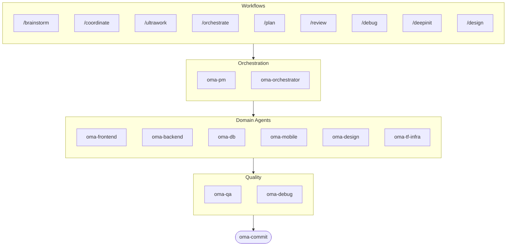

# oh-my-agent: Portable Multi-Agent Harness

[](https://www.npmjs.com/package/oh-my-agent) [](https://www.npmjs.com/package/oh-my-agent) [](https://github.com/first-fluke/oh-my-agent) [](https://github.com/first-fluke/oh-my-agent/blob/main/LICENSE) [](https://github.com/first-fluke/oh-my-agent/commits/main)

[English](../README.md) | [한국어](./README.ko.md) | [中文](./README.zh.md) | [Português](./README.pt.md) | [日本語](./README.ja.md) | [Français](./README.fr.md) | [Español](./README.es.md) | [Nederlands](./README.nl.md) | [Polski](./README.pl.md) | [Русский](./README.ru.md) | [Deutsch](./README.de.md)

Bạn đã bao giờ ước trợ lý AI của mình có đồng nghiệp chưa? Đó chính là điều oh-my-agent làm được.

Thay vì một AI làm tất cả mọi thứ (rồi bị lạc hướng giữa chừng), oh-my-agent phân chia công việc cho các **agent chuyên biệt** — frontend, backend, QA, PM, DB, mobile, infra, debug, design và nhiều hơn nữa. Mỗi agent hiểu sâu lĩnh vực của mình, có công cụ và checklist riêng, và chỉ tập trung vào phần việc được giao.

Hỗ trợ tất cả các AI IDE chính: Antigravity, Claude Code, Cursor, Gemini CLI, Codex CLI, OpenCode và nhiều hơn nữa.

## Bắt đầu nhanh

```bash
# Cài đặt một dòng (tự động cài bun & uv nếu chưa có)
curl -fsSL https://raw.githubusercontent.com/first-fluke/oh-my-agent/main/cli/install.sh | bash

# Hoặc chạy trực tiếp
bunx oh-my-agent
```

Chọn một preset và bạn đã sẵn sàng:

| Preset | Bạn nhận được |
|--------|--------------|
| ✨ All | Tất cả agent và skill |
| 🌐 Fullstack | frontend + backend + db + pm + qa + debug + brainstorm + commit |
| 🎨 Frontend | frontend + pm + qa + debug + brainstorm + commit |
| ⚙️ Backend | backend + db + pm + qa + debug + brainstorm + commit |
| 📱 Mobile | mobile + pm + qa + debug + brainstorm + commit |
| 🚀 DevOps | tf-infra + dev-workflow + pm + qa + debug + brainstorm + commit |

## Đội ngũ Agent

| Agent | Chức năng |
|-------|----------|
| **oma-brainstorm** | Khám phá ý tưởng trước khi bắt tay vào xây dựng |
| **oma-pm** | Lập kế hoạch, phân tích yêu cầu, định nghĩa API contract |
| **oma-frontend** | React/Next.js, TypeScript, Tailwind CSS v4, shadcn/ui |
| **oma-backend** | Xây dựng API bằng Python, Node.js hoặc Rust |
| **oma-db** | Thiết kế schema, migration, indexing, vector DB |
| **oma-mobile** | Ứng dụng đa nền tảng với Flutter |
| **oma-design** | Hệ thống thiết kế, token, accessibility, responsive |
| **oma-qa** | Đánh giá bảo mật OWASP, hiệu suất, accessibility |
| **oma-debug** | Phân tích nguyên nhân gốc, sửa lỗi, regression test |
| **oma-tf-infra** | Terraform IaC đa đám mây |
| **oma-dev-workflow** | CI/CD, release, tự động hóa monorepo |
| **oma-translator** | Dịch thuật đa ngôn ngữ tự nhiên |
| **oma-orchestrator** | Thực thi agent song song qua CLI |
| **oma-commit** | Conventional commit gọn gàng |

## Cách hoạt động

Chỉ cần trò chuyện. Mô tả điều bạn muốn và oh-my-agent sẽ tự tìm ra agent phù hợp.

```
You: "Xây dựng ứng dụng TODO có xác thực người dùng"
→ PM lập kế hoạch công việc
→ Backend xây dựng API xác thực
→ Frontend xây dựng giao diện React
→ DB thiết kế schema
→ QA đánh giá toàn bộ
→ Hoàn thành: mã nguồn được phối hợp và đánh giá
```

Hoặc sử dụng slash command cho các workflow có cấu trúc:

| Lệnh | Chức năng |
|------|----------|
| `/plan` | PM phân tách tính năng thành các task |
| `/coordinate` | Thực thi multi-agent từng bước |
| `/orchestrate` | Tự động spawn agent song song |
| `/ultrawork` | Workflow chất lượng 5 giai đoạn với 11 cổng đánh giá |
| `/review` | Kiểm tra bảo mật + hiệu suất + accessibility |
| `/debug` | Debug có cấu trúc tìm nguyên nhân gốc |
| `/design` | Workflow hệ thống thiết kế 7 giai đoạn |
| `/brainstorm` | Phát triển ý tưởng tự do |
| `/commit` | Conventional commit với phân tích type/scope |

**Tự động phát hiện**: Bạn thậm chí không cần slash command — các từ khóa như "kế hoạch", "đánh giá", "debug" trong tin nhắn (hỗ trợ 11 ngôn ngữ!) sẽ tự động kích hoạt workflow phù hợp.

## CLI

```bash
# Cài đặt toàn cục
bun install --global oh-my-agent   # hoặc: brew install oh-my-agent

# Sử dụng ở bất kỳ đâu
oma doctor                  # Kiểm tra sức khỏe hệ thống
oma dashboard               # Giám sát agent thời gian thực
oma agent:spawn backend "Build auth API" session-01
oma agent:parallel -i backend:"Auth API" frontend:"Login form"
```

## Tại sao chọn oh-my-agent?

> [Đọc thêm lý do →](https://github.com/first-fluke/oh-my-agent/issues/155#issuecomment-4142133589)

- **Di động** — `.agents/` đi cùng dự án, không bị ràng buộc vào một IDE
- **Dựa trên vai trò** — Agent được mô hình hóa như đội kỹ thuật thực, không phải một đống prompt
- **Tiết kiệm token** — Thiết kế skill 2 lớp tiết kiệm ~75% token
- **Ưu tiên chất lượng** — Charter preflight, quality gate và review workflow được tích hợp sẵn
- **Đa nhà cung cấp** — Kết hợp Gemini, Claude, Codex và Qwen theo loại agent
- **Có thể quan sát** — Dashboard terminal và web để giám sát thời gian thực

## Kiến trúc



## Tìm hiểu thêm

- **[Tài liệu chi tiết](./AGENTS_SPEC.md)** — Đặc tả kỹ thuật và kiến trúc đầy đủ
- **[Agent được hỗ trợ](./SUPPORTED_AGENTS.md)** — Ma trận hỗ trợ agent theo IDE
- **[Tài liệu web](https://first-fluke.github.io/oh-my-agent/)** — Hướng dẫn, tutorial và CLI reference

## Nhà tài trợ

Dự án này được duy trì nhờ sự hỗ trợ hào phóng của các nhà tài trợ.

> **Thích dự án này?** Hãy tặng một ngôi sao!
>
> ```bash
> gh api --method PUT /user/starred/first-fluke/oh-my-agent
> ```
>
> Thử template starter tối ưu của chúng tôi: [fullstack-starter](https://github.com/first-fluke/fullstack-starter)

<a href="https://github.com/sponsors/first-fluke">
  
</a>
<a href="https://buymeacoffee.com/firstfluke">
  
</a>

### 🚀 Champion

<!-- Champion tier ($100/mo) logos here -->

### 🛸 Booster

<!-- Booster tier ($30/mo) logos here -->

### ☕ Contributor

<!-- Contributor tier ($10/mo) names here -->

[Trở thành nhà tài trợ →](https://github.com/sponsors/first-fluke)

Xem danh sách đầy đủ người ủng hộ tại [SPONSORS.md](../SPONSORS.md).


## Star History

[](https://www.star-history.com/#first-fluke/oh-my-agent&type=date&legend=bottom-right)


## Giấy phép

MIT
