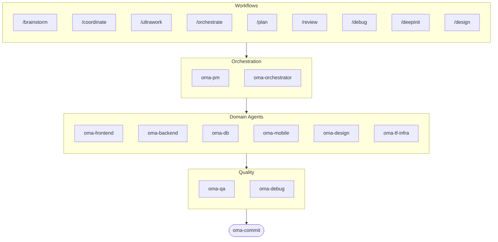

# oh-my-agent: Portable Multi-Agent Harness

[](https://www.npmjs.com/package/oh-my-agent) [](https://www.npmjs.com/package/oh-my-agent) [](https://github.com/first-fluke/oh-my-agent) [](https://github.com/first-fluke/oh-my-agent/blob/main/LICENSE) [](https://github.com/first-fluke/oh-my-agent/commits/main)

[English](../README.md) | [한국어](./README.ko.md) | [Português](./README.pt.md) | [日本語](./README.ja.md) | [Français](./README.fr.md) | [Español](./README.es.md) | [Nederlands](./README.nl.md) | [Polski](./README.pl.md) | [Русский](./README.ru.md) | [Deutsch](./README.de.md)

有没有想过，要是你的 AI 助手有同事就好了？oh-my-agent 就是干这个的。

与其让一个 AI 包揽一切（然后做到一半就迷路），oh-my-agent 把工作分配给**专业 agent** — frontend、backend、QA、PM、DB、mobile、infra、debug、design 等等。每个 agent 深耕自己的领域，拥有专属工具和检查清单，各司其职。

支持所有主流 AI IDE：Antigravity、Claude Code、Cursor、Gemini CLI、Codex CLI、OpenCode 等。

## 快速开始

```bash
# 一行搞定（自动安装 bun & uv）
curl -fsSL https://raw.githubusercontent.com/first-fluke/oh-my-agent/main/cli/install.sh | bash

# 或者手动运行
bunx oh-my-agent
```

选个预设就能开始：

| 预设 | 包含内容 |
|------|---------|
| ✨ All | 所有 agent 和 skill |
| 🌐 Fullstack | frontend + backend + db + pm + qa + debug + brainstorm + commit |
| 🎨 Frontend | frontend + pm + qa + debug + brainstorm + commit |
| ⚙️ Backend | backend + db + pm + qa + debug + brainstorm + commit |
| 📱 Mobile | mobile + pm + qa + debug + brainstorm + commit |
| 🚀 DevOps | tf-infra + dev-workflow + pm + qa + debug + brainstorm + commit |

## Agent 团队

| Agent | 职责 |
|-------|------|
| **oma-brainstorm** | 动手之前先探索想法 |
| **oma-pm** | 任务规划、需求拆解、API 契约定义 |
| **oma-frontend** | React/Next.js、TypeScript、Tailwind CSS v4、shadcn/ui |
| **oma-backend** | 用 Python、Node.js 或 Rust 开发 API |
| **oma-db** | Schema 设计、迁移、索引、vector DB |
| **oma-mobile** | Flutter 跨平台应用 |
| **oma-design** | 设计系统、token、无障碍、响应式 |
| **oma-qa** | OWASP 安全、性能、无障碍审查 |
| **oma-debug** | 根因分析、修复、回归测试 |
| **oma-tf-infra** | 多云 Terraform IaC |
| **oma-dev-workflow** | CI/CD、发布、monorepo 自动化 |
| **oma-translator** | 自然的多语言翻译 |
| **oma-orchestrator** | 通过 CLI 并行执行 agent |
| **oma-commit** | 干净的 conventional commit |

## 工作原理

直接聊就行。描述你想要什么，oh-my-agent 会自动选择合适的 agent。

```
You: "做一个带用户认证的 TODO 应用"
→ PM 规划任务
→ Backend 构建认证 API
→ Frontend 构建 React UI
→ DB 设计 schema
→ QA 审查全部代码
→ 完成：协调一致、经过审查的代码
```

也可以用斜杠命令执行结构化工作流：

| 命令 | 说明 |
|------|------|
| `/plan` | PM 把功能拆解成任务 |
| `/coordinate` | 逐步执行多 agent 协作 |
| `/orchestrate` | 自动并行 agent 调度 |
| `/ultrawork` | 含 11 个审查门禁的 5 阶段质量工作流 |
| `/review` | 安全 + 性能 + 无障碍审计 |
| `/debug` | 结构化根因调试 |
| `/design` | 7 阶段设计系统工作流 |
| `/brainstorm` | 自由发散想法 |
| `/commit` | 带 type/scope 分析的 conventional commit |

**自动检测**：不用斜杠命令也行 — 在消息里写"计划"、"审查"、"调试"之类的关键词（支持 11 种语言！），就会自动激活对应的工作流。

## CLI

```bash
# 全局安装
bun install --global oh-my-agent   # 或者: brew install oh-my-agent

# 随处使用
oma doctor                  # 健康检查
oma dashboard               # 实时 agent 监控
oma agent:spawn backend "Build auth API" session-01
oma agent:parallel -i backend:"Auth API" frontend:"Login form"
```

## 为什么选 oh-my-agent？

- **可移植** — `.agents/` 跟着项目走，不被任何 IDE 绑定
- **角色化** — 像真正的工程团队一样建模，而不是一堆 prompt 的堆砌
- **省 token** — 双层 skill 设计节省约 75% 的 token
- **质量优先** — 内置 Charter preflight、quality gate 和审查工作流
- **多厂商** — 按 agent 类型混用 Gemini、Claude、Codex、Qwen
- **可观测** — 终端和 Web 仪表盘实时监控

## 架构



## 了解更多

- **[详细文档](./AGENTS_SPEC.md)** — 完整技术规格和架构
- **[支持的 Agent](./SUPPORTED_AGENTS.md)** — 各 IDE 的 agent 支持情况
- **[Web 文档](https://oh-my-agent.dev)** — 指南、教程和 CLI 参考

## 赞助

本项目由慷慨的赞助者们支持维护。

> **喜欢这个项目？** 给个 star 吧！
>
> ```bash
> gh api --method PUT /user/starred/first-fluke/oh-my-agent
> ```
>
> 试试我们优化过的入门模板：[fullstack-starter](https://github.com/first-fluke/fullstack-starter)

<a href="https://github.com/sponsors/first-fluke">
  
</a>
<a href="https://buymeacoffee.com/firstfluke">
  
</a>

### 🚀 Champion

<!-- Champion tier ($100/mo) logos here -->

### 🛸 Booster

<!-- Booster tier ($30/mo) logos here -->

### ☕ Contributor

<!-- Contributor tier ($10/mo) names here -->

[成为赞助者 →](https://github.com/sponsors/first-fluke)

完整赞助者列表请查看 [SPONSORS.md](../SPONSORS.md)。


## 许可证

MIT
