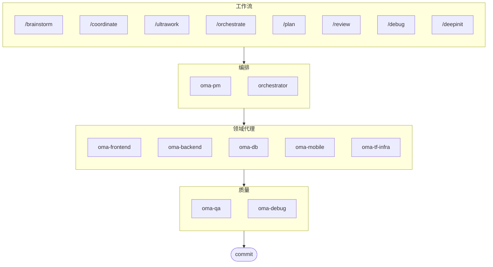

# oh-my-agent: 便携式多代理 Harness

[](https://www.npmjs.com/package/oh-my-agent) [](https://www.npmjs.com/package/oh-my-agent) [](https://github.com/first-fluke/oh-my-agent) [](https://github.com/first-fluke/oh-my-agent/blob/main/LICENSE) [](https://github.com/first-fluke/oh-my-agent/commits/main)

[English](../README.md) | [한국어](./README.ko.md) | [Português](./README.pt.md) | [日本語](./README.ja.md) | [Français](./README.fr.md) | [Español](./README.es.md) | [Nederlands](./README.nl.md) | [Polski](./README.pl.md) | [Русский](./README.ru.md) | [Deutsch](./README.de.md)

专为严谨的 AI 辅助工程打造的便携式、基于角色的代理 Harness。

通过 **Serena Memory** 编排 10 个专业领域代理（PM、Frontend、Backend、DB、Mobile、QA、Debug、Brainstorm、DevWorkflow、Terraform）。`oh-my-agent` 以 `.agents/` 作为便携技能和工作流的权威来源，并对接其他 AI IDE 和 CLI。它将基于角色的代理、显式工作流、实时可观测性和标准化指导融为一体，帮助团队告别粗制滥造的 AI 代码，走向更有纪律的工程执行。

## 目录

- [架构](#架构)
- [为何不同](#为何不同)
- [兼容性](#兼容性)
- [`.agents` 规范](#agents-规范)
- [这是什么？](#这是什么)
- [快速开始](#快速开始)
- [赞助商](#赞助商)
- [许可证](#许可证)

## 架构



## 为何不同

- **`.agents/` 是权威来源**：技能、工作流、共享资源和配置都存放在一个可移植的项目结构中，而不是锁死在某个 IDE 插件里。
- **角色化代理团队**：PM、QA、DB、Infra、Frontend、Backend、Mobile、Debug 和 Workflow 代理按工程组织的模式建模，而不只是一堆提示词。
- **工作流优先的编排**：规划、审查、调试和协调执行都是一等公民的工作流，而非事后补丁。
- **内建标准意识**：代理携带针对 ISO 驱动规划、QA、数据库连续性/安全及基础设施治理的专项指导。
- **为验证而设计**：仪表盘、清单生成、共享执行协议和结构化输出以可追溯性为先，而不是凭感觉生成。

## 兼容性

`oh-my-agent` 以 `.agents/` 为核心设计，在需要时对接各工具专属的技能目录。

| 工具 / IDE | 技能来源 | 互操作模式 | 备注 |
|------------|---------------|--------------|-------|
| Antigravity | `.agents/skills/` | 原生 | 主要权威来源布局；不支持自定义子代理 |
| Claude Code | `.claude/skills/` + `.claude/agents/` | 原生 + 适配器 | 领域技能符号链接 + 薄路由工作流技能、从 `.agents/agents/` 生成的子代理 |
| Codex CLI | `.codex/agents/` + `.agents/skills/` | 原生 + 适配器 | 从 `.agents/agents/` 生成 TOML 格式代理定义 (planned) |
| Gemini CLI | `.gemini/agents/` + `.agents/skills/` | 原生 + 适配器 | 从 `.agents/agents/` 生成 MD 格式代理定义 (planned) |
| OpenCode | `.agents/skills/` | 原生兼容 | 使用相同的项目级技能来源 |
| Amp | `.agents/skills/` | 原生兼容 | 共享相同的项目级来源 |
| Cursor | `.agents/skills/` | 原生兼容 | 可使用相同的项目级技能来源 |
| GitHub Copilot | `.github/skills/` | 可选符号链接 | 安装时按需选择 |

当前支持矩阵和互操作性说明请参阅 [SUPPORTED_AGENTS.md](./SUPPORTED_AGENTS.md)。

### Claude Code 原生集成

Claude Code 提供超越符号链接的一等原生集成：

- **`CLAUDE.md`** — 项目标识、架构和规则（由 Claude Code 自动加载）
- **`.claude/skills/`** — 委托至 `.agents/workflows/` 的 12 个薄路由 SKILL.md（如 `/orchestrate`、`/coordinate`、`/ultrawork`）。技能通过斜杠命令显式调用，不会被关键字自动激活。
- **`.claude/agents/`** — 从 `.agents/agents/*.yaml` 生成的 7 个子代理定义，通过 Task tool 调用（backend-engineer、frontend-engineer、mobile-engineer、db-engineer、qa-reviewer、debug-investigator、pm-planner）
- **原生循环模式** — Review Loop、Issue Remediation Loop 和 Phase Gate Loop，使用同步 Task tool 结果，无需 CLI 轮询

领域技能（oma-backend、oma-frontend 等）保持为 `.agents/skills/` 的符号链接。工作流技能是委托至对应 `.agents/workflows/*.md` 权威来源的薄路由 SKILL.md 文件。

## `.agents` 规范

`oh-my-agent` 将 `.agents/` 视为代理技能、工作流和共享上下文的可移植项目约定。

- 技能位于 `.agents/skills/<skill-name>/SKILL.md`
- 抽象代理定义位于 `.agents/agents/`（供应商中立的 SSOT；CLI 从中生成 `.claude/agents/`、`.codex/agents/` (planned)、`.gemini/agents/` (planned)）
- 共享资源位于 `.agents/skills/_shared/`
- 工作流位于 `.agents/workflows/*.md`
- 项目配置位于 `.agents/config/`
- CLI 元数据和打包通过生成的清单保持一致

有关项目布局、必需文件、互操作性规则和权威来源模型的详细信息，请参阅 [AGENTS_SPEC.md](./AGENTS_SPEC.md)。

## 这是什么？

一套 **Agent 技能**集合，支持协作式多代理开发。工作按明确的角色、工作流和验证边界分配给各专业代理：

| 代理 | 专业领域 | 触发条件 |
|------|---------|---------|
| **Brainstorm** | 规划前的设计优先构思 | "brainstorm", "ideate", "explore idea" |
| **PM Agent** | 需求分析、任务分解、架构设计 | "plan", "break down", "what should we build" |
| **Frontend Agent** | React/Next.js、TypeScript、Tailwind CSS | "UI", "component", "styling" |
| **Backend Agent** | Backend (Python, Node.js, Rust, ...) | "API", "database", "authentication" |
| **DB Agent** | SQL/NoSQL 建模、规范化、完整性、备份、容量规划 | "ERD", "schema", "database design", "index tuning" |
| **Mobile Agent** | Flutter 跨平台开发 | "mobile app", "iOS/Android" |
| **QA Agent** | OWASP Top 10 安全、性能、可访问性 | "review security", "audit", "check performance" |
| **Debug Agent** | Bug 诊断、根因分析、回归测试 | "bug", "error", "crash" |
| **Developer Workflow** | 单仓库任务自动化、mise 任务、CI/CD、迁移、发布 | "dev workflow", "mise tasks", "CI/CD pipeline" |
| **TF Infra Agent** | 多云 IaC 基础设施配置（AWS、GCP、Azure、OCI） | "infrastructure", "terraform", "cloud setup" |
| **Orchestrator** | 基于 CLI 的并行代理执行，使用 Serena Memory | "spawn agent", "parallel execution" |
| **Commit** | 遵循项目特定规则的 Conventional Commits | "commit", "save changes" |

## 快速开始

### 前置条件

- **AI IDE**（Antigravity, Claude Code, Codex, Gemini 等）

### 选项 1：一行安装（推荐）

```bash
curl -fsSL https://raw.githubusercontent.com/first-fluke/oh-my-agent/main/cli/install.sh | bash
```

自动检测并安装缺失的依赖项（bun、uv），然后启动交互式设置。

### 选项 2：手动安装

```bash
# 如果还没有 bun，请先安装：
# curl -fsSL https://bun.sh/install | bash

# 如果还没有 uv，请先安装：
# curl -LsSf https://astral.sh/uv/install.sh | sh

bunx oh-my-agent
```

选择项目类型，技能将安装到 `.agents/skills/`，并在 `.agents/skills/` 和 `.claude/skills/` 下创建兼容符号链接。

| 预设 | 技能 |
|------|------|
| ✨ 全部 | 所有技能 |
| 🌐 全栈 | oma-brainstorm, oma-frontend, oma-backend, oma-db, oma-pm, oma-qa, oma-debug, oma-commit |
| 🎨 前端 | oma-brainstorm, oma-frontend, oma-pm, oma-qa, oma-debug, oma-commit |
| ⚙️ 后端 | oma-brainstorm, oma-backend, oma-db, oma-pm, oma-qa, oma-debug, oma-commit |
| 📱 移动端 | oma-brainstorm, oma-mobile, oma-pm, oma-qa, oma-debug, oma-commit |
| 🚀 DevOps | oma-brainstorm, oma-tf-infra, oma-dev-workflow, oma-pm, oma-qa, oma-debug, oma-commit |

### 选项 3：全局安装（用于编排器）

若要全局使用核心工具或运行 SubAgent Orchestrator：

```bash
bun install --global oh-my-agent
```

你还需要至少安装一个 CLI 工具：

| CLI | 安装 | 认证 |
|-----|------|------|
| Gemini | `bun install --global @google/gemini-cli` | Auto on first `gemini` run |
| Claude | `curl -fsSL https://claude.ai/install.sh \| bash` | Auto on first `claude` run |
| Codex | `bun install --global @openai/codex` | `codex login` |
| Qwen | `bun install --global @qwen-code/qwen-code` | `/auth` inside CLI |

### 选项 4：集成到现有项目

**推荐（CLI）：**

在项目根目录运行以下命令，自动安装/更新技能和工作流：

```bash
bunx oh-my-agent
```

> **提示：** 安装后运行 `bunx oh-my-agent doctor` 可验证所有配置是否正确（包括全局工作流）。

### 2. 对话

**复杂项目**（/coordinate 工作流）：

```
"用用户认证功能构建一个 TODO 应用"
→ /coordinate → PM Agent 规划 → 在 Agent Manager 中启动代理
```

**全面部署**（/ultrawork 工作流）：

```
"重构认证模块、补充 API 测试并更新文档"
→ /ultrawork → 各代理并行执行独立任务
```

**简单任务**（直接调用领域技能）：

```
"用 Tailwind CSS 和表单验证创建一个登录表单"
→ oma-frontend 技能
```

**提交变更**（conventional commits）：

```
/commit
→ 分析变更、建议提交类型/范围、创建带 Co-Author 的提交
```

### 3. 使用仪表盘监控

有关仪表盘设置和使用详情，请参阅 [`web/content/en/guide/usage.md`](./web/content/en/guide/usage.md#real-time-dashboards)。

## 赞助商

本项目的持续维护得益于慷慨赞助商的支持。

> **喜欢这个项目吗？** 给它一颗星！
>
> ```bash
> gh api --method PUT /user/starred/first-fluke/oh-my-agent
> ```
>
> 试试我们优化的入门模板：[fullstack-starter](https://github.com/first-fluke/fullstack-starter)

<a href="https://github.com/sponsors/first-fluke">
  
</a>
<a href="https://buymeacoffee.com/firstfluke">
  
</a>

### 🚀 Champion

<!-- Champion tier ($100/mo) logos here -->

### 🛸 Booster

<!-- Booster tier ($30/mo) logos here -->

### ☕ Contributor

<!-- Contributor tier ($10/mo) names here -->

[成为赞助商 →](https://github.com/sponsors/first-fluke)

查看 [SPONSORS.md](./SPONSORS.md) 获取完整赞助者列表。

## Star 历史

[](https://www.star-history.com/#first-fluke/oh-my-agent&type=date&legend=bottom-right)

## 许可证

MIT
