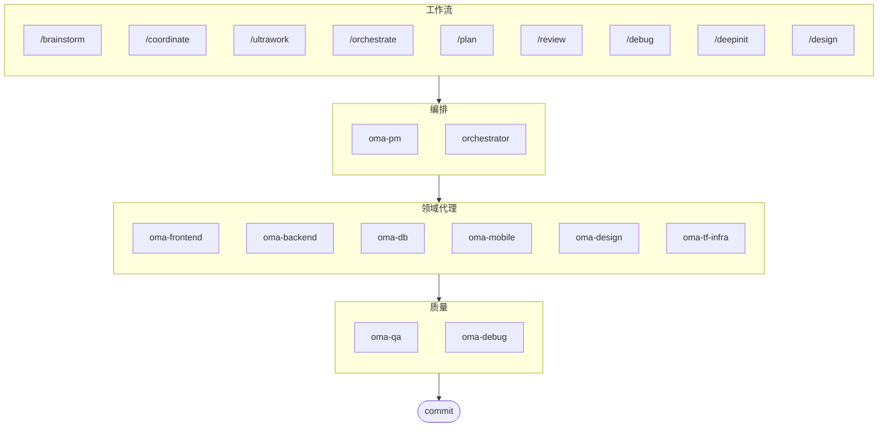

# oh-my-agent: 便携式多代理 Harness

[](https://www.npmjs.com/package/oh-my-agent) [](https://www.npmjs.com/package/oh-my-agent) [](https://github.com/first-fluke/oh-my-agent) [](https://github.com/first-fluke/oh-my-agent/blob/main/LICENSE) [](https://github.com/first-fluke/oh-my-agent/commits/main)

[English](../README.md) | [한국어](./README.ko.md) | [Português](./README.pt.md) | [日本語](./README.ja.md) | [Français](./README.fr.md) | [Español](./README.es.md) | [Nederlands](./README.nl.md) | [Polski](./README.pl.md) | [Русский](./README.ru.md) | [Deutsch](./README.de.md)

专为严谨的 AI 辅助工程打造的便携式、基于角色的代理 Harness。

适用于所有主流 AI IDE，包括 Antigravity、Claude Code、Cursor、Gemini、OpenCode 等。它将基于角色的代理、显式工作流、实时可观测性和标准化指导融为一体，帮助团队告别粗制滥造的 AI 代码，走向更有纪律的工程执行。

## 目录

- [这是什么？](#这是什么)
- [为何不同](#为何不同)
- [快速开始](#快速开始)
- [架构](#架构)
- [赞助商](#赞助商)
- [许可证](#许可证)

## 这是什么？

一套 **Agent 技能**集合，支持协作式多代理开发。工作按明确的角色、工作流和验证边界分配给各专业代理：

| 代理 | 专业领域 | 触发条件 |
|------|---------|---------|
| **Brainstorm** | 规划前的设计优先构思 | "brainstorm", "ideate", "explore idea" |
| **PM Agent** | 需求分析、任务分解、架构设计 | "plan", "break down", "what should we build" |
| **Frontend Agent** | React/Next.js、TypeScript、Tailwind CSS | "UI", "component", "styling" |
| **Backend Agent** | Backend (Python, Node.js, Rust, ...) | "API", "database", "authentication" |
| **DB Agent** | SQL/NoSQL 建模、规范化、完整性、备份、容量规划 | "ERD", "schema", "database design", "index tuning" |
| **Mobile Agent** | Flutter 跨平台开发 | "mobile app", "iOS/Android" |
| **QA Agent** | OWASP Top 10 安全、性能、可访问性 | "review security", "audit", "check performance" |
| **Debug Agent** | Bug 诊断、根因分析、回归测试 | "bug", "error", "crash" |
| **Developer Workflow** | 单仓库任务自动化、mise 任务、CI/CD、迁移、发布 | "dev workflow", "mise tasks", "CI/CD pipeline" |
| **TF Infra Agent** | 多云 IaC 基础设施配置（AWS、GCP、Azure、OCI） | "infrastructure", "terraform", "cloud setup" |
| **Orchestrator** | 基于 CLI 的并行代理执行 | "spawn agent", "parallel execution" |
| **Commit** | 遵循项目特定规则的 Conventional Commits | "commit", "save changes" |


## 为何不同

- **`.agents/` 是权威来源**：技能、工作流、共享资源和配置都存放在一个可移植的项目结构中，而不是锁死在某个 IDE 插件里。
- **角色化代理团队**：PM、QA、DB、Infra、Frontend、Backend、Mobile、Debug 和 Workflow 代理按工程组织的模式建模，而不只是一堆提示词。
- **工作流优先的编排**：规划、审查、调试和协调执行都是一等公民的工作流，而非事后补丁。
- **内建标准意识**：代理携带针对 ISO 驱动规划、QA、数据库连续性/安全及基础设施治理的专项指导。
- **为验证而设计**：仪表盘、清单生成、共享执行协议和结构化输出以可追溯性为先，而不是凭感觉生成。


## 快速开始

### 前置条件

- **AI IDE** (Antigravity、Claude Code、Codex、Gemini 等)

### 选项 1：一键安装（推荐）

```bash
curl -fsSL https://raw.githubusercontent.com/first-fluke/oh-my-agent/main/cli/install.sh | bash
```


### 选项 2：手动安装

```bash
# bun이 없으면:
# curl -fsSL https://bun.sh/install | bash

# uv가 없으면:
# curl -LsSf https://astral.sh/uv/install.sh | sh

bunx oh-my-agent
```

选择项目类型后，skills 将安装到 `.agents/skills/`。

| 预设 | Skills |
|--------|--------|
| ✨ All | 全部 |
| 🌐 Fullstack | oma-brainstorm, oma-frontend, oma-backend, oma-db, oma-pm, oma-qa, oma-debug, oma-commit |
| 🎨 Frontend | oma-brainstorm, oma-frontend, oma-pm, oma-qa, oma-debug, oma-commit |
| ⚙️ Backend | oma-brainstorm, oma-backend, oma-db, oma-pm, oma-qa, oma-debug, oma-commit |
| 📱 Mobile | oma-brainstorm, oma-mobile, oma-pm, oma-qa, oma-debug, oma-commit |
| 🚀 DevOps | oma-brainstorm, oma-tf-infra, oma-dev-workflow, oma-pm, oma-qa, oma-debug, oma-commit |


```bash
# Homebrew (macOS/Linux)
brew install oh-my-agent

# npm/bun
bun install --global oh-my-agent
```


| CLI | 安装 | 认证 |
|-----|------|------|
| Gemini | `bun install --global @google/gemini-cli` | Auto on first `gemini` run |
| Claude | `curl -fsSL https://claude.ai/install.sh \| bash` | Auto on first `claude` run |
| Codex | `bun install --global @openai/codex` | `codex login` |
| Qwen | `bun install --global @qwen-code/qwen-code` | `/auth` inside CLI |


在项目根目录运行此命令以自动安装 skills 和 workflows：

```bash
bunx oh-my-agent
```

> **提示：** 安装后运行 `bunx oh-my-agent doctor` 验证配置是否正确。

### 2. 使用으로 쓰기

**复杂项目**（/coordinate 工作流）：

```
"做个带用户认证的 TODO 应用"
→ /coordinate → PM Agent가 기획 → Agent Manager에서 에이전트 실행
```

**最大部署**（/ultrawork 工作流）：

```
"重构认证模块、添加 API 测试、更新文档"
→ /ultrawork → 独立任务在 agents 间并行执行
```

**简单任务**（直接调用域技能）：

```
"Tailwind CSS로 로그인 폼 만들어줘"
→ oma-frontend 스킬
```

**提交更改**（conventional commits）：

```
/commit
→ 변경 분석, 커밋 타입/스코프 제안, Co-Author 포함 커밋
```

**设计系统** (DESIGN.md + 反模式 + 可选 Stitch MCP):

```
/design
→ 7阶段工作流: 设置 → 提取 → 增强 → 提议 → 生成 → 审核 → 交接
```

### 3. 仪表盘监控

有关仪表盘设置和使用详情，请参阅 [`web/content/en/guide/usage.md`](./web/content/en/guide/usage.md#real-time-dashboards)。


## 架构




## 赞助商

本项目得益于慷慨的赞助商支持。

> **喜欢这个项目吗？** 请给它一颗星！
>
> ```bash
> gh api --method PUT /user/starred/first-fluke/oh-my-agent
> ```
>
> 查看我们优化的启动模板：[fullstack-starter](https://github.com/first-fluke/fullstack-starter)

<a href="https://github.com/sponsors/first-fluke">
  
</a>
<a href="https://buymeacoffee.com/firstfluke">
  
</a>

### 🚀 冠军

<!-- Champion tier ($100/mo) logos here -->

### 🛸 助推者

<!-- Booster tier ($30/mo) logos here -->

### ☕ 贡献者

<!-- Contributor tier ($10/mo) names here -->

[Become a sponsor →](https://github.com/sponsors/first-fluke)

See [SPONSORS.md](./SPONSORS.md) for a full list of supporters.


## 许可证

MIT


